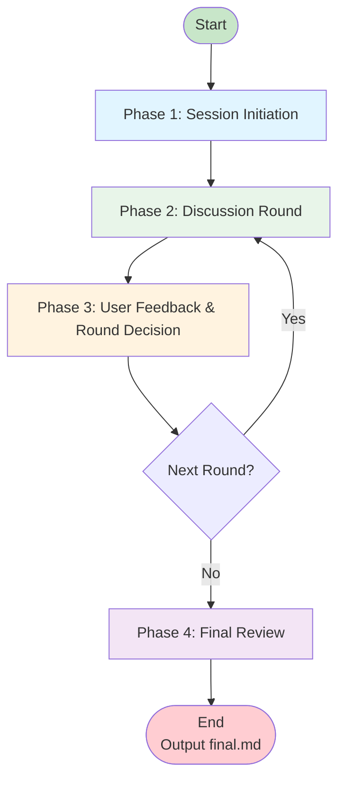
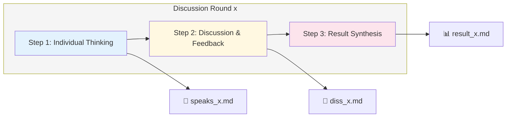
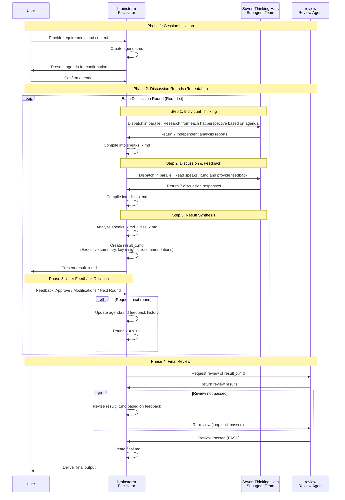
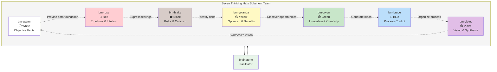
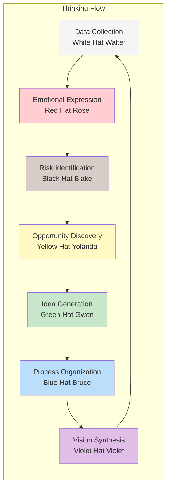

# Brainstorm Team

## Overview

The Brainstorm Team is a structured creative collaboration system based on Edward de Bono's "Six Thinking Hats" methodology with an innovative extension. Building upon the classic six hats (White, Red, Black, Yellow, Green, Blue), we have added a **seventh Violet Thinking Hat**, focusing on vision synthesis and holistic thinking. Through seven subagents with different perspectives, it helps users achieve comprehensive, in-depth, and innovative solutions.

> **Note**: The Violet Thinking Hat is an innovative extension of this system, representing high-level vision integration and holistic thinking, complementing the strategic perspective of the classic six thinking hats.

---

## Team Composition

### Primary Agent

| Agent | Role | Core Responsibility |
|-------|------|---------------------|
| **brainstorm** | Brainstorm Facilitator | Coordinates the entire brainstorming process, manages discussion rounds, synthesizes results, and ensures output quality |

### Subagent Team - The Seven Thinking Hats

| Agent | Thinking Hat | Color | Core Belief | Focus |
|-------|-------------|-------|-------------|-------|
| **bm-walter** | White Hat | ⚪ White | "Facts are the foundation of all good decisions. Without data, we are just guessing." | Objective facts, data, information |
| **bm-rose** | Red Hat | 🔴 Red | "Logic alone cannot make great decisions. Our feelings and intuition contain wisdom that data cannot capture." | Emotions, intuition, feelings |
| **bm-blake** | Black Hat | ⚫ Black | "Being cautious and identifying risks is not pessimism—it's wisdom. Every great plan needs a devil's advocate." | Risks, caution, critical thinking |
| **bm-yolanda** | Yellow Hat | 🟡 Yellow | "Optimism is not naive—it's a practical strategy for success. Every challenge contains opportunity." | Optimism, benefits, positive aspects |
| **bm-gwen** | Green Hat | 🟢 Green | "Creativity is the engine of progress. The best solutions are often the ones nobody has thought of yet." | Creativity, innovation, new ideas |
| **bm-bruce** | Blue Hat | 🔵 Blue | "Great outcomes require great processes. The structure of thinking is as important as the content of thinking." | Process control, organization, meta-thinking |
| **bm-violet** | Violet Hat | 🟣 Violet | "True wisdom comes from seeing the whole picture. The best solutions honor both the practical and the visionary." | Vision, synthesis, holistic thinking |

---

## Overall Workflow

The brainstorming process consists of **four main phases**, each with clear inputs, processing steps, and outputs.



### Phase Details

#### Phase 1: Session Initiation

**Goal**: Clarify session background, objectives, and expected outputs

**Input**: User's creative requirement or problem statement

**Process**:
1. Engage with user to understand:
   - **Background**: What is the current situation and context?
   - **Goals**: What does the user want to achieve?
   - **Expected Output**: What form should the final result take?
   - **Constraints**: Any limitations, deadlines, or special requirements?
   - **Success Criteria**: How will we know the output is good?
2. Document all information in `agenda.md`
3. Present agenda to user and wait for confirmation

**Output**: `agenda.md` (Session Agenda)

---

#### Phase 2: Discussion Round

**Goal**: Generate comprehensive insights through multiple rounds of in-depth discussion

**Structure**: Each complete discussion round contains **three sequential steps**



**Per Round File Structure**:
- `speaks_x.md` - Round x: Individual thoughts from 7 subagents
- `diss_x.md` - Round x: Discussion responses and feedback
- `result_x.md` - Round x: Synthesized results and recommendations

---

#### Phase 3: User Feedback & Round Decision

**Goal**: Gather user feedback and decide whether another discussion round is needed

**Input**: Round x's `result_x.md`

**Process**:
1. Present `result_x.md` to user, clearly showing this round's findings and recommendations
2. Ask for user feedback: "Please review the results from this round. Are you satisfied with the results? Or would you like to dive deeper into certain aspects?"
3. **Determine user intent**:
   - **If user approves results** → Proceed to Phase 4 (Final Review)
   - **If user provides modification suggestions but doesn't explicitly request a new round** → Ask for clarification: "Would you like me to revise the current results based on your feedback, or start a new round for the seven thinking hats to discuss more deeply?"
   - **If user explicitly requests another round** → Record feedback and continue to next round
4. **Start new round (if needed)**:
   - Record user feedback in `agenda.md` under "Feedback History" section
   - Update agenda to clarify the focus direction for the new round
   - Increment round counter (x = x + 1)
   - Return to Phase 2 to start a new three-step discussion

**Key Principle**: User has complete control over discussion rounds. After each round, user explicitly decides whether to continue. Facilitator never automatically starts a new round.

**Output**: User decision (Complete / Continue to next round)

---

#### Phase 4: Final Review & Approval

**Goal**: Ensure output quality through review

**Process**:
1. Call review agent (with name "review") to audit the final `result_x.md`
2. Review checks: completeness of analysis, clarity of recommendations, quality of synthesis, alignment with goals
3. **If review identifies issues**:
   - Revise `result_x.md` based on review feedback
   - Call review agent again to re-review the revised document
   - Repeat until review passes
4. **After review passes**:
   - Create `final.md` containing the polished final version
   - Present `final.md` to user as completed output

**Output**: `final.md` (Final polished output)

---

## Complete Project File Structure

```
brainstorm-session/
├── agenda.md              # Session agenda and background
├── speaks_1.md            # Round 1: Individual thoughts from 7 subagents
├── diss_1.md              # Round 1: Discussion responses and feedback
├── result_1.md            # Round 1: Synthesized results
├── speaks_2.md            # Round 2: Individual thoughts (if needed)
├── diss_2.md              # Round 2: Discussion responses (if needed)
├── result_2.md            # Round 2: Synthesized results (if needed)
├── speaks_3.md            # Round 3: Individual thoughts (if needed)
├── diss_3.md              # Round 3: Discussion responses (if needed)
├── result_3.md            # Round 3: Synthesized results (if needed)
└── final.md               # Final polished output after review approval
```

---

## Subtask Workflow Details

### Internal Discussion Round Process

Each discussion round (Round x) contains three sequentially executed steps, forming a complete "think-discuss-synthesize" cycle:



### Three Steps in Detail

Each discussion round contains three sequentially executed steps, forming a complete "think-discuss-synthesize" cycle:

#### Step 1: Individual Thinking

**Trigger**: `agenda.md` is confirmed (first round) or user explicitly requests a new round

**Process**:
1. **Parallel Dispatch**: The brainstorm facilitator simultaneously sends tasks to all 7 subagents
2. **Independent Research**: Each subagent independently researches the agenda topic from their hat perspective
   - White Hat: Focuses on objective facts and data
   - Red Hat: Focuses on emotions and intuitive reactions
   - Black Hat: Focuses on risks and potential problems
   - Yellow Hat: Focuses on positive aspects and opportunities
   - Green Hat: Focuses on innovative ideas and alternatives
   - Blue Hat: Focuses on process and methodology
   - Violet Hat: Focuses on holistic vision and strategic significance
3. **Collect Responses**: Wait for all 7 subagents to return independent analysis reports
4. **Document Compilation**: Compile the 7 reports into `speaks_x.md` in a fixed format

**Output**: `speaks_x.md` (Round x: Individual Thoughts Summary)

**Duration**: Depends on subagent research depth, typically completed simultaneously

---

#### Step 2: Discussion & Feedback

**Trigger**: `speaks_x.md` has been created

**Process**:
1. **Share Document**: Brainstorm distributes `speaks_x.md` to all 7 subagents
2. **Cross-Review**: Each subagent reads the independent thinking reports from the other 6 agents
3. **Generate Feedback**: Each subagent responds to others' perspectives from their own viewpoint
   - White Hat: Questions factual accuracy of viewpoints, requests evidence
   - Red Hat: Expresses emotional reactions and intuitive feelings about others' ideas
   - Black Hat: Challenges optimistic assumptions, points out weaknesses and risks
   - Yellow Hat: Discovers potential and value in others' ideas
   - Green Hat: Creatively builds upon others' ideas
   - Blue Hat: Identifies patterns and connections between different viewpoints
   - Violet Hat: Integrates all perspectives into a more comprehensive understanding
4. **Collect Feedback**: Wait for all 7 subagents to return discussion responses
5. **Document Compilation**: Compile the 7 feedback responses into `diss_x.md` in a fixed format

**Key Value**:
- **Idea Collision**: Cross-discussion between different perspectives generates new insights
- **Blind Spot Discovery**: Each hat helps identify blind spots in other perspectives
- **Deepened Perspectives**: Through questioning and responding, viewpoints are explored more deeply
- **Consensus Formation**: Gradually identify commonly agreed-upon insights

**Output**: `diss_x.md` (Round x: Discussion Responses Summary)

**Duration**: Similar to Step 1, all subagents work in parallel

---

#### Step 3: Result Synthesis

**Trigger**: `diss_x.md` has been created

**Process**:
1. **Comprehensive Review**: Brainstorm facilitator carefully reads `speaks_x.md` and `diss_x.md`
2. **Extract Key Points**:
   - Identify key insights from each thinking hat
   - Find consensus points commonly agreed upon by the team
   - Mark divergence points requiring further discussion
   - Distill actionable recommendations
3. **Comprehensive Analysis**:
   - Integrate scattered perspectives into a coherent strategic picture
   - Balance recommendations from different perspectives (e.g., Black Hat risks vs Yellow Hat opportunities)
   - Identify the most valuable innovation points (Green Hat contributions)
   - Build a clear implementation path (Blue Hat contributions)
4. **Document Creation**: Create `result_x.md` following the standard template, including:
   - Executive Summary (concise overview of core findings)
   - Key Insights by Perspective (7 sections, one for each hat)
   - Points of Agreement (viewpoints commonly agreed upon by the team)
   - Points of Tension/Debate (different opinions requiring further discussion)
   - Actionable Recommendations (specific, executable action items)
   - Next Steps (recommended follow-up actions)
5. **Quality Check**: Ensure content is complete, logic is clear, and recommendations are executable
6. **User Presentation**: Present `result_x.md` to user and wait for feedback

**Output**: `result_x.md` (Round x: Synthesis Results)

**Key Principles**:
- **Objective Neutrality**: Synthesis process doesn't favor any single perspective
- **Preserve Differences**: Honestly record divergence points, don't force false consensus
- **Highlight Value**: Emphasize recommendations with the most practical value
- **User-Oriented**: Always focus on the user's original goals and constraints

---

### Seven Thinking Hats Collaboration Pattern



### Interaction Relationships Between Hats



---

## Detailed Subagent Responsibilities

### Step 1: Individual Thinking Phase (Research Phase)

| Agent | Individual Thinking Tasks |
|-------|--------------------------|
| **bm-walter** (White) | Gather objective facts, statistics; identify known vs. unknown information; look for historical precedents and established patterns; note information gaps |
| **bm-rose** (Red) | Reflect on emotional reactions to topic; consider how stakeholders might feel; identify intuitive insights; explore human and cultural factors |
| **bm-blake** (Black) | Identify potential risks and failure modes; examine what could go wrong with each approach; consider regulatory, legal, and compliance issues; evaluate resource constraints |
| **bm-yolanda** (Yellow) | Identify benefits and positive outcomes of different approaches; explore best-case scenarios; look for ways to add value and create wins; consider long-term positive impacts |
| **bm-gwen** (Green) | Generate creative alternatives and novel approaches; explore "what if" scenarios; look for inspiration from unrelated fields; challenge conventional wisdom |
| **bm-bruce** (Blue) | Define the thinking process and methodology; identify key questions that need answering; organize information in a structured way; establish criteria for evaluating ideas |
| **bm-violet** (Violet) | Consider long-term vision and strategic implications; look for deeper meaning and purpose; explore how different elements connect and interact; identify overarching themes |

### Step 2: Discussion Response Phase (Response Phase)

| Agent | Discussion Response Tasks |
|-------|--------------------------|
| **bm-walter** (White) | Evaluate other agents' contributions based on factual accuracy; ask "Is this supported by evidence?"; point out missing data |
| **bm-rose** (Red) | Share emotional reactions to other agents' ideas; express what feels right or wrong intuitively; highlight human impact and emotional considerations |
| **bm-blake** (Black) | Challenge optimistic assumptions from Yellow Hat; point out flaws and weaknesses in proposed ideas; ask tough questions about implementation; highlight risks others might have overlooked |
| **bm-yolanda** (Yellow) | Highlight the potential in other agents' ideas; counter Black Hat pessimism with constructive optimism; identify benefits others might have missed |
| **bm-gwen** (Green) | Build on others' ideas with creative additions; suggest alternative angles others haven't considered; use lateral thinking to reframe problems; combine different ideas in unexpected ways |
| **bm-bruce** (Blue) | Identify patterns across different agents' contributions; synthesize diverse perspectives into coherent themes; point out process issues or gaps in thinking; suggest next steps |
| **bm-violet** (Violet) | Synthesize all six thinking hats into holistic understanding; identify overarching themes and patterns; connect tactical ideas to strategic vision; find the deeper "why" behind the discussion |

---

## Output Document Structure Specifications

### speaks_x.md Structure (Individual Thoughts Summary)

```markdown
# Round x: Individual Thoughts

## bm-walter (White Hat - Objective Facts)
[Facts data and analysis]

## bm-rose (Red Hat - Emotions & Intuition)
[Emotional reactions and intuition]

## bm-blake (Black Hat - Risks & Criticism)
[Risk identification and criticism]

## bm-yolanda (Yellow Hat - Optimism & Benefits)
[Positive aspects and opportunities]

## bm-gwen (Green Hat - Innovation & Creativity)
[New ideas and creativity]

## bm-bruce (Blue Hat - Process Control)
[Process observations and organization]

## bm-violet (Violet Hat - Vision & Synthesis)
[Holistic assessment and vision]
```

### diss_x.md Structure (Discussion Responses Summary)

```markdown
# Round x: Discussion Responses

## Feedback from bm-walter
[Response to white hat perspective]

## Feedback from bm-rose
[Response to red hat perspective]

## Feedback from bm-blake
[Response to black hat perspective]

## Feedback from bm-yolanda
[Response to yellow hat perspective]

## Feedback from bm-gwen
[Response to green hat perspective]

## Feedback from bm-bruce
[Response to blue hat perspective]

## Feedback from bm-violet
[Response to violet hat perspective]
```

### result_x.md Structure (Synthesis Results)

```markdown
# Round x: Synthesis Results

## Executive Summary
[Brief overview of key findings]

## Key Insights by Perspective

### White Hat Perspective
[Key findings from factual basis]

### Red Hat Perspective
[Key findings from emotional factors]

### Black Hat Perspective
[Key findings from risk considerations]

### Yellow Hat Perspective
[Key findings from opportunity identification]

### Green Hat Perspective
[Key findings from innovative ideas]

### Blue Hat Perspective
[Key findings from process organization]

### Violet Hat Perspective
[Key findings from holistic vision]

## Points of Agreement
- [Points generally agreed upon by the team]

## Points of Tension/Debate
- [Different opinions that need further discussion]

## Actionable Recommendations
1. [Specific recommendation 1]
2. [Specific recommendation 2]
3. [Specific recommendation 3]

## Next Steps
- [Recommended next actions]
```

### final.md Structure (Final Output)

```markdown
# Brainstorm Final Output

## Project Overview
- Topic: [Discussion topic]
- Rounds: [Number of rounds conducted]
- Date: [Generation date]

## Key Findings
[Top 3-5 most important findings]

## Detailed Recommendations

### Short-term Actions
[Recommendations that can be executed immediately]

### Medium-term Strategy
[Recommendations that require planning and preparation]

### Long-term Vision
[Strategic direction recommendations]

## Risk Assessment
[Key risks from black hat perspective]

## Opportunity Analysis
[Key opportunities from yellow hat perspective]

## Innovation Highlights
[Creative solutions from green hat perspective]

## Implementation Roadmap
[Action plan from blue hat perspective]

## Summary & Vision
[Holistic vision from violet hat perspective]
```

---

## Usage Examples

### Starting a Brainstorming Session

```
User: I need to develop a marketing strategy for a new product launch

brainstorm: Great! Let me coordinate a structured brainstorming session.
First, I need to understand some background:
1. What type of product is this?
2. Who is the target audience?
3. What timeline are you looking at for the launch?
4. Are there any special constraints?
5. What form do you expect the output to take?
```

### Multi-Round Discussion Example

```
Round 1: Exploration Phase
- speaks_1.md: Each hat analyzes marketing strategy from their perspective
- diss_1.md: Each hat provides feedback on other perspectives
- result_1.md: First round synthesis results

User Feedback: "This direction is good, but I want to dig deeper into digital marketing channels"

Round 2: Deepening Phase (focused on digital marketing)
- speaks_2.md: Each hat focuses on analyzing digital marketing
- diss_2.md: In-depth discussion and feedback
- result_2.md: Second round synthesis results

User Feedback: "Very satisfied, no more rounds needed"

Phase 4: Review and Final Output
- agent with name "review" reviews result_2.md
- Create final.md
```

---

## Key Principles

1. **Parallel Thinking**: All seven hats think simultaneously from different angles
2. **Clear Structure**: Each phase and step has clear inputs and outputs
3. **User-Driven**: User decides after each round whether to continue
4. **Quality Assurance**: Final output must be validated by review agent
5. **Complete Documentation**: All intermediate documents are preserved for traceability and reference

---

*Last Updated: March 2026*
