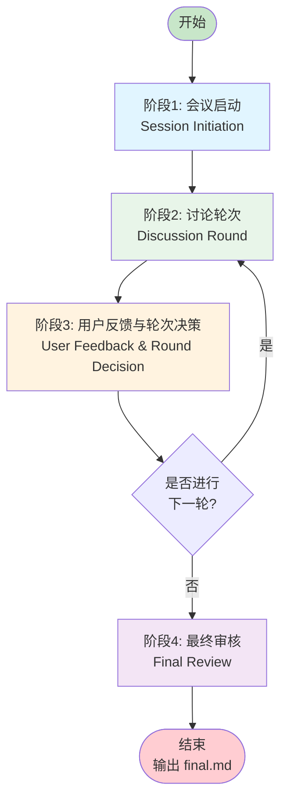
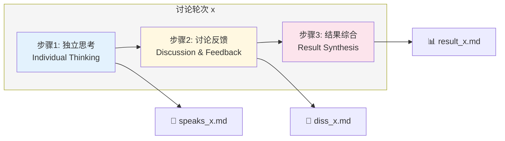
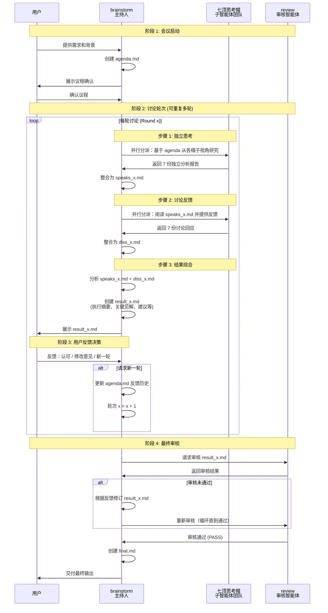
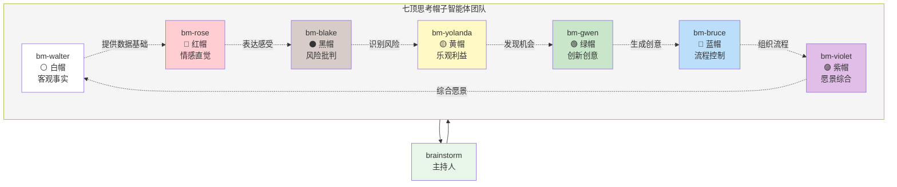
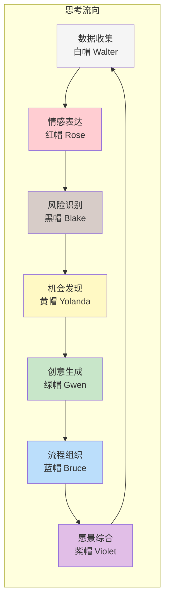

# 头脑风暴团队 (Brainstorm Team)

## 概述

头脑风暴团队是一个基于爱德华·德·博诺（Edward de Bono）"六顶思考帽"方法论并扩展创新的结构化创意协作系统。在经典的六顶思考帽（白、红、黑、黄、绿、蓝）基础上，增加了**第七顶紫罗兰思考帽（Violet Hat）**，专注于愿景整合与整体思维。通过七个不同视角的智能体协同工作，帮助用户获得全面、深入的创新性解决方案。

> **注**: 紫罗兰思考帽是本系统的扩展创新，代表高层次的愿景整合与 holistic thinking（整体思维），补充了经典六顶思考帽在战略层面的视角。

---

## 团队组成

### 主智能体 (Primary Agent)

| 智能体 | 角色 | 核心职责 |
|--------|------|----------|
| **brainstorm** | 头脑风暴主持人 | 协调整个头脑风暴流程，管理讨论轮次，整合结果，确保输出质量 |

### 子智能体团队 (Subagent Team) - 七顶思考帽

| 智能体 | 思考帽 | 颜色 | 核心信念 | 关注焦点 |
|--------|--------|------|----------|----------|
| **bm-walter** | 白色思考帽 | ⚪ 白色 | "事实是良好决策的基础。没有数据，我们只是在猜测。" | 客观事实、数据、信息 |
| **bm-rose** | 红色思考帽 | 🔴 红色 | "仅靠逻辑无法做出伟大决策。我们的情感和直觉包含着数据无法捕捉的智慧。" | 情感、直觉、感受 |
| **bm-blake** | 黑色思考帽 | ⚫ 黑色 | "谨慎和识别风险不是悲观——而是智慧。每个伟大的计划都需要一个魔鬼代言人。" | 风险、谨慎、批判性思维 |
| **bm-yolanda** | 黄色思考帽 | 🟡 黄色 | "乐观并非天真——而是成功的实用策略。每个挑战都蕴含着机会。" | 乐观、利益、积极面 |
| **bm-gwen** | 绿色思考帽 | 🟢 绿色 | "创造力是进步的引擎。最好的解决方案往往是那些尚未被想到的。" | 创造力、创新、新想法 |
| **bm-bruce** | 蓝色思考帽 | 🔵 蓝色 | "伟大的成果需要伟大的流程。思考的结构与思考的内容同样重要。" | 流程控制、组织、元思考 |
| **bm-violet** | 紫罗兰思考帽 | 🟣 紫罗兰 | "真正的智慧来自看到全局。最好的解决方案既尊重实际又富有远见。" | 愿景、综合、整体思维 |

---

## 整体工作流

头脑风暴流程分为**四个主要阶段**，每个阶段都有明确的输入、处理和输出。



### 阶段详解

#### 阶段 1: 会议启动 (Session Initiation)

**目标**: 明确会议背景、目标和期望输出

**输入**: 用户的创意需求或问题陈述

**处理**:
1. 与用户沟通，了解：
   - **背景**: 当前情况和上下文是什么？
   - **目标**: 用户希望达成什么？
   - **期望输出**: 最终结果应该是什么形式？
   - **约束条件**: 有什么限制、截止日期或特殊要求？
   - **成功标准**: 如何判断输出质量？
2. 将所有信息记录在 `agenda.md`
3. 向用户展示议程并等待确认

**输出**: `agenda.md`（会议议程）

---

#### 阶段 2: 讨论轮次 (Discussion Round)

**目标**: 通过多轮深度讨论生成全面见解

**结构**: 每个完整的讨论轮次包含**三个顺序步骤**



**每轮文件结构**:
- `speaks_x.md` - 第 x 轮：7 个子智能体的独立思考
- `diss_x.md` - 第 x 轮：讨论反馈和回应
- `result_x.md` - 第 x 轮：综合结果和建议

---

#### 阶段 3: 用户反馈与轮次决策 (User Feedback & Round Decision)

**目标**: 获取用户反馈，决定是否需要下一轮讨论

**输入**: 第 x 轮的 `result_x.md`

**处理**:
1. 向用户展示 `result_x.md`，清晰呈现本轮的发现和建议
2. 询问用户反馈："请审核本轮结果。您对结果满意吗？或者您希望针对某些方面进行更深入的讨论？"
3. **判断用户意图**:
   - **如果用户认可结果** → 进入阶段 4（最终审核）
   - **如果用户提出修改意见但未明确要求新一轮** → 询问澄清："您希望我基于您的反馈直接修订当前结果，还是开启新一轮让七顶思考帽进行更深入的讨论？"
   - **如果用户明确要求新一轮讨论** → 记录反馈并继续下一轮
4. **开启新一轮（如需要）**:
   - 将用户反馈记录在 `agenda.md` 的"反馈历史"部分
   - 更新议程，明确新一轮的重点方向
   - 轮次计数器递增 (x = x + 1)
   - 返回阶段 2，开始新一轮的三步讨论

**关键原则**: 用户完全掌控讨论轮次。每轮结束后，用户明确决定是否继续。主持人绝不自动开启新一轮。

**输出**: 用户决策（结束 / 继续下一轮）

---

#### 阶段 4: 最终审核 (Final Review & Approval)

**目标**: 确保输出质量并通过审核

**处理**:
1. 调用审核智能体 (review) 审核最后一轮的 `result_x.md`
2. 检查：分析完整性、建议清晰度、综合质量、目标一致性
3. **如果审核发现问题**:
   - 根据审核反馈修订 `result_x.md`
   - 重新调用审核智能体审查修订版
   - 重复直到审核通过
4. **审核通过后**:
   - 创建 `final.md`（润色后的最终版本）
   - 向用户展示作为完成的输出

**输出**: `final.md`（最终润色输出）

---

## 完整项目文件结构

```
brainstorm-session/
├── agenda.md              # 会议议程和背景
├── speaks_1.md            # 第1轮：7个子智能体的独立思考
├── diss_1.md              # 第1轮：讨论反馈和回应
├── result_1.md            # 第1轮：综合结果
├── speaks_2.md            # 第2轮：独立思考（如需要）
├── diss_2.md              # 第2轮：讨论反馈（如需要）
├── result_2.md            # 第2轮：综合结果（如需要）
├── speaks_3.md            # 第3轮：独立思考（如需要）
├── diss_3.md              # 第3轮：讨论反馈（如需要）
├── result_3.md            # 第3轮：综合结果（如需要）
└── final.md               # 审核通过后的最终润色输出
```

---

## 子任务工作流详解

### 讨论轮次内部流程

每个讨论轮次 (Round x) 包含三个顺序执行的步骤，形成完整的"思考-讨论-综合"循环：



### 三个步骤详解

每个讨论轮次包含三个顺序执行的步骤，形成完整的"思考-讨论-综合"循环：

#### 步骤 1: 独立思考 (Individual Thinking)

**触发条件**: `agenda.md` 已确认（第一轮）或用户明确要求新一轮

**处理流程**:
1. **并行分派**: brainstorm 主智能体同时向全部 7 个子智能体发送任务
2. **独立研究**: 每个子智能体基于自己的思考帽视角，独立研究议程中的主题
   - 白帽关注客观事实和数据
   - 红帽关注情感和直觉反应
   - 黑帽关注风险和潜在问题
   - 黄帽关注积极面和机会
   - 绿帽关注创新想法和替代方案
   - 蓝帽关注流程和方法论
   - 紫帽关注整体愿景和战略意义
3. **收集响应**: 等待所有 7 个子智能体返回独立的分析报告
4. **文档整合**: 将 7 份报告按固定格式整合为 `speaks_x.md`

**输出**: `speaks_x.md`（第 x 轮独立思考汇总）

**耗时**: 取决于子智能体的研究深度，通常同时完成

---

#### 步骤 2: 讨论反馈 (Discussion & Feedback)

**触发条件**: `speaks_x.md` 已创建完成

**处理流程**:
1. **共享文档**: brainstorm 将 `speaks_x.md` 分发给全部 7 个子智能体
2. **交叉审阅**: 每个子智能体阅读其他 6 个智能体的独立思考报告
3. **反馈生成**: 每个子智能体从自己的视角对其他观点进行回应
   - 白帽：质疑观点的事实准确性，要求证据支持
   - 红帽：表达对他人观点的情感反应和直觉感受
   - 黑帽：挑战乐观假设，指出弱点和潜在风险
   - 黄帽：发现他人想法中的潜力和价值
   - 绿帽：在他人的想法基础上进行创意扩展
   - 蓝帽：识别不同观点间的模式和联系
   - 紫帽：将所有观点整合为更全面的理解
4. **收集反馈**: 等待所有 7 个子智能体返回讨论回应
5. **文档整合**: 将 7 份反馈按固定格式整合为 `diss_x.md`

**关键价值**:
- **思想碰撞**: 不同视角的交叉讨论产生新的见解
- **盲点发现**: 各帽子帮助发现其他视角的盲点
- **观点深化**: 通过质疑和回应，观点得到更深入的探讨
- **共识形成**: 逐步识别共同认同的见解

**输出**: `diss_x.md`（第 x 轮讨论反馈汇总）

**耗时**: 与步骤 1 类似，所有子智能体并行工作

---

#### 步骤 3: 结果综合 (Result Synthesis)

**触发条件**: `diss_x.md` 已创建完成

**处理流程**:
1. **全面审阅**: brainstorm 主智能体仔细阅读 `speaks_x.md` 和 `diss_x.md`
2. **提取要点**:
   - 识别各思考帽的关键见解
   - 找出团队普遍认同的共识点
   - 标注需要进一步讨论的分歧点
   - 提炼可行的行动建议
3. **综合分析**:
   - 将分散的观点整合为连贯的战略图景
   - 平衡不同视角的建议（如黑帽的风险与黄帽的机会）
   - 识别最具价值的创新点（绿帽贡献）
   - 构建清晰的实施路径（蓝帽贡献）
4. **文档创建**: 按照标准模板创建 `result_x.md`，包含：
   - 执行摘要（核心发现的精炼概述）
   - 各视角关键见解（7 个部分，每个帽子一个）
   - 共识点（团队普遍认同的观点）
   - 分歧点/争议点（需要进一步讨论的不同意见）
   - 可行建议（具体、可执行的行动项）
   - 后续步骤（推荐的下一步行动）
5. **质量检查**: 确保内容完整、逻辑清晰、建议可执行
6. **用户展示**: 向用户展示 `result_x.md`，等待反馈

**输出**: `result_x.md`（第 x 轮综合结果）

**关键原则**:
- **客观中立**: 综合过程不偏袒任何单一视角
- **保留差异**: 如实记录分歧点，不强行达成虚假共识
- **突出价值**: 强调最具实践价值的建议
- **用户导向**: 始终围绕用户的原始目标和约束条件

---

### 七顶思考帽协作模式



### 各帽子在讨论中的互动关系



---

## 各子智能体详细职责

### 步骤 1: 独立思考阶段 (Research Phase)

| 智能体 | 独立思考任务 |
|--------|-------------|
| **bm-walter** (白帽) | 收集客观事实、统计数据；识别已知与未知信息；寻找历史先例和既定模式；标注信息缺口 |
| **bm-rose** (红帽) | 反思对话题的情感反应；考虑利益相关者的感受；识别直觉洞察；探索人文因素 |
| **bm-blake** (黑帽) | 识别潜在风险和失败模式；检查每种方法可能出错的地方；考虑法规、法律和合规问题；评估资源限制 |
| **bm-yolanda** (黄帽) | 识别不同方法的好处和积极成果；探索最佳情况场景；寻找增值和创造双赢的方式；考虑长期积极影响 |
| **bm-gwen** (绿帽) | 生成创意替代方案和新颖方法；探索"如果...会怎样"场景；从其他领域寻找灵感；挑战传统智慧 |
| **bm-bruce** (蓝帽) | 定义思考过程和方法论；识别需要回答的关键问题；以结构化方式组织信息；建立评估标准 |
| **bm-violet** (紫帽) | 考虑长期愿景和战略影响；寻找话题的深层意义和目的；探索不同要素如何连接和互动；识别总体主题 |

### 步骤 2: 讨论反馈阶段 (Response Phase)

| 智能体 | 讨论反馈任务 |
|--------|-------------|
| **bm-walter** (白帽) | 基于事实准确性评估其他智能体的贡献；质疑："这有证据支持吗？"；指出缺失的数据 |
| **bm-rose** (红帽) | 分享对其他智能体想法的情感反应；表达直觉上感觉对或错的东西；强调人文影响和情感考虑 |
| **bm-blake** (黑帽) | 挑战黄帽的乐观假设；指出提议想法中的缺陷和弱点；提出关于实施的尖锐问题；突出他人可能忽视的风险 |
| **bm-yolanda** (黄帽) | 突出其他智能体想法中的潜力；用建设性乐观对抗黑帽的悲观；识别他人可能遗漏的好处 |
| **bm-gwen** (绿帽) | 用创意补充他人的想法；提出其他人未考虑过的替代角度；使用横向思维重新定义问题；以意外方式结合不同想法 |
| **bm-bruce** (蓝帽) | 识别不同智能体贡献中的模式；将不同视角综合成连贯主题；指出思考过程中的问题或缺口；建议后续步骤 |
| **bm-violet** (紫帽) | 将六顶思考帽综合成整体理解；识别总体主题和模式；将战术想法与战略愿景连接；找到讨论背后的深层"为什么" |

---

## 输出文档结构规范

### speaks_x.md 结构 (独立思考汇总)

```markdown
# 第 x 轮独立思考汇总 (Round x: Individual Thoughts)

## bm-walter (白帽 - 客观事实)
[事实数据和分析]

## bm-rose (红帽 - 情感直觉)
[情感反应和直觉]

## bm-blake (黑帽 - 风险批判)
[风险识别和批判]

## bm-yolanda (黄帽 - 乐观利益)
[积极面和机会]

## bm-gwen (绿帽 - 创新创意)
[新想法和创意]

## bm-bruce (蓝帽 - 流程控制)
[流程观察和组织]

## bm-violet (紫帽 - 愿景综合)
[整体评估和愿景]
```

### diss_x.md 结构 (讨论反馈汇总)

```markdown
# 第 x 轮讨论反馈汇总 (Round x: Discussion Responses)

## bm-walter 的反馈
[对白帽观点的回应]

## bm-rose 的反馈
[对红帽观点的回应]

## bm-blake 的反馈
[对黑帽观点的回应]

## bm-yolanda 的反馈
[对黄帽观点的回应]

## bm-gwen 的反馈
[对绿帽观点的回应]

## bm-bruce 的反馈
[对蓝帽观点的回应]

## bm-violet 的反馈
[对紫帽观点的回应]
```

### result_x.md 结构 (综合结果)

```markdown
# 第 x 轮综合结果 (Round x: Synthesis Results)

## 执行摘要 (Executive Summary)
[关键发现的简要概述]

## 各视角关键见解 (Key Insights by Perspective)

### 白帽视角
[事实基础的关键发现]

### 红帽视角
[情感因素的关键发现]

### 黑帽视角
[风险考虑的关键发现]

### 黄帽视角
[机会识别的关键发现]

### 绿帽视角
[创新想法的关键发现]

### 蓝帽视角
[流程组织的关键发现]

### 紫帽视角
[整体愿景的关键发现]

## 共识点 (Points of Agreement)
- [团队普遍认同的观点]

## 分歧点/争议点 (Points of Tension/Debate)
- [需要进一步讨论的不同意见]

## 可行建议 (Actionable Recommendations)
1. [具体建议 1]
2. [具体建议 2]
3. [具体建议 3]

## 后续步骤 (Next Steps)
- [建议的下一步行动]
```

### final.md 结构 (最终输出)

```markdown
# 头脑风暴最终输出 (Brainstorm Final Output)

## 项目概述 (Project Overview)
- 主题: [讨论主题]
- 轮次: [进行的轮次数]
- 日期: [生成日期]

## 核心发现 (Key Findings)
[最重要的 3-5 个发现]

## 详细建议 (Detailed Recommendations)

### 短期行动 (Short-term Actions)
[可立即执行的建议]

### 中期策略 (Medium-term Strategy)
[需要规划和准备的建议]

### 长期愿景 (Long-term Vision)
[战略性方向建议]

## 风险评估 (Risk Assessment)
[黑帽视角的关键风险]

## 机会分析 (Opportunity Analysis)
[黄帽视角的关键机会]

## 创新亮点 (Innovation Highlights)
[绿帽视角的创意方案]

## 实施路线图 (Implementation Roadmap)
[蓝帽视角的行动计划]

## 总结与展望 (Summary & Vision)
[紫帽视角的整体愿景]
```

---

## 使用示例

### 启动头脑风暴会话

```
用户: 我需要为新产品发布制定市场策略

brainstorm: 好的！让我来协调一个结构化的头脑风暴会议。
首先，我需要了解一些背景信息：
1. 这是什么类型的产品？
2. 目标受众是谁？
3. 您希望在什么时间内发布？
4. 有什么特殊的约束条件吗？
5. 您期望的输出形式是什么？
```

### 多轮讨论示例

```
Round 1: 探索阶段
- speaks_1.md: 各帽子从自己的视角分析市场策略
- diss_1.md: 各帽子对其他观点的反馈
- result_1.md: 第一轮综合结果

用户反馈: "这个方向不错，但我想更深入地了解数字化营销渠道"

Round 2: 深化阶段（聚焦数字化营销）
- speaks_2.md: 各帽子专注分析数字化营销
- diss_2.md: 深入讨论和反馈
- result_2.md: 第二轮综合结果

用户反馈: "很满意，不需要更多轮次"

Phase 4: 审核和最终输出
- review 审核 result_2.md
- 创建 final.md
```

---

## 关键原则

1. **并行思考**: 所有七顶帽子同时从不同角度思考
2. **结构清晰**: 每个阶段和步骤都有明确的输入输出
3. **用户主导**: 用户在每轮结束后决定是否需要继续
4. **质量保证**: 最终输出必须经过审核智能体验证
5. **文档完整**: 保留所有中间文档以便追溯和参考

---

*最后更新: 2026年3月*
