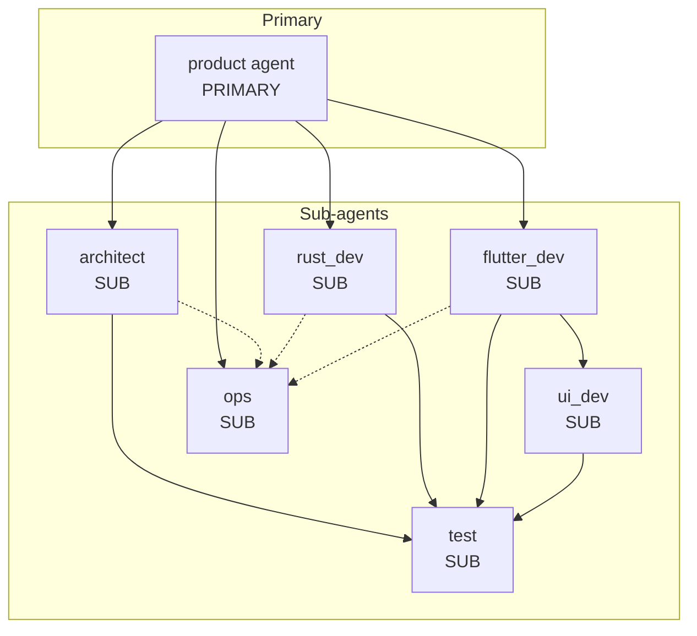
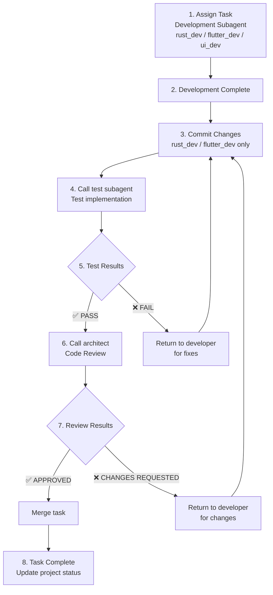
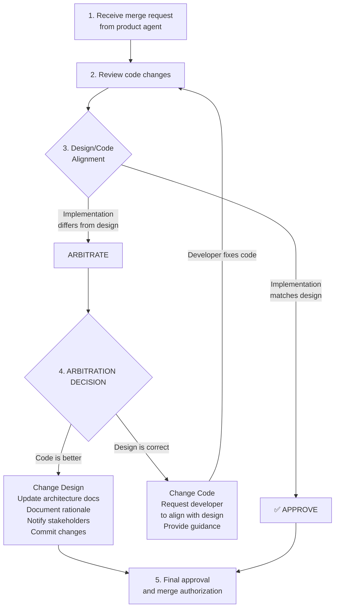
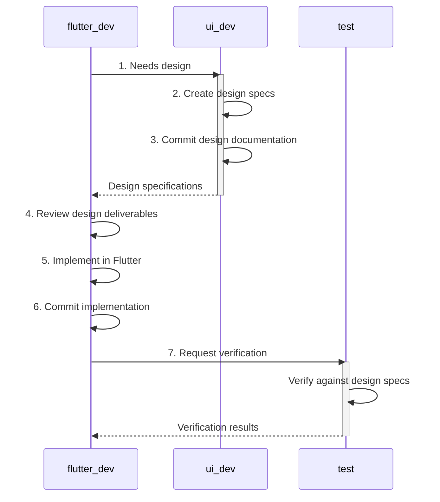

# Product Development Agent Team

## Overview

This document describes the product development agent team for Rust+Flutter stack projects. The team consists of 7 specialized agents working together to deliver high-quality software products.

## Agent Hierarchy



## Agent Roles and Responsibilities

### 1. Product Agent (Primary)
**Role**: Main orchestrator and project manager

**Responsibilities**:
- Requirements collection and verification
- Feasibility verification with architect
- Product Requirements Document (PRD) creation
- Architecture design coordination
- Development plan setup
- Task distribution and execution management
- Code review management
- Final product testing coordination
- Bug fix coordination
- Product delivery

**Git Workflow**: Uses `git-workflow` skill for version control operations

### 2. Architect Agent
**Role**: Software architect and technical decision maker

**Responsibilities**:
- Architecture design for Rust+Flutter stack
- Feasibility analysis
- Task decomposition and interface definition
- Code review and quality gate
- **Merge review** (FIRST reviewer during merge)
- **Design/Code arbitration** when implementation differs from design
- Conflict arbitration between teams

**Special Feature**:
- **Merge Review Process**: As the first reviewer, architect compares code with design
- **Arbitration Rules**:
  - CHANGE CODE when implementation violates principles
  - CHANGE DESIGN when code reveals better approach
- Must document arbitration decisions

**Git Workflow**: Commits design documentation changes with `git-workflow` skill

### 3. Rust Dev Agent
**Role**: Rust backend development

**Responsibilities**:
- Write idiomatic, safe Rust code
- Testing (unit, integration, doctests)
- Code quality (formatting, clippy, documentation)
- Debugging and bug fixing
- Code refactoring
- FFI integration with Flutter
- Cross-platform build support (iOS, Android, Desktop)

**Git Workflow Requirements**:
- **MUST commit before requesting testing**
- Only commit self-made changes
- Use Conventional Commits format
- Follow pre-test commit workflow:
  ```
  1. Complete implementation
  2. Run quality checks (cargo fmt, clippy, test)
  3. Stage only self-made changes
  4. Commit with descriptive message
  5. Call test agent for verification
  ```

**Commit Message Examples**:
```bash
git commit -m "feat(api): add user authentication endpoints"
git commit -m "fix(ffi): resolve memory leak in string conversion"
git commit -m "test(models): add unit tests for User entity"
```

### 4. Flutter Dev Agent
**Role**: Flutter frontend development

**Responsibilities**:
- UI implementation and cross-platform development
- State management and business logic
- Navigation and routing
- Testing (widget, unit, integration)
- Code quality and analysis
- Performance optimization
- FFI and Rust integration
- Localization and accessibility

**Git Workflow Requirements**:
- **MUST commit before requesting testing**
- Only commit self-made changes
- Use Conventional Commits format
- Follow pre-test commit workflow:
  ```
  1. Complete implementation
  2. Run quality checks (dart format, flutter analyze, flutter test)
  3. Stage only self-made changes
  4. Commit with descriptive message
  5. Call test agent for verification
  ```

**Collaboration with UI Dev Agent**:
- Call `ui_dev` agent before implementing new UI features without design specs
- Review design deliverables before implementation
- Request `ui_dev` agent review if visual discrepancies found

### 5. UI Dev Agent
**Role**: UI/UX design and design system creation

**Responsibilities**:
- Design system creation (colors, typography, spacing)
- Visual design specifications
- Design tokens management
- Component library design
- Accessibility and UX guidelines
- **Design documentation** (MUST write for every design task)
- Design-to-code handoff

**Design Documentation Requirements**:
- MUST write comprehensive design documentation
- Document structure:
  ```
  docs/design/
  ├── design-system.md
  ├── component-library.md
  ├── design-tokens.md
  ├── accessibility-guide.md
  ├── design-decisions.md
  └── [feature-name]/
      ├── overview.md
      ├── user-flows.md
      ├── screens.md
      └── interactions.md
  ```

**Git Workflow for Design**:
```bash
# Commit design tokens
git add docs/design/design-tokens.md lib/theme/
git commit -m "docs(design): add color and typography tokens"

# Commit component documentation
git add docs/design/component-library.md
git commit -m "docs(components): add button and input specifications"
```

### 6. Test Agent
**Role**: Black-box testing and quality assurance

**Responsibilities**:
- **Test case design** (black-box focus)
- **Test documentation** (MUST write test cases and results)
- Functional testing
- Integration testing (FFI)
- Cross-platform testing
- Negative testing
- Regression testing
- Bug reporting and verification

**Black-Box Testing Principles**:
- NEVER review source code when designing tests
- ALWAYS base tests on requirements and specifications
- FOCUS on what the system should do, not how it does it

**Test Documentation Requirements**:
- MUST write test case documents before execution
- MUST write test results documents after testing
- Document structure:
  ```
  docs/testing/
  ├── test-plans/
  ├── test-cases/
  ├── test-results/
  ├── defects/
  └── coverage/
  ```

**Git Workflow for Testing**:
```bash
# Commit test cases
git add docs/testing/test-cases/
git commit -m "test: add comprehensive test cases for checkout flow"

# Commit test results
git add docs/testing/test-results/
git commit -m "test: add test execution results for sprint 4"
```

### 7. Ops Agent
**Role**: Build, deployment, and DevOps

**Responsibilities**:
- Build script creation
- Package creation (iOS, Android, Web, Desktop)
- CI/CD pipeline setup
- Deployment scripts
- Infrastructure as Code (Docker, Kubernetes)
- Release management

**Git Workflow**:
- MUST commit all ops changes
- Use Conventional Commits with types: `ci`, `build`, `chore`, `feat`, `fix`

**Commit Examples**:
```bash
git commit -m "ci: add GitHub Actions workflow"
git commit -m "build: optimize Rust release build flags"
git commit -m "feat(deploy): add production deployment script"
```

## Collaboration Workflows

### Task Lifecycle



### Merge Review Process



### UI/Flutter Collaboration



### Design/Code Arbitration Rules

**When actual code differs from previous design:**

**CHANGE CODE when:**
- Implementation violates architectural principles
- Code introduces unnecessary complexity
- Implementation breaks established patterns without justification
- Security or performance requirements are compromised
- Code doesn't follow agreed interface contracts

**CHANGE DESIGN when:**
- Implementation reveals design flaws or impractical assumptions
- Code provides a better architectural approach
- Implementation is more efficient or maintainable
- Design was incomplete or missed critical edge cases
- Technical constraints were underestimated in design

## Git Workflow Integration

All agents use the `git-workflow` skill for:
- Conventional Commits
- Branch management
- Merge operations
- Commit message standards

### Common Commit Types

| Type | Description | Used By |
|------|-------------|---------|
| `feat` | New feature | rust_dev, flutter_dev |
| `fix` | Bug fix | rust_dev, flutter_dev |
| `docs` | Documentation | ui_dev, architect, test |
| `style` | Code style changes | rust_dev, flutter_dev |
| `refactor` | Code refactoring | rust_dev, flutter_dev |
| `perf` | Performance improvement | rust_dev, flutter_dev |
| `test` | Adding tests | rust_dev, flutter_dev, test |
| `chore` | Build/tooling changes | ops |
| `ci` | CI/CD changes | ops |
| `build` | Build system changes | ops |

### Branch Naming Conventions

- Feature branches: `feat/[feature-name]`
- Bug fixes: `fix/[bug-description]`
- Documentation: `docs/[documentation-topic]`

## Quality Gates

1. **Requirements Gate**: User-approved PRD
2. **Architecture Gate**: Architect-approved design
3. **Development Gate**: Task passes tests
4. **Review Gate**: Architect-approved code
5. **System Gate**: Final testing passes
6. **Delivery Gate**: User acceptance

## Getting Started

1. **Product Agent** starts by collecting requirements
2. **Architect** verifies feasibility and designs architecture
3. **Product Agent** coordinates task distribution
4. **UI Dev** creates design specifications (if needed)
5. **Flutter Dev / Rust Dev** implement features
6. **Test Agent** verifies functionality
7. **Architect** reviews and approves code
8. **Ops Agent** handles build and deployment

## Communication Guidelines

- **Product Agent** keeps user informed of major milestones
- **Product Agent** escalates blockers to user promptly
- **All agents** use `git-workflow` skill for git operations
- **Developers** commit before requesting testing
- **UI Dev** commits design documentation
- **Test Agent** commits test cases and results
- **Architect** commits design changes when arbitration changes design
- **Ops Agent** commits CI/CD and deployment configurations

---

## Related Documents

Agent configuration files (in `/agents/` directory):

- `/agents/product.md` - Product agent configuration (primary orchestrator)
- `/agents/architect.md` - Architect agent configuration (design & review)
- `/agents/rust_dev.md` - Rust development agent configuration (backend)
- `/agents/flutter_dev.md` - Flutter development agent configuration (frontend)
- `/agents/ui_dev.md` - UI/UX design agent configuration (design system)
- `/agents/test.md` - Testing agent configuration (QA)
- `/agents/ops.md` - Operations agent configuration (CI/CD & deployment)
