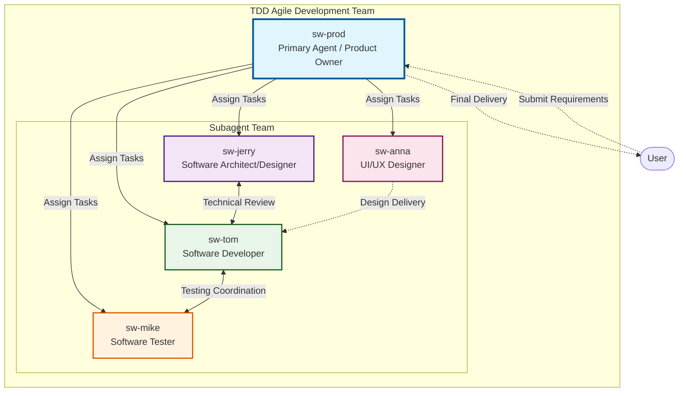
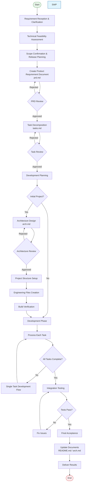
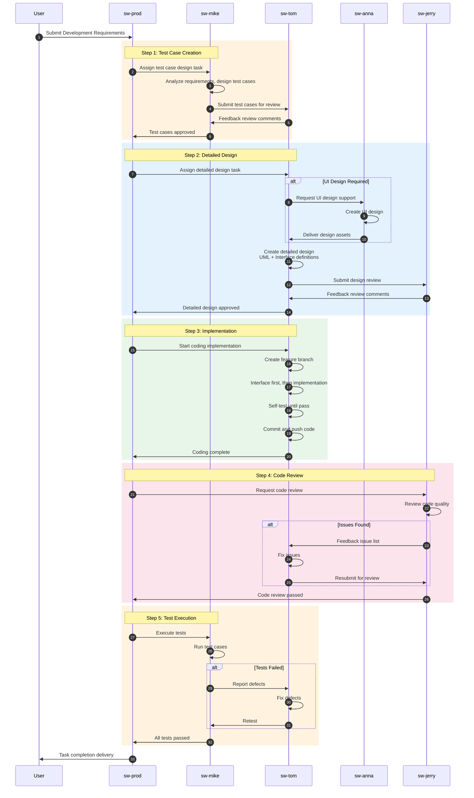
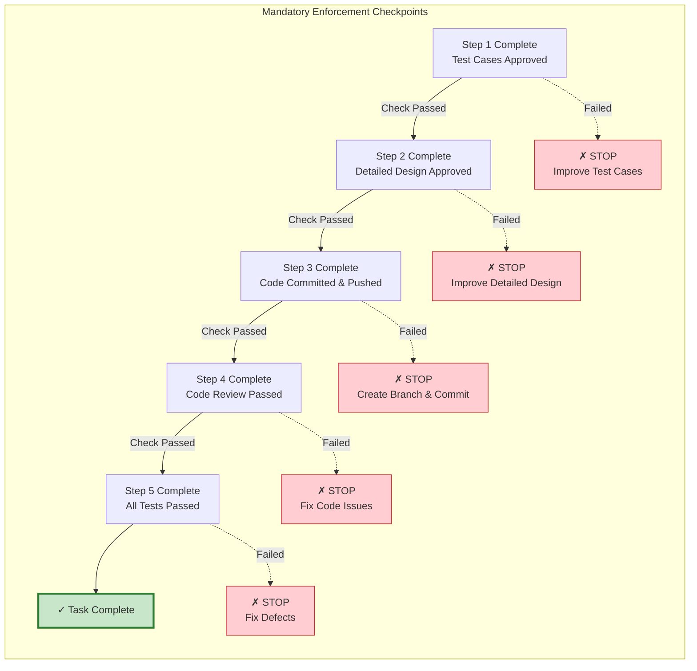
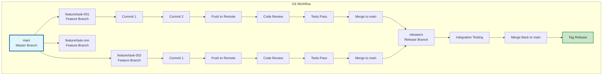
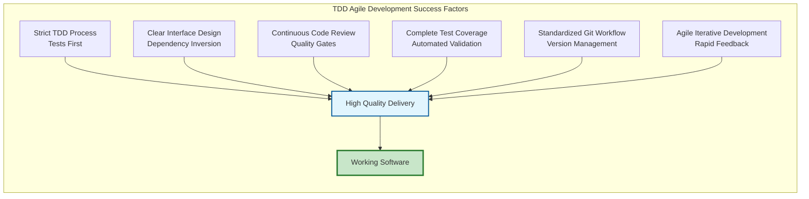

# TDD Agile Development Team Documentation

## 1. Team Composition

### 1.1 Team Architecture Overview


```mermaid
graph TB
    subgraph "TDD Agile Development Team"
        SWP["sw-prod<br/>Primary Agent / Product Owner"]
        
        subgraph "Subagent Team"
            SWJ["sw-jerry<br/>Software Architect/Designer"]
            SWT["sw-tom<br/>Software Developer"]
            SWM["sw-mike<br/>Software Tester"]
            SWA["sw-anna<br/>UI/UX Designer"]
        end
    end
    
    User([User]) -.->|Submit Requirements| SWP
    SWP -->|Assign Tasks| SWJ
    SWP -->|Assign Tasks| SWT
    SWP -->|Assign Tasks| SWM
    SWP -->|Assign Tasks| SWA
    
    SWJ <-->|Technical Review| SWT
    SWT <-->|Testing Coordination| SWM
    SWA -.->|Design Delivery| SWT
    
    SWP -.->|Final Delivery| User
    
    style SWP fill:#e1f5fe,stroke:#01579b,stroke-width:3px
    style SWJ fill:#f3e5f5,stroke:#4a148c,stroke-width:2px
    style SWT fill:#e8f5e9,stroke:#1b5e20,stroke-width:2px
    style SWM fill:#fff3e0,stroke:#e65100,stroke-width:2px
    style SWA fill:#fce4ec,stroke:#880e4f,stroke-width:2px
```

### 1.2 Role Responsibilities

| Agent | Role | Core Responsibilities | Mode |
|-------|------|----------------------|------|
| **sw-prod** | Product Owner / Primary | Requirement clarification, workflow control, final acceptance | Primary |
| **sw-jerry** | Software Architect/Designer | Architecture design, technical feasibility, task decomposition, code review | Subagent |
| **sw-tom** | Software Developer | Detailed design, coding, self-testing, architecture doc updates | Subagent |
| **sw-mike** | Software Tester | Test case design, test execution, quality assurance | Subagent |
| **sw-anna** | UI/UX Designer | Interface design, interaction design, Material Design style | Subagent |

---

## 2. Overall Workflow

### 2.1 Release-Level Workflow


```mermaid
flowchart TD
    Start([Start]) --> Req[Requirement Reception & Clarification]
    Req --> Feas[Technical Feasibility Assessment]
    Feas --> Scope[Scope Confirmation & Release Planning]
    Scope --> PRD[Create Product Requirement Document<br/>prd.md]
    PRD --> PRDReview{PRD Review}
    PRDReview -->|Rejected| PRD
    PRDReview -->|Approved| Tasks[Task Decomposition<br/>tasks.md]
    Tasks --> TaskReview{Task Review}
    TaskReview -->|Rejected| Tasks
    TaskReview -->|Approved| Plan[Development Planning]
    
    Plan --> CheckInitial{Initial Project?}
    CheckInitial -->|Yes| Arch[Architecture Design<br/>arch.md]
    CheckInitial -->|No| DevPhase[Development Phase]
    
    Arch --> ArchReview{Architecture Review}
    ArchReview -->|Rejected| Arch
    ArchReview -->|Approved| Setup[Project Structure Setup]
    Setup --> EngFiles[Engineering Files Creation]
    EngFiles --> BuildVerify[Build Verification]
    BuildVerify --> DevPhase
    
    DevPhase --> TaskLoop[Process Each Task]
    TaskLoop --> AllDone{All Tasks Complete?}
    AllDone -->|No| SingleTask[Single Task Development Flow]
    SingleTask --> TaskLoop
    
    AllDone -->|Yes| IntegTest[Integration Testing]
    IntegTest --> IntegPass{Tests Pass?}
    IntegPass -->|No| FixInteg[Fix Issues]
    FixInteg --> IntegTest
    IntegPass -->|Yes| Accept[Final Acceptance]
    Accept --> UpdateDocs[Update Documents<br/>README.md / arch.md]
    UpdateDocs --> Deliver[Deliver Results]
    Deliver --> End([End])
    
    style Start fill:#e8f5e9,stroke:#2e7d32
    style End fill:#ffebee,stroke:#c62828
    style SWP fill:#e1f5fe,stroke:#01579b
```

### 2.2 Phase Responsibilities

| Phase | Responsible Agent | Output | Key Checkpoints |
|-------|------------------|--------|-----------------|
| Requirement Clarification | sw-prod | Clarified requirements document | All details clear |
| Feasibility Assessment | sw-jerry | Feasibility report | Technical solution feasible |
| PRD Creation | sw-prod | `log/release_x/prd.md` | Approved by sw-jerry review |
| Task Decomposition | sw-jerry | `log/release_x/tasks.md` | Approved by sw-tom review |
| Architecture Design | sw-jerry | `arch.md` | Approved by sw-tom review |
| Project Setup | sw-jerry/sw-tom | Engineering files | Build verification passed by sw-mike |
| Development Execution | sw-prod coordination | Functional code | Follow TDD workflow |
| Integration Testing | sw-mike | Test report | All tests passed |
| Final Acceptance | sw-prod | `acceptance.md` | Meets PRD requirements |

---

## 3. Subtask Workflow (Strict TDD Process)

### 3.1 Single Task Development Flow


```mermaid
flowchart TD
    subgraph "Single Task Development Flow - Mandatory Sequential Execution"
        StartTask([Start Task]) --> Step1["Step 1: Test Case Creation<br/>Owner: sw-mike"]
        Step1 --> TestReview{sw-tom Review}
        TestReview -->|Rejected| Step1
        TestReview -->|Approved| Step2["Step 2: Detailed Design<br/>Owner: sw-tom"]
        
        Step2 --> DesignContent["Design Contents:"]
        DesignContent --> UML["UML Diagrams (Mermaid)"]
        UML --> Interface["Interface Definitions<br/>Follow DIP"]
        Interface --> UI["UI Design<br/>sw-anna support (when required)"]
        
        UI --> DesignReview{sw-jerry Review}
        DesignReview -->|Rejected| Step2
        DesignReview -->|Approved| Step3["Step 3: Implementation<br/>Owner: sw-tom"]
        
        Step3 --> GitBranch["Create Feature Branch<br/>feature/task-xxx"]
        GitBranch --> Implement["Implement per Design"]
        Implement --> SelfTest["Self-test Until Pass"]
        SelfTest --> Commit["Commit Code<br/>At least once per sub-task"]
        Commit --> Push["Push to Remote Repository"]
        
        Push --> Step4["Step 4: Code Review<br/>Owner: sw-jerry"]
        Step4 --> CodeReview{Review Result}
        CodeReview -->|Rejected| FixCode[Fix Issues] --> Push
        CodeReview -->|Approved| Step5["Step 5: Test Execution<br/>Owner: sw-mike"]
        
        Step5 --> RunTest["Execute Test Cases"]
        RunTest --> TestResult{Test Result}
        TestResult -->|Failed| FixBug[Fix Bugs] --> Push
        TestResult -->|Passed| Complete[Task Complete]
        
        Complete --> EndTask([End Task])
    end
    
    style StartTask fill:#e8f5e9,stroke:#2e7d32
    style EndTask fill:#ffebee,stroke:#c62828
    style Step1 fill:#fff3e0,stroke:#e65100
    style Step2 fill:#e3f2fd,stroke:#1565c0
    style Step3 fill:#e8f5e9,stroke:#2e7d32
    style Step4 fill:#fce4ec,stroke:#880e4f
    style Step5 fill:#fff3e0,stroke:#e65100
    style Complete fill:#e8f5e9,stroke:#1b5e20,stroke-width:3px
```

### 3.2 Task Collaboration Sequence Diagram


```mermaid
sequenceDiagram
    autonumber
    participant User as User
    participant Prod as sw-prod
    participant Mike as sw-mike
    participant Tom as sw-tom
    participant Anna as sw-anna
    participant Jerry as sw-jerry
    
    User->>Prod: Submit Development Requirements
    
    rect rgb(255, 243, 224)
        Note over Prod,Mike: Step 1: Test Case Creation
        Prod->>Mike: Assign test case design task
        Mike->>Mike: Analyze requirements, design test cases
        Mike->>Tom: Submit test cases for review
        Tom->>Mike: Feedback review comments
        Mike->>Prod: Test cases approved
    end
    
    rect rgb(227, 242, 253)
        Note over Prod,Tom: Step 2: Detailed Design
        Prod->>Tom: Assign detailed design task
        
        alt UI Design Required
            Tom->>Anna: Request UI design support
            Anna->>Anna: Create UI design
            Anna->>Tom: Deliver design assets
        end
        
        Tom->>Tom: Create detailed design<br/>UML + Interface definitions
        Tom->>Jerry: Submit design review
        Jerry->>Tom: Feedback review comments
        Tom->>Prod: Detailed design approved
    end
    
    rect rgb(232, 245, 233)
        Note over Prod,Tom: Step 3: Implementation
        Prod->>Tom: Start coding implementation
        Tom->>Tom: Create feature branch
        Tom->>Tom: Interface first, then implementation
        Tom->>Tom: Self-test until pass
        Tom->>Tom: Commit and push code
        Tom->>Prod: Coding complete
    end
    
    rect rgb(252, 228, 236)
        Note over Prod,Jerry: Step 4: Code Review
        Prod->>Jerry: Request code review
        Jerry->>Jerry: Review code quality
        
        alt Issues Found
            Jerry->>Tom: Feedback issue list
            Tom->>Tom: Fix issues
            Tom->>Jerry: Resubmit for review
        end
        
        Jerry->>Prod: Code review passed
    end
    
    rect rgb(255, 243, 224)
        Note over Prod,Mike: Step 5: Test Execution
        Prod->>Mike: Execute tests
        Mike->>Mike: Run test cases
        
        alt Tests Failed
            Mike->>Tom: Report defects
            Tom->>Tom: Fix defects
            Tom->>Mike: Retest
        end
        
        Mike->>Prod: All tests passed
    end
    
    Prod->>User: Task completion delivery
```

### 3.3 Workflow Enforcement Rules


```mermaid
flowchart LR
    subgraph "Mandatory Enforcement Checkpoints"
        A["Step 1 Complete<br/>Test Cases Approved"] -->|Check Passed| B["Step 2 Complete<br/>Detailed Design Approved"]
        B -->|Check Passed| C["Step 3 Complete<br/>Code Committed & Pushed"]
        C -->|Check Passed| D["Step 4 Complete<br/>Code Review Passed"]
        D -->|Check Passed| E["Step 5 Complete<br/>All Tests Passed"]
        E --> F["✓ Task Complete"]
        
        A -.->|Failed| Stop1["✗ STOP<br/>Improve Test Cases"]
        B -.->|Failed| Stop2["✗ STOP<br/>Improve Detailed Design"]
        C -.->|Failed| Stop3["✗ STOP<br/>Create Branch & Commit"]
        D -.->|Failed| Stop4["✗ STOP<br/>Fix Code Issues"]
        E -.->|Failed| Stop5["✗ STOP<br/>Fix Defects"]
    end
    
    style F fill:#c8e6c9,stroke:#2e7d32,stroke-width:3px
    style Stop1 fill:#ffcdd2,stroke:#c62828
    style Stop2 fill:#ffcdd2,stroke:#c62828
    style Stop3 fill:#ffcdd2,stroke:#c62828
    style Stop4 fill:#ffcdd2,stroke:#c62828
    style Stop5 fill:#ffcdd2,stroke:#c62828
```

---

## 4. Git Workflow Standards

### 4.1 Branch Strategy


```mermaid
flowchart TD
    subgraph "Git Workflow"
        Main["main<br/>Master Branch"]
        
        Main --> Feature1["feature/task-001<br/>Feature Branch"]
        Main --> Feature2["feature/task-002<br/>Feature Branch"]
        Main --> FeatureN["feature/task-nnn<br/>Feature Branch"]
        
        Feature1 --> Commit1["Commit 1"]
        Commit1 --> Commit2["Commit 2"]
        Commit2 --> Push1["Push to Remote"]
        Push1 --> Review1["Code Review"]
        Review1 --> Test1["Tests Pass"]
        Test1 --> Merge1["Merge to main"]
        
        Feature2 --> Commit3["Commit 1"]
        Commit3 --> Push2["Push to Remote"]
        Push2 --> Review2["Code Review"]
        Review2 --> Test2["Tests Pass"]
        Test2 --> Merge2["Merge to main"]
        
        Merge1 & Merge2 --> Release["release/x<br/>Release Branch"]
        Release --> IntegTest["Integration Testing"]
        IntegTest --> MergeMain["Merge Back to main"]
        MergeMain --> Tag["Tag Release"]
    end
    
    style Main fill:#e1f5fe,stroke:#01579b,stroke-width:3px
    style Tag fill:#c8e6c9,stroke:#2e7d32,stroke-width:2px
```

### 4.2 Git Mandatory Rules

| Rule | Description | Violation Consequence |
|------|-------------|----------------------|
| **Must Create Feature Branch** | Each task must create `feature/task-description` branch | Code review will be rejected |
| **Must Atomic Commit** | At least one commit per sub-task | Code review will be rejected |
| **Must Push Remote** | Must push to remote before code review | Code review will be rejected |
| **Must Pass Tests** | Must pass all tests before merging to main | Merge prohibited |
| **Main Branch Protection** | Can only merge via PR, no direct commits | Operation rejected |

---

## 5. Documentation Output Standards

### 5.1 Documentation Directory Structure

```
project/
├── arch.md                          # Architecture design document
├── README.md                        # Project README
├── log/
│   └── release_0/                   # Release log directory
│       ├── prd.md                   # Product requirements document
│       ├── tasks.md                 # Task decomposition document
│       ├── acceptance.md            # Acceptance report
│       ├── test/                    # Test related documents
│       │   ├── test_cases_task_001.md
│       │   ├── test_results_task_001.md
│       │   └── integration_test.md
│       ├── design/                  # Detailed design documents
│       │   └── design_task_001.md
│       ├── review/                  # Code review records
│       │   └── review_task_001.md
│       └── ui/                      # UI design documents
│           ├── design_spec.md
│           └── assets/
```

### 5.2 Document Language Standards

- **Consistent with user input**: If user inputs in Chinese, all documents in Chinese; if user inputs in English, all documents in English
- **Technical diagrams**: Use Mermaid syntax
- **API documentation**: Must include request/response examples

---

## 6. Technology Stack Preferences (Non-mandatory)

| Layer | Preferred Technology | Rationale |
|-------|---------------------|-----------|
| Backend/Embedded | Rust | Performance and safety |
| Frontend | Flutter | Cross-platform UI development |
| UI Style | Material Design | Light/dark theme support |
| Architecture | Frontend-Backend Separation | Scalability |
| Version Control | Git | main + feature branches |

> **Note**: sw-jerry should select the optimal technology stack based on specific project requirements and user preferences, documenting the rationale.

---

## 7. Key Success Factors


```mermaid
flowchart TD
    subgraph "TDD Agile Development Success Factors"
        direction TB
        
        A["Strict TDD Process<br/>Tests First"] --> Success["High Quality Delivery"]
        B["Clear Interface Design<br/>Dependency Inversion"] --> Success
        C["Continuous Code Review<br/>Quality Gates"] --> Success
        D["Complete Test Coverage<br/>Automated Validation"] --> Success
        E["Standardized Git Workflow<br/>Version Management"] --> Success
        F["Agile Iterative Development<br/>Rapid Feedback"] --> Success
        
        Success --> Goal["Working Software"]
    end
    
    style Success fill:#e1f5fe,stroke:#01579b,stroke-width:2px
    style Goal fill:#c8e6c9,stroke:#2e7d32,stroke-width:3px
```

---

## 8. Communication and Collaboration Principles

1. **Clear Requirements**: sw-prod must ensure all requirement details are clear and unambiguous
2. **Design First**: Interface definitions and detailed design must be completed before coding
3. **Test-Driven**: Test cases must be completed and reviewed before coding
4. **Continuous Integration**: Frequent commits to maintain a healthy codebase
5. **Quality Gates**: Each phase must pass review before entering the next phase
6. **User Confirmation**: Key milestones (PRD, task list) must obtain explicit user confirmation
