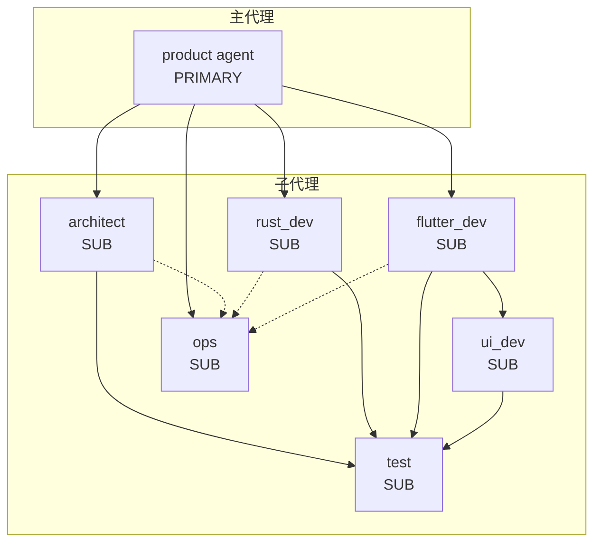
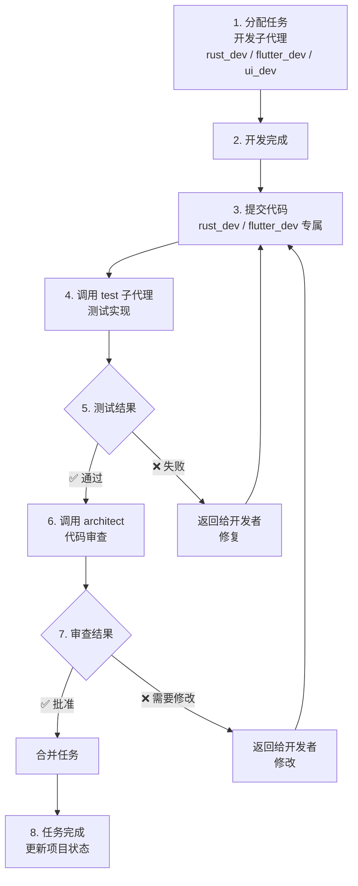
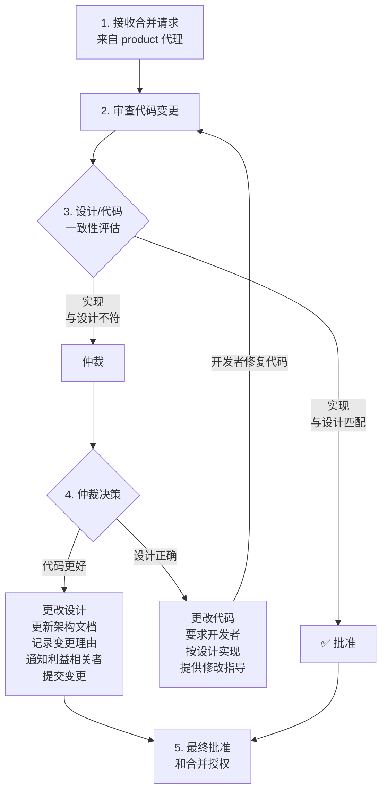
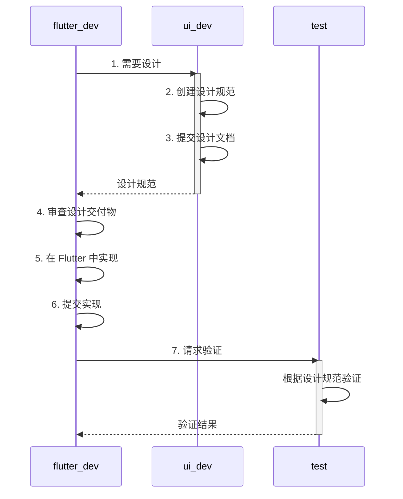

# 产品开发 Agent 团队

## 📝 概述

本文档描述了用于 Rust+Flutter 技术栈项目的产品开发代理团队。该团队由 7 个专业代理组成，协同工作以交付高质量的软件产品。

## 🏗️ 代理层级结构



## 👥 代理角色与职责

### 1. Product Agent（主代理）
**角色**: 主要协调者和项目经理

**职责**:
- 需求收集和验证
- 与架构师一起进行可行性验证
- 产品需求文档（PRD）创建
- 架构设计协调
- 开发计划制定
- 任务分配和执行管理
- 代码审查管理
- 最终产品测试协调
- 缺陷修复协调
- 产品交付

**Git 工作流**: 使用 `git-workflow` 技能进行版本控制操作

### 2. Architect Agent（架构师代理）
**角色**: 软件架构师和技术决策者

**职责**:
- Rust+Flutter 技术栈的架构设计
- 可行性分析
- 任务分解和接口定义
- 代码审查和质量把控
- **合并审查**（合并时的第一位审查者）
- **设计/代码仲裁**（当实现与设计不符时）
- 团队间冲突仲裁

**特殊功能**:
- **合并审查流程**: 作为第一位审查者，架构师将代码与设计进行比较
- **仲裁规则**:
  - **更改代码**（当设计正确时）
  - **更改设计**（当代码方案更好时）
- 必须记录仲裁决策

**Git 工作流**: 使用 `git-workflow` 技能提交设计文档变更

### 3. Rust Dev Agent（Rust 开发代理）
**角色**: Rust 后端开发

**职责**:
- 编写地道且安全的 Rust 代码
- 测试（单元测试、集成测试、文档测试）
- 代码质量（格式化、clippy、文档）
- 调试和缺陷修复
- 代码重构
- 与 Flutter 的 FFI 集成
- 跨平台开发

**Git 工作流要求**:
- **在请求测试之前必须提交代码**
- 只提交自己修改的变更
- 使用约定式提交格式
- 遵循提交前测试工作流：
  ```
  1. 完成实现
  2. 运行质量检查（cargo fmt、clippy、test）
  3. 仅暂存自己做的变更
  4. 使用描述性消息提交
  5. 调用测试代理进行验证
  ```

**提交消息示例**:
```bash
git commit -m "feat(api): add user authentication endpoints"
git commit -m "fix(ffi): resolve memory leak in string conversion"
git commit -m "test(models): add unit tests for User entity"
```

### 4. Flutter Dev Agent（Flutter 开发代理）
**角色**: Flutter 前端开发

**职责**:
- UI 实现和跨平台开发
- 状态管理和业务逻辑
- 导航和路由
- 测试（widget、单元、集成）
- 代码质量和分析
- 性能优化
- FFI 和 Rust 集成
- 本地化和无障碍访问

**Git 工作流要求**:
- **在请求测试之前必须提交代码**
- 只提交自己修改的变更
- 使用约定式提交格式
- 遵循提交前测试工作流：
  ```
  1. 完成实现
  2. 运行质量检查（dart format、flutter analyze、flutter test）
  3. 仅暂存自己做的变更
  4. 使用描述性消息提交
  5. 调用测试代理进行验证
  ```

**与 UI Dev Agent 的协作**:
- 在没有设计规范的情况下实现新 UI 功能之前调用 `ui_dev` 代理
- 实现前审查设计交付物
- 如果发现视觉差异，请求 `ui_dev` 代理审查

### 5. UI Dev Agent（UI/UX 开发代理）
**角色**: UI/UX 设计与设计系统构建

**职责**:
- 设计系统构建（色彩、排版、间距）
- 视觉设计规范
- 设计令牌管理
- 组件库设计
- 无障碍访问和 UX 规范
- **设计文档**（每个设计任务必须编写）
- 设计到代码的交接

**设计文档要求**:
- 必须编写全面的设计文档
- 文档结构：
  ```
  docs/design/
  ├── design-system.md
  ├── component-library.md
  ├── design-tokens.md
  ├── accessibility-guide.md
  ├── design-decisions.md
  └── [feature-name]/
      ├── overview.md
      ├── user-flows.md
      ├── screens.md
      └── interactions.md
  ```

**设计的 Git 工作流**:
```bash
# 提交设计令牌
git add docs/design/design-tokens.md lib/theme/
git commit -m "docs(design): add color and typography tokens"

# 提交组件文档
git add docs/design/component-library.md
git commit -m "docs(components): add button and input specifications"
```

### 6. Test Agent（测试代理）
**角色**: 黑盒测试和质量保证

**职责**:
- **测试用例设计**（黑盒测试重点）
- **测试文档**（必须编写测试用例和结果）
- 功能测试
- 集成测试（FFI）
- 跨平台测试
- 负面测试
- 回归测试
- 缺陷报告和验证

**黑盒测试原则**:
- 设计测试时**严禁**查看源代码
- 始终基于需求和规范进行测试
- 关注系统应该做什么，而不是怎么做

**测试文档要求**:
- 执行前必须编写测试用例文档
- 测试后必须编写测试结果文档
- 文档结构：
  ```
  docs/testing/
  ├── test-plans/
  ├── test-cases/
  ├── test-results/
  ├── defects/
  └── coverage/
  ```

**测试的 Git 工作流**:
```bash
# 提交测试用例
git add docs/testing/test-cases/
git commit -m "test: add comprehensive test cases for checkout flow"

# 提交测试结果
git add docs/testing/test-results/
git commit -m "test: add test execution results for sprint 4"
```

### 7. Ops Agent（运维代理）
**角色**: 构建、部署和 DevOps

**职责**:
- 构建脚本创建
- 打包创建（iOS、Android、Web、桌面端）
- CI/CD 流水线设置
- 部署脚本
- 基础设施即代码（Docker、Kubernetes）
- 发布管理

**Git 工作流**:
- 必须提交所有运维变更
- 使用约定式提交，类型包括：`ci`、`build`、`chore`、`feat`、`fix`

**提交示例**:
```bash
git commit -m "ci: add GitHub Actions workflow"
git commit -m "build: optimize Rust release build flags"
git commit -m "feat(deploy): add production deployment script"
```

## 🔄 协作工作流

### 📋 任务生命周期流程



### 🔍 合并审查流程



### UI/Flutter 开发协作流程



### 设计与代码分歧处理规则

**当实际代码与先前设计不符时：**

**更改代码的情况：**
- 实现违反架构原则
- 代码引入不必要的复杂性
- 实现无正当理由破坏既定模式
- 安全或性能要求受损
- 代码未遵循约定的接口契约

**更改设计的情况：**
- 实现揭示设计缺陷或不切实际的假设
- 代码提供更好的架构方案
- 实现更高效或可维护
- 设计不完整或遗漏关键边界情况
- 技术约束在设计中被低估

## 🌿 Git 工作流集成

所有代理使用 `git-workflow` 技能进行：
- 约定式提交
- 分支管理
- 合并操作
- 提交消息规范

### 常用提交类型

| 类型 | 描述 | 使用者 |
|------|------|--------|
| `feat` | 新功能 | rust_dev、flutter_dev |
| `fix` | 缺陷修复 | rust_dev、flutter_dev |
| `docs` | 文档 | ui_dev、architect、test |
| `style` | 代码风格变更 | rust_dev、flutter_dev |
| `refactor` | 代码重构 | rust_dev、flutter_dev |
| `perf` | 性能改进 | rust_dev、flutter_dev |
| `test` | 添加测试 | rust_dev、flutter_dev、test |
| `chore` | 构建/工具变更 | ops |
| `ci` | CI/CD 变更 | ops |
| `build` | 构建系统变更 | ops |

### 分支命名约定

- 功能分支：`feat/[feature-name]`
- 缺陷修复：`fix/[bug-description]`
- 文档：`docs/[documentation-topic]`

## 🚦 质量关卡

1. **需求评审关卡**: 用户批准的 PRD
2. **架构评审关卡**: 架构师批准的设计
3. **开发检查点**: 任务通过测试
4. **代码审查关卡**: 架构师批准的代码
5. **系统测试关卡**: 最终测试通过
6. **交付验收关卡**: 用户验收

## 🚀 开始使用

1. **Product Agent** 开始收集需求
2. **Architect** 验证可行性并设计架构
3. **Product Agent** 协调任务分配
4. **UI Dev** 创建设计规范（如需要）
5. **Flutter Dev / Rust Dev** 实现功能
6. **Test Agent** 验证功能
7. **Architect** 审查和批准代码
8. **Ops Agent** 处理构建和部署

## 沟通指南

- **Product Agent**：及时告知用户重大里程碑
- **Product Agent**：及时将阻碍因素上报给用户
- **所有代理**：使用 `git-workflow` 技能进行 git 操作
- **开发者**：在请求测试之前提交代码
- **UI Dev**：提交设计文档
- **Test Agent**：提交测试用例和结果
- **Architect**：当仲裁改变设计时提交设计变更
- **Ops Agent**：提交 CI/CD 和部署配置

---

## 相关文档

Agent 配置文件（位于 `/agents/` 目录）：

- `/agents/product.md` - Product 代理配置（主协调者）
- `/agents/architect.md` - Architect 代理配置（设计与审查）
- `/agents/rust_dev.md` - Rust 开发代理配置（后端）
- `/agents/flutter_dev.md` - Flutter 开发代理配置（前端）
- `/agents/ui_dev.md` - UI/UX 设计代理配置（设计系统）
- `/agents/test.md` - 测试代理配置（质量保证）
- `/agents/ops.md` - 运维代理配置（CI/CD 与部署）
