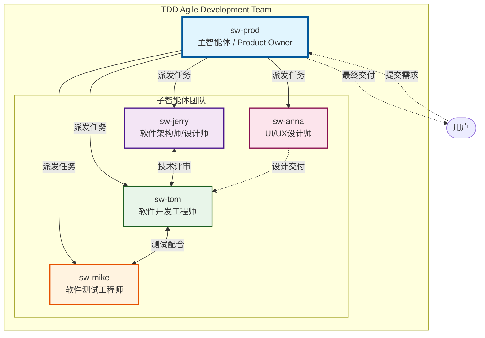
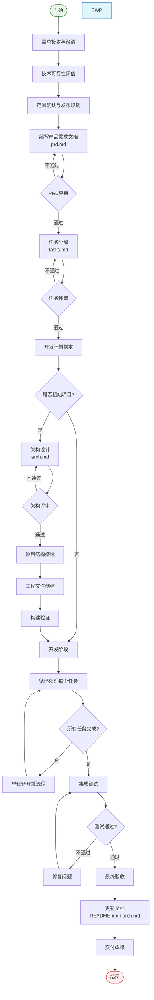
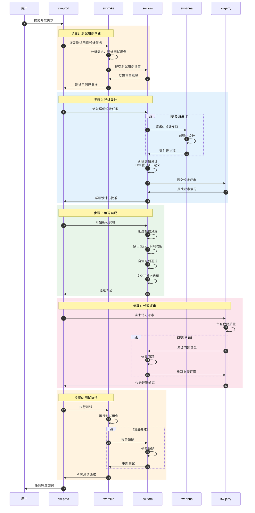
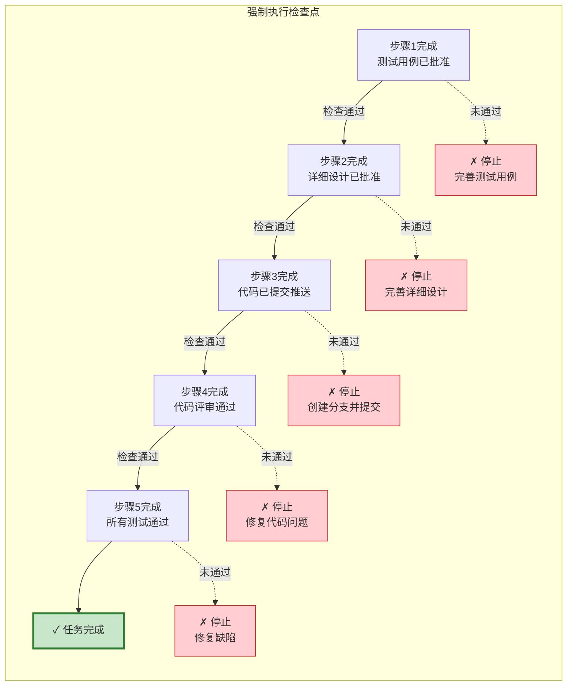
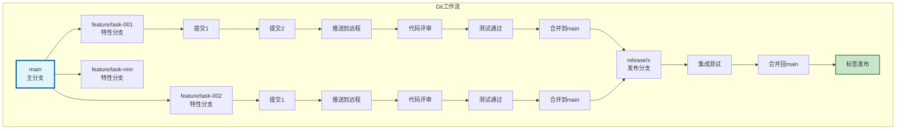
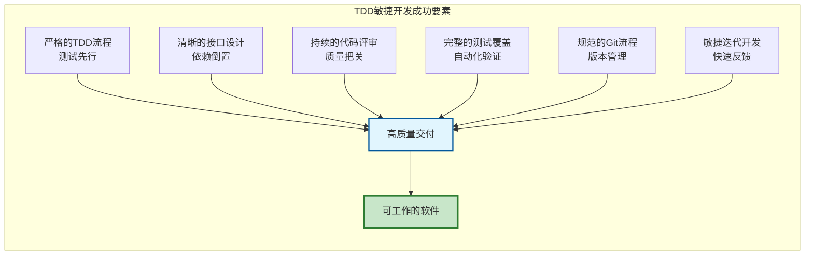

# TDD 敏捷开发团队说明

## 1. 团队组成

### 1.1 团队架构概览


```mermaid
graph TB
    subgraph "TDD Agile Development Team"
        SWP["sw-prod<br/>主智能体 / Product Owner"]
        
        subgraph "子智能体团队"
            SWJ["sw-jerry<br/>软件架构师/设计师"]
            SWT["sw-tom<br/>软件开发工程师"]
            SWM["sw-mike<br/>软件测试工程师"]
            SWA["sw-anna<br/>UI/UX设计师"]
        end
    end
    
    User([用户]) -.->|提交需求| SWP
    SWP -->|派发任务| SWJ
    SWP -->|派发任务| SWT
    SWP -->|派发任务| SWM
    SWP -->|派发任务| SWA
    
    SWJ <-->|技术评审| SWT
    SWT <-->|测试配合| SWM
    SWA -.->|设计交付| SWT
    
    SWP -.->|最终交付| User
    
    style SWP fill:#e1f5fe,stroke:#01579b,stroke-width:3px
    style SWJ fill:#f3e5f5,stroke:#4a148c,stroke-width:2px
    style SWT fill:#e8f5e9,stroke:#1b5e20,stroke-width:2px
    style SWM fill:#fff3e0,stroke:#e65100,stroke-width:2px
    style SWA fill:#fce4ec,stroke:#880e4f,stroke-width:2px
```

### 1.2 角色职责说明

| 智能体 | 角色 | 核心职责 | 智能体类型 |
|--------|------|----------|------------|
| **sw-prod** | Product Owner / 主智能体 | 需求澄清、工作流管控、最终验收 | 主智能体(Primary) |
| **sw-jerry** | 软件架构师/设计师 | 架构设计、技术可行性评估、任务分解、代码评审 | 子智能体(Subagent) |
| **sw-tom** | 软件开发工程师 | 详细设计、编码实现、自测、架构文档更新 | 子智能体(Subagent) |
| **sw-mike** | 软件测试工程师 | 测试用例设计、测试执行、质量保证 | 子智能体(Subagent) |
| **sw-anna** | UI/UX设计师 | 界面设计、交互设计、Material Design风格 | 子智能体(Subagent) |

---

## 2. 整体工作流

### 2.1 发布级工作流程


```mermaid
flowchart TD
    Start([开始]) --> Req[需求接收与澄清]
    Req --> Feas[技术可行性评估]
    Feas --> Scope[范围确认与发布规划]
    Scope --> PRD[编写产品需求文档<br/>prd.md]
    PRD --> PRDReview{PRD评审}
    PRDReview -->|不通过| PRD
    PRDReview -->|通过| Tasks[任务分解<br/>tasks.md]
    Tasks --> TaskReview{任务评审}
    TaskReview -->|不通过| Tasks
    TaskReview -->|通过| Plan[开发计划制定]
    
    Plan --> CheckInitial{是否初始项目?}
    CheckInitial -->|是| Arch[架构设计<br/>arch.md]
    CheckInitial -->|否| DevPhase[开发阶段]
    
    Arch --> ArchReview{架构评审}
    ArchReview -->|不通过| Arch
    ArchReview -->|通过| Setup[项目结构搭建]
    Setup --> EngFiles[工程文件创建]
    EngFiles --> BuildVerify[构建验证]
    BuildVerify --> DevPhase
    
    DevPhase --> TaskLoop[循环处理每个任务]
    TaskLoop --> AllDone{所有任务完成?}
    AllDone -->|否| SingleTask[单任务开发流程]
    SingleTask --> TaskLoop
    
    AllDone -->|是| IntegTest[集成测试]
    IntegTest --> IntegPass{测试通过?}
    IntegPass -->|不通过| FixInteg[修复问题]
    FixInteg --> IntegTest
    IntegPass -->|通过| Accept[最终验收]
    Accept --> UpdateDocs[更新文档<br/>README.md / arch.md]
    UpdateDocs --> Deliver[交付成果]
    Deliver --> End([结束])
    
    style Start fill:#e8f5e9,stroke:#2e7d32
    style End fill:#ffebee,stroke:#c62828
    style SWP fill:#e1f5fe,stroke:#01579b
```

### 2.2 各阶段责任人

| 阶段 | 负责智能体 | 输出物 | 关键检查点 |
|------|-----------|--------|------------|
| 需求澄清 | sw-prod | 澄清后需求文档 | 所有细节已明确 |
| 可行性评估 | sw-jerry | 可行性报告 | 技术方案可行 |
| PRD编写 | sw-prod | `log/release_x/prd.md` | sw-jerry评审通过 |
| 任务分解 | sw-jerry | `log/release_x/tasks.md` | sw-tom评审通过 |
| 架构设计 | sw-jerry | `arch.md` | sw-tom评审通过 |
| 项目搭建 | sw-jerry/sw-tom | 工程文件 | sw-mike构建验证通过 |
| 开发执行 | sw-prod协调 | 功能代码 | 遵循TDD流程 |
| 集成测试 | sw-mike | 测试报告 | 所有测试通过 |
| 最终验收 | sw-prod | `acceptance.md` | 符合PRD要求 |

---

## 3. 子任务工作流（TDD严格流程）

### 3.1 单任务开发流程


```mermaid
flowchart TD
    subgraph "单任务开发流程 - 强制顺序执行"
        StartTask([开始任务]) --> Step1["步骤1: 测试用例创建<br/>负责人: sw-mike"]
        Step1 --> TestReview{sw-tom评审}
        TestReview -->|不通过| Step1
        TestReview -->|通过| Step2["步骤2: 详细设计<br/>负责人: sw-tom"]
        
        Step2 --> DesignContent["设计内容:"]
        DesignContent --> UML["UML图(Mermaid)"]
        UML --> Interface["接口定义<br/>遵循依赖倒置原则"]
        Interface --> UI["UI设计<br/>sw-anna支持(如需要)"]
        
        UI --> DesignReview{sw-jerry评审}
        DesignReview -->|不通过| Step2
        DesignReview -->|通过| Step3["步骤3: 编码实现<br/>负责人: sw-tom"]
        
        Step3 --> GitBranch["创建特性分支<br/>feature/task-xxx"]
        GitBranch --> Implement["按设计实现"]
        Implement --> SelfTest["自测直到通过"]
        SelfTest --> Commit["提交代码<br/>每个子任务至少一次提交"]
        Commit --> Push["推送到远程仓库"]
        
        Push --> Step4["步骤4: 代码评审<br/>负责人: sw-jerry"]
        Step4 --> CodeReview{评审结果}
        CodeReview -->|不通过| FixCode[修复问题] --> Push
        CodeReview -->|通过| Step5["步骤5: 测试执行<br/>负责人: sw-mike"]
        
        Step5 --> RunTest["执行测试用例"]
        RunTest --> TestResult{测试结果}
        TestResult -->|不通过| FixBug[修复缺陷] --> Push
        TestResult -->|通过| Complete[任务完成]
        
        Complete --> EndTask([结束任务])
    end
    
    style StartTask fill:#e8f5e9,stroke:#2e7d32
    style EndTask fill:#ffebee,stroke:#c62828
    style Step1 fill:#fff3e0,stroke:#e65100
    style Step2 fill:#e3f2fd,stroke:#1565c0
    style Step3 fill:#e8f5e9,stroke:#2e7d32
    style Step4 fill:#fce4ec,stroke:#880e4f
    style Step5 fill:#fff3e0,stroke:#e65100
    style Complete fill:#e8f5e9,stroke:#1b5e20,stroke-width:3px
```

### 3.2 任务协作时序图


```mermaid
sequenceDiagram
    autonumber
    participant User as 用户
    participant Prod as sw-prod
    participant Mike as sw-mike
    participant Tom as sw-tom
    participant Anna as sw-anna
    participant Jerry as sw-jerry
    
    User->>Prod: 提交开发需求
    
    rect rgb(255, 243, 224)
        Note over Prod,Mike: 步骤1: 测试用例创建
        Prod->>Mike: 派发测试用例设计任务
        Mike->>Mike: 分析需求，设计测试用例
        Mike->>Tom: 提交测试用例评审
        Tom->>Mike: 反馈评审意见
        Mike->>Prod: 测试用例已批准
    end
    
    rect rgb(227, 242, 253)
        Note over Prod,Tom: 步骤2: 详细设计
        Prod->>Tom: 派发详细设计任务
        
        alt 需要UI设计
            Tom->>Anna: 请求UI设计支持
            Anna->>Anna: 创建UI设计
            Anna->>Tom: 交付设计稿
        end
        
        Tom->>Tom: 创建详细设计<br/>UML图+接口定义
        Tom->>Jerry: 提交设计评审
        Jerry->>Tom: 反馈评审意见
        Tom->>Prod: 详细设计已批准
    end
    
    rect rgb(232, 245, 233)
        Note over Prod,Tom: 步骤3: 编码实现
        Prod->>Tom: 开始编码实现
        Tom->>Tom: 创建特性分支
        Tom->>Tom: 接口先行，实现功能
        Tom->>Tom: 自测直到通过
        Tom->>Tom: 提交并推送代码
        Tom->>Prod: 编码完成
    end
    
    rect rgb(252, 228, 236)
        Note over Prod,Jerry: 步骤4: 代码评审
        Prod->>Jerry: 请求代码评审
        Jerry->>Jerry: 审查代码质量
        
        alt 发现问题
            Jerry->>Tom: 反馈问题清单
            Tom->>Tom: 修复问题
            Tom->>Jerry: 重新提交评审
        end
        
        Jerry->>Prod: 代码评审通过
    end
    
    rect rgb(255, 243, 224)
        Note over Prod,Mike: 步骤5: 测试执行
        Prod->>Mike: 执行测试
        Mike->>Mike: 运行测试用例
        
        alt 测试失败
            Mike->>Tom: 报告缺陷
            Tom->>Tom: 修复缺陷
            Tom->>Mike: 重新测试
        end
        
        Mike->>Prod: 所有测试通过
    end
    
    Prod->>User: 任务完成交付
```

### 3.3 工作流强制执行规则


```mermaid
flowchart LR
    subgraph "强制执行检查点"
        A["步骤1完成<br/>测试用例已批准"] -->|检查通过| B["步骤2完成<br/>详细设计已批准"]
        B -->|检查通过| C["步骤3完成<br/>代码已提交推送"]
        C -->|检查通过| D["步骤4完成<br/>代码评审通过"]
        D -->|检查通过| E["步骤5完成<br/>所有测试通过"]
        E --> F["✓ 任务完成"]
        
        A -.->|未通过| Stop1["✗ 停止<br/>完善测试用例"]
        B -.->|未通过| Stop2["✗ 停止<br/>完善详细设计"]
        C -.->|未通过| Stop3["✗ 停止<br/>创建分支并提交"]
        D -.->|未通过| Stop4["✗ 停止<br/>修复代码问题"]
        E -.->|未通过| Stop5["✗ 停止<br/>修复缺陷"]
    end
    
    style F fill:#c8e6c9,stroke:#2e7d32,stroke-width:3px
    style Stop1 fill:#ffcdd2,stroke:#c62828
    style Stop2 fill:#ffcdd2,stroke:#c62828
    style Stop3 fill:#ffcdd2,stroke:#c62828
    style Stop4 fill:#ffcdd2,stroke:#c62828
    style Stop5 fill:#ffcdd2,stroke:#c62828
```

---

## 4. Git工作流规范

### 4.1 分支策略


```mermaid
flowchart TD
    subgraph "Git工作流"
        Main["main<br/>主分支"]
        
        Main --> Feature1["feature/task-001<br/>特性分支"]
        Main --> Feature2["feature/task-002<br/>特性分支"]
        Main --> FeatureN["feature/task-nnn<br/>特性分支"]
        
        Feature1 --> Commit1["提交1"]
        Commit1 --> Commit2["提交2"]
        Commit2 --> Push1["推送到远程"]
        Push1 --> Review1["代码评审"]
        Review1 --> Test1["测试通过"]
        Test1 --> Merge1["合并到main"]
        
        Feature2 --> Commit3["提交1"]
        Commit3 --> Push2["推送到远程"]
        Push2 --> Review2["代码评审"]
        Review2 --> Test2["测试通过"]
        Test2 --> Merge2["合并到main"]
        
        Merge1 & Merge2 --> Release["release/x<br/>发布分支"]
        Release --> IntegTest["集成测试"]
        IntegTest --> MergeMain["合并回main"]
        MergeMain --> Tag["标签发布"]
    end
    
    style Main fill:#e1f5fe,stroke:#01579b,stroke-width:3px
    style Tag fill:#c8e6c9,stroke:#2e7d32,stroke-width:2px
```

### 4.2 Git强制规则

| 规则 | 说明 | 违反后果 |
|------|------|----------|
| **必须创建特性分支** | 每个任务必须创建 `feature/task-description` 分支 | 代码评审将被拒绝 |
| **必须原子提交** | 每个子任务至少提交一次 | 代码评审将被拒绝 |
| **必须推送远程** | 代码评审前必须推送到远程仓库 | 代码评审将被拒绝 |
| **必须通过测试** | 合并到main前必须通过所有测试 | 禁止合并 |
| **main分支保护** | 只能通过PR合并，不能直接提交 | 操作被拒绝 |

---

## 5. 文档输出规范

### 5.1 文档目录结构

```
project/
├── arch.md                          # 架构设计文档
├── README.md                        # 项目说明文档
├── log/
│   └── release_0/                   # 发布日志目录
│       ├── prd.md                   # 产品需求文档
│       ├── tasks.md                 # 任务分解文档
│       ├── acceptance.md            # 验收报告
│       ├── test/                    # 测试相关文档
│       │   ├── test_cases_task_001.md
│       │   ├── test_results_task_001.md
│       │   └── integration_test.md
│       ├── design/                  # 详细设计文档
│       │   └── design_task_001.md
│       ├── review/                  # 代码评审记录
│       │   └── review_task_001.md
│       └── ui/                      # UI设计文档
│           ├── design_spec.md
│           └── assets/
```

### 5.2 文档语言规范

- **与用户输入语言一致**：用户用中文输入，所有文档使用中文；用户用英文输入，所有文档使用英文
- **技术图表**：使用 Mermaid 语法绘制
- **API文档**：必须包含请求/响应示例

---

## 6. 技术栈偏好（非强制）

| 层级 | 首选技术 | 说明 |
|------|----------|------|
| 后端/嵌入式 | Rust | 性能和安全优先 |
| 前端 | Flutter | 跨平台UI开发 |
| UI风格 | Material Design | 支持亮色/暗色主题 |
| 架构 | 前后端分离 | 可扩展性考虑 |
| 版本控制 | Git | main + 特性分支 |

> **注意**：sw-jerry应根据具体项目需求和用户偏好选择最优技术栈，并记录选型理由。

---

## 7. 关键成功因素


```mermaid
flowchart TD
    subgraph "TDD敏捷开发成功要素"
        direction TB
        
        A["严格的TDD流程<br/>测试先行"] --> Success["高质量交付"]
        B["清晰的接口设计<br/>依赖倒置"] --> Success
        C["持续的代码评审<br/>质量把关"] --> Success
        D["完整的测试覆盖<br/>自动化验证"] --> Success
        E["规范的Git流程<br/>版本管理"] --> Success
        F["敏捷迭代开发<br/>快速反馈"] --> Success
        
        Success --> Goal["可工作的软件"]
    end
    
    style Success fill:#e1f5fe,stroke:#01579b,stroke-width:2px
    style Goal fill:#c8e6c9,stroke:#2e7d32,stroke-width:3px
```

---

## 8. 沟通协作原则

1. **需求明确化**：sw-prod 必须确保所有需求细节清晰无歧义
2. **设计先行**：编码前必须完成接口定义和详细设计
3. **测试驱动**：测试用例必须在编码前完成并评审通过
4. **持续集成**：频繁提交，保持代码库健康
5. **质量门禁**：每个阶段必须通过评审才能进入下一阶段
6. **用户确认**：关键里程碑（PRD、任务列表）必须获得用户明确确认
