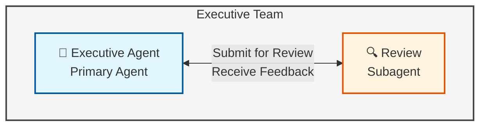
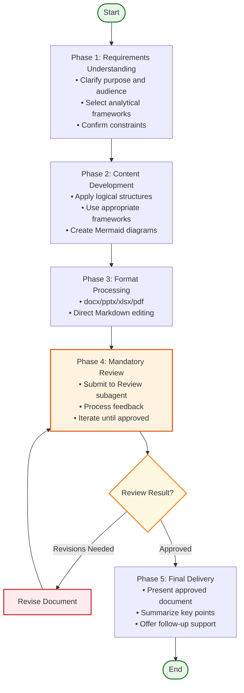
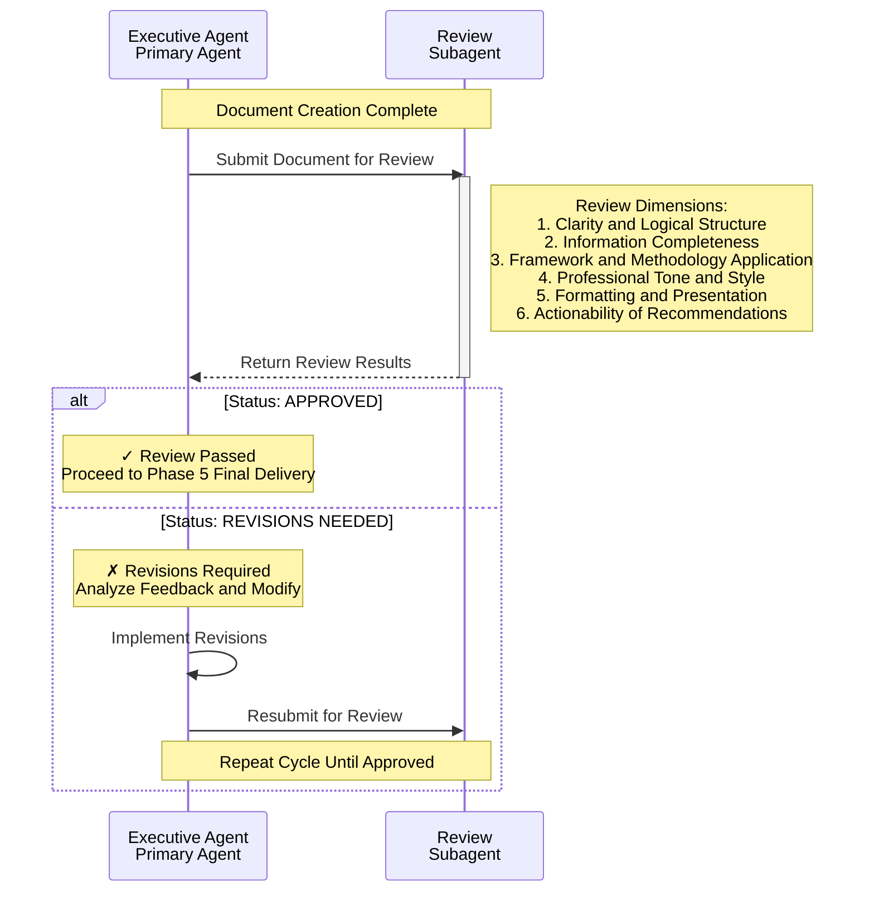
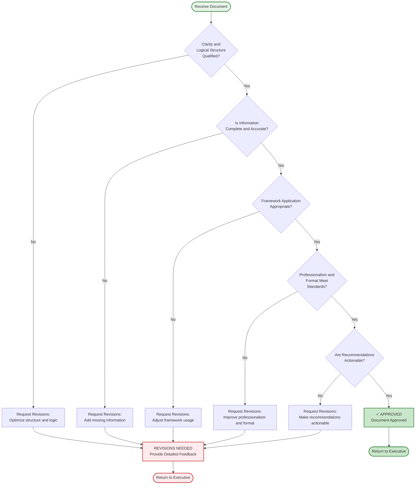
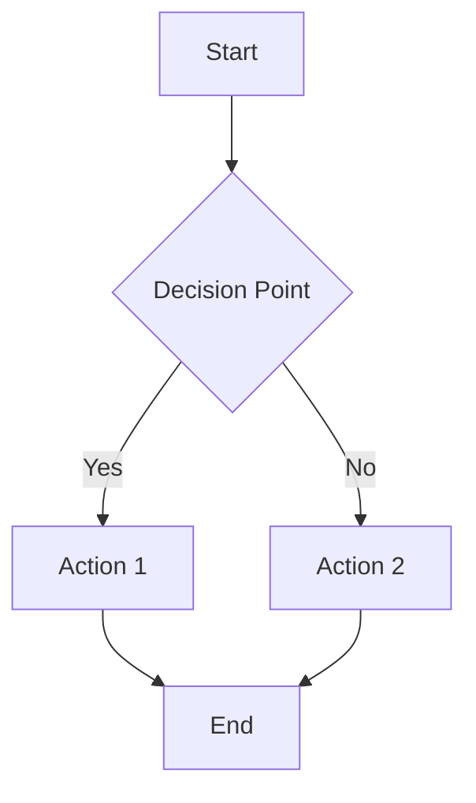
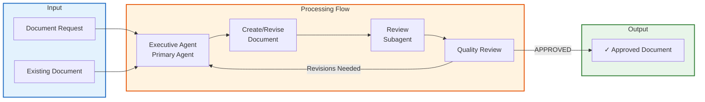

# Executive Team

## Overview

The Executive Team is the core team responsible for document creation and quality assurance. The team employs a rigorous **two-stage review process** to ensure every document meets professional standards.

## Team Composition

The Executive Team consists of the following roles, forming a **primary-subagent collaboration model**:

| Role | Type | Responsibilities |
|------|------|------------------|
| **Executive Agent** | Primary Agent | Document creation, format processing, framework application, submission for review |
| **Review** | Subagent | Quality review, feedback provision, approve/reject decisions |

### Role Relationship

## Getting Started

### How to Request a Document

Submit your request with the following information:

| Information | Description | Example |
|-------------|-------------|---------|
| **Document Type** | What kind of document you need | "Strategic Plan" |
| **Purpose** | Why you need this document | "Board presentation for Q1 planning" |
| **Audience** | Who will read it | "C-level executives" |
| **Format** | Output format | "PowerPoint (.pptx)" |
| **Framework** | Preferred structure (optional) | "Five Views & Three Certainties" |
| **Constraints** | Special requirements | "Maximum 15 slides" |

### What to Expect

1. **Initial Response**: Executive Agent confirms requirements
2. **First Draft**: Document created following the 5-phase workflow
3. **Review Cycle**: Review subagent evaluates quality (may require revisions)
4. **Final Delivery**: Approved document delivered with summary

### Example Request

> "Create a quarterly business review presentation (PPT) for our executive team covering Q3 performance. Use the STAR framework for key initiatives. Keep it under 20 slides."

## Core Principles

The Executive Team adheres to the following principles:

1. **McKinsey-Style Writing**: Structured, pyramid principle, data-driven
2. **MECE Principle**: Mutually Exclusive, Collectively Exhaustive categorization
3. **Mandatory Review Cycle**: Every document must undergo review and approval
4. **Evidence-First**: Conclusions must be supported by facts

## Overall Workflow

The Executive Team's complete workflow follows a **5-phase document development process** that incorporates iterative quality control:

### Phase Details

#### Phase 1: Requirements Understanding
- **Objective**: Ensure correct document direction
- **Key Activities**:
  - Clarify document purpose, audience, and key messages
  - Identify appropriate format and structure
  - Select relevant analytical frameworks
  - Confirm specific constraints or preferences

#### Phase 2: Content Development
- **Objective**: Create high-quality content
- **Key Activities**:
  - Apply McKinsey-style structure
  - Use appropriate frameworks and logical structures
  - Include Mermaid diagrams for visualization
  - Ensure MECE principle in categorization

#### Phase 3: Format Processing
- **Objective**: Ensure professional presentation
- **Key Activities**:
  - Word documents (.docx): Use `skill({name: "docx"})`
  - PowerPoint (.pptx): Use `skill({name: "pptx"})`
  - Excel (.xlsx): Use `skill({name: "xlsx"})`
  - PDF: Use `skill({name: "pdf"})`
  - Other formats: Direct file operations

#### Phase 4: Mandatory Review (Core Phase)
- **Objective**: Ensure quality standards
- **Key Activities**:
  - **Submit for Review**: Call Review subagent after each draft completion
  - **Process Feedback**: Decide next steps based on review results
  - **Iteration Loop**: Resubmit after revision if needed

#### Phase 5: Final Delivery
- **Objective**: Complete and present the document
- **Key Activities**:
  - Present the approved document
  - Summarize key points and recommendations
  - Provide follow-up support

## Subtask Workflow: Review Process

The review process is the core quality assurance mechanism of the Executive Team, employing a **mandatory review cycle**:

### Review Checklist

The Review subagent evaluates documents across the following dimensions with specific criteria:

| Review Dimension | Evaluation Content | Specific Criteria |
|-----------------|-------------------|-------------------|
| **Clarity** | Is the structure clear? Is the logic smooth? | • Clear heading hierarchy (H1→H2→H3) • Each paragraph has one main idea • Logical transitions between sections • Conclusion stated upfront |
| **Completeness** | Is the information complete? Are necessary elements missing? | • All sections from requirements addressed • Examples provided where needed • Context sufficient for target audience • No critical information gaps |
| **Framework Application** | Are analytical frameworks used appropriately? | • Framework choice matches content type • Framework applied consistently • Framework adds value, not just decoration |
| **Professional Style** | Is the tone and style professional and consistent? | • Appropriate formality for audience • Consistent terminology throughout • No unnecessary jargon or filler • Active voice where appropriate |
| **Format Presentation** | Is the format correct? Is the visual presentation professional? | • Tables aligned and formatted • Code blocks syntax-highlighted • Consistent use of bold/italics • Visual elements support text |
| **Actionability** | Are recommendations specific and feasible? | • Clear next steps identified • Recommendations are specific • Resource requirements stated • Timeline or priority indicated |

### Review Decision Rules

## Document Types Supported

The Executive Team supports the creation and revision of the following document types:

### Communication
- **Emails**: Professional correspondence, announcements, requests
- **Meeting Minutes**: Structured records of discussions and decisions
- **Memos**: Internal communications and policy updates

### Planning & Strategy
- **Strategic Plans**: Long-term direction using Five Views & Three Certainties framework
- **Project Plans**: Scope, timeline, resources, risks
- **Annual Plans**: Yearly objectives and key results
- **Work Plans**: Quarterly/monthly operational plans

### Analysis & Reports
- **Business Analysis**: Market research, competitive analysis, feasibility studies
- **Review Reports**: Post-project retrospectives
- **Research Reports**: Data-driven insights and recommendations

### Technical Documentation
- **Design Documents**: Architecture, system design, API specifications
- **Test Documentation**: Test plans, test cases, test reports
- **User Guides**: Instructions and tutorials
- **API Documentation**: Technical references

### Presentations
- **Executive Presentations**: Board decks, investor updates
- **Project Presentations**: Kickoffs, status updates, retrospectives
- **Training Materials**: Educational content and workshops

## Analytical Framework Toolkit

The Executive Team is proficient in the following analytical frameworks:

### Logical Structures
| Framework | Description |
|-----------|-------------|
| **STAR** | Situation, Task, Action, Result |
| **SQCA** | Situation, Question, Complication, Answer |
| **Why-What-How** | Purpose, Content, Method |
| **5W2H** | What, Why, Who, When, Where, How, How much |

### Business Analysis Tools
| Framework | Description |
|-----------|-------------|
| **Five Views & Three Certainties** | Market, Industry, Competition, Self, Opportunity / Strategy, Tactics, Capability |
| **SWOT** | Strengths, Weaknesses, Opportunities, Threats |
| **PEST** | Political, Economic, Social, Technological |
| **Porter's Five Forces** | Competitive rivalry, Supplier power, Buyer power, Threat of substitution, Threat of new entry |
| **BCG Matrix** | Stars, Cash Cows, Question Marks, Dogs |
| **Business Model Canvas** | Nine building blocks for business model innovation |

### Management Principles
| Framework | Description |
|-----------|-------------|
| **SMART** | Specific, Measurable, Achievable, Relevant, Time-bound |
| **MECE** | Mutually Exclusive, Collectively Exhaustive |
| **PDCA** | Plan, Do, Check, Act |

### Framework Selection Guide

Choose the right framework based on your document type and purpose:

| Document Type | Recommended Framework | Why This Framework |
|---------------|----------------------|-------------------|
| **Project Retrospective** | STAR | Captures context, actions, and outcomes clearly |
| **Problem-Solving Report** | SQCA | Structures problem analysis and solution presentation |
| **Strategic Plan** | Five Views & Three Certainties | Comprehensive market and capability analysis |
| **Business Case** | SWOT | Balanced internal/external factor analysis |
| **Market Analysis** | PEST | Systematic environmental scan |
| **Competitive Analysis** | Porter's Five Forces | Industry structure evaluation |
| **Product Portfolio** | BCG Matrix | Strategic positioning of products/business units |
| **New Initiative** | Business Model Canvas | Holistic business model design |
| **Goal Setting** | SMART | Clear, actionable objective definition |
| **Process Improvement** | PDCA | Iterative improvement methodology |
| **Documentation Structure** | Why-What-How | Clear information architecture |
| **Requirements Gathering** | 5W2H | Comprehensive coverage of all aspects |
| **Communication** | MECE | Organized, non-overlapping categories |

## Mermaid Diagram Usage Guidelines

The Executive Team uses Mermaid diagrams in Markdown for visualization:

### Applicable Scenarios
- **Flowcharts**: Workflows, decision trees
- **Sequence Diagrams**: Interaction processes, temporal relationships
- **Timeline Diagrams**: Roadmaps, schedules
- **Organizational Charts**: Structures, relationship maps

### Example

## Quality Standards

Every document must meet the following standards:

1. **Clarity**: Clear purpose, structure, and easily understandable information
2. **Accuracy**: Factually correct, properly sourced
3. **Conciseness**: No redundant words or filler content
4. **Completeness**: All necessary information included
5. **Consistency**: Uniform style, terminology, and formatting
6. **Actionability**: Clear next steps or recommendations
7. **Professionalism**: Appropriate tone and presentation

## Workflow Summary

---

**Note**: The Executive Team's workflow ensures that every document undergoes strict quality control, delivering high-quality results to professional standards.
