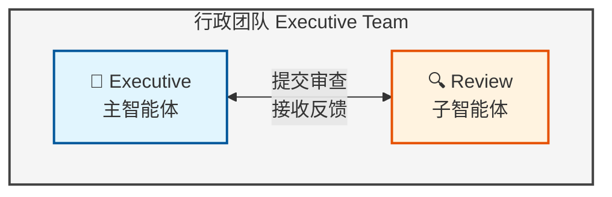
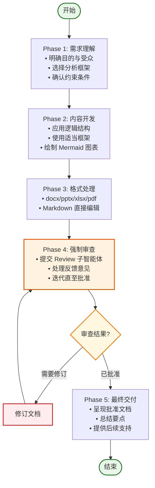
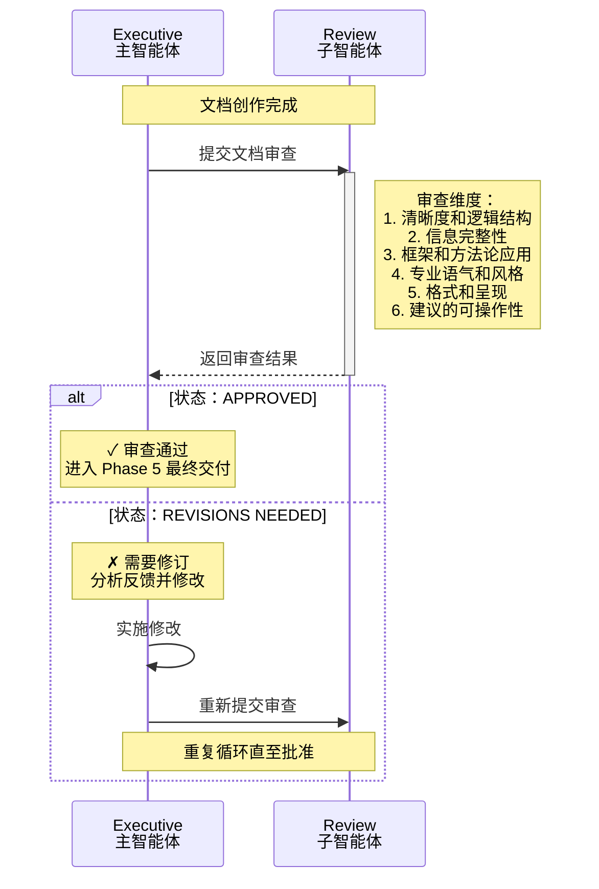
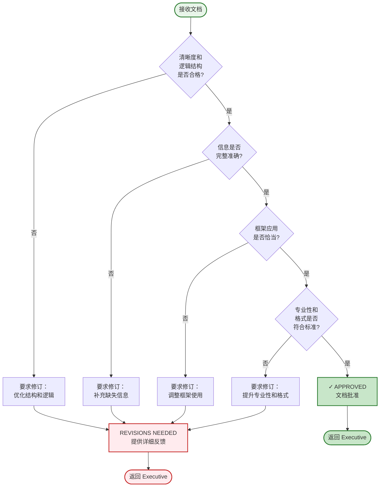
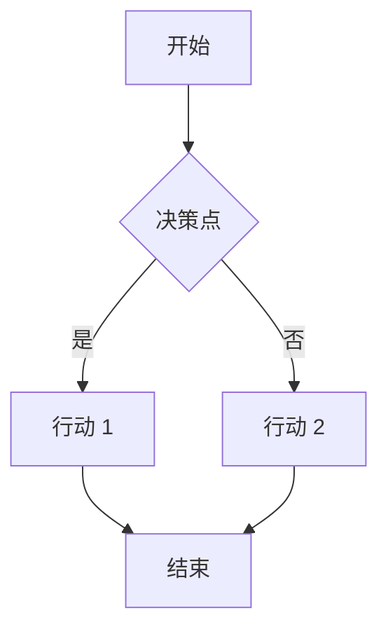
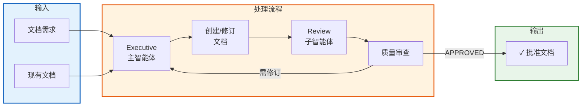

# 行政团队 (Executive Team)

## 概述

行政团队是负责文档创作与质量保障的核心团队。团队采用严格的**双阶段审查流程**，确保每一份文档都符合专业标准。

## 团队组成

行政团队由以下角色构成，形成**主-子智能体协作模式**：

| 角色 | 类型 | 职责 |
|------|------|------|
| **Executive** | 主智能体 | 文档创作、格式处理、框架应用、提交审查 |
| **Review** | 子智能体 | 质量审查、反馈提供、批准/驳回决策 |

### 角色关系

## 核心原则

行政团队遵循以下原则：

1. **McKinsey 风格写作**：结构化、金字塔原理、数据驱动
2. **MECE 原则**：分类相互独立、完全穷尽
3. **强制审查循环**：每份文档必须经过审查批准
4. **证据优先**：结论必须有事实支撑

## 整体工作流

行政团队的完整工作流程遵循 **PDCA 循环**（Plan-Do-Check-Act）：

### 阶段详解

#### Phase 1: 需求理解
- **目标**：确保文档方向正确
- **关键活动**：
  - 澄清文档目的、受众和关键信息
  - 识别适当格式和结构
  - 选择相关分析框架
  - 确认特定约束或偏好

#### Phase 2: 内容开发
- **目标**：创作高质量内容
- **关键活动**：
  - 应用 McKinsey 风格结构
  - 使用适当的框架和逻辑结构
  - 包含 Mermaid 图表进行可视化
  - 确保 MECE 原则在分类中的应用

#### Phase 3: 格式处理
- **目标**：确保专业呈现
- **关键活动**：
  - Word 文档 (.docx)：使用 `skill({name: "docx"})`
  - PowerPoint (.pptx)：使用 `skill({name: "pptx"})`
  - Excel (.xlsx)：使用 `skill({name: "xlsx"})`
  - PDF：使用 `skill({name: "pdf"})`
  - 其他格式：直接文件操作

#### Phase 4: 强制审查（核心环节）
- **目标**：确保质量标准
- **关键活动**：
  - **提交审查**：每次草稿完成后调用 Review 子智能体
  - **处理反馈**：根据审查结果决定下一步
  - **迭代循环**：如有需要，修订后重新提交

#### Phase 5: 最终交付
- **目标**：完成并呈现文档
- **关键活动**：
  - 呈现经批准的文档
  - 总结关键点和建议
  - 提供后续支持

## 子任务工作流：审查流程

审查流程是行政团队的核心质量保证机制，采用**强制审查循环**：

### 审查检查清单

Review 子智能体按照以下维度进行评估：

| 审查维度 | 评估内容 |
|----------|----------|
| **清晰度** | 结构是否清晰、逻辑是否流畅 |
| **完整性** | 信息是否完整、必要内容是否缺失 |
| **框架应用** | 分析框架使用是否恰当 |
| **专业风格** | 语气和风格是否专业一致 |
| **格式呈现** | 格式是否正确、视觉呈现是否专业 |
| **可操作性** | 建议是否具体可行 |

### 审查决策规则

## 文档类型支持

行政团队支持创建和修订以下类型的文档：

### 沟通类
- **电子邮件**：专业通信、公告、请求
- **会议纪要**：讨论和决策的结构化记录
- **备忘录**：内部通信和政策更新

### 规划与战略类
- **战略规划**：使用"五看三定"的长期方向
- **项目计划**：范围、时间线、资源、风险
- **年度计划**：年度目标和关键结果
- **工作计划**：季度/月度运营计划

### 分析与报告类
- **商业分析**：市场研究、竞争分析、可行性研究
- **评审报告**：项目后回顾
- **研究报告**：数据驱动的洞察和建议

### 技术文档类
- **设计文档**：架构、系统设计、API 规范
- **测试文档**：测试计划、测试用例、测试报告
- **用户指南**：说明和教程
- **API 文档**：技术参考

### 演示类
- **高管演示**：董事会报告、投资者更新
- **项目演示**：启动会、状态更新、回顾
- **培训材料**：教育内容和研讨会

## 分析框架工具箱

行政团队熟练运用以下分析框架：

### 逻辑结构
| 框架 | 说明 |
|------|------|
| **STAR** | 情境、任务、行动、结果 |
| **SQCA** | 情境、问题、复杂性、答案 |
| **Why-What-How** | 目的、内容、方法 |
| **5W2H** | 什么、为什么、谁、何时、何地、如何、多少 |

### 商业分析工具
| 框架 | 说明 |
|------|------|
| **五看三定** | 市场、行业、竞争、自身、机会 / 战略、战术、能力 |
| **SWOT** | 优势、劣势、机会、威胁 |
| **PEST** | 政治、经济、社会、技术 |
| **波特五力** | 行业内竞争、供应商议价能力、买方议价能力、替代品威胁、新进入者威胁 |
| **波士顿矩阵** | 明星、现金牛、问题、瘦狗 |
| **商业模式画布** | 商业模式创新的九个构建块 |

### 管理原则
| 框架 | 说明 |
|------|------|
| **SMART** | 具体、可衡量、可实现、相关、有时限 |
| **MECE** | 相互独立、完全穷尽 |
| **PDCA** | 计划、执行、检查、行动 |

## Mermaid 图表使用指南

行政团队在 Markdown 中使用 Mermaid 图表进行可视化：

### 适用场景
- **流程图**：工作流程、决策树
- **序列图**：交互过程、时序关系
- **时序图**：时间线、路线图
- **组织结构图**：组织架构、关系映射

### 示例

## 质量标准

每份文档必须满足以下标准：

1. **清晰度**：目的明确、结构清晰、信息易于理解
2. **准确性**：事实正确、来源可靠
3. **简洁性**：无冗余词语或填充内容
4. **完整性**：包含所有必要信息
5. **一致性**：风格、术语、格式统一
6. **可操作性**：下一步行动或建议明确
7. **专业性**：语气和呈现专业

## 工作流程总结

---

**注**：行政团队的工作流程确保每份文档都经过严格的质量控制，以专业标准交付高质量成果。
