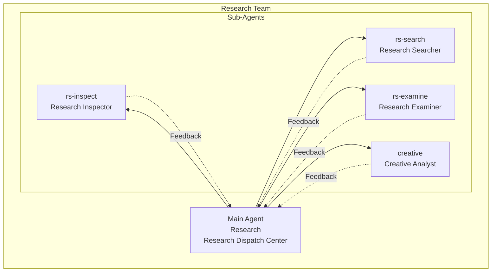
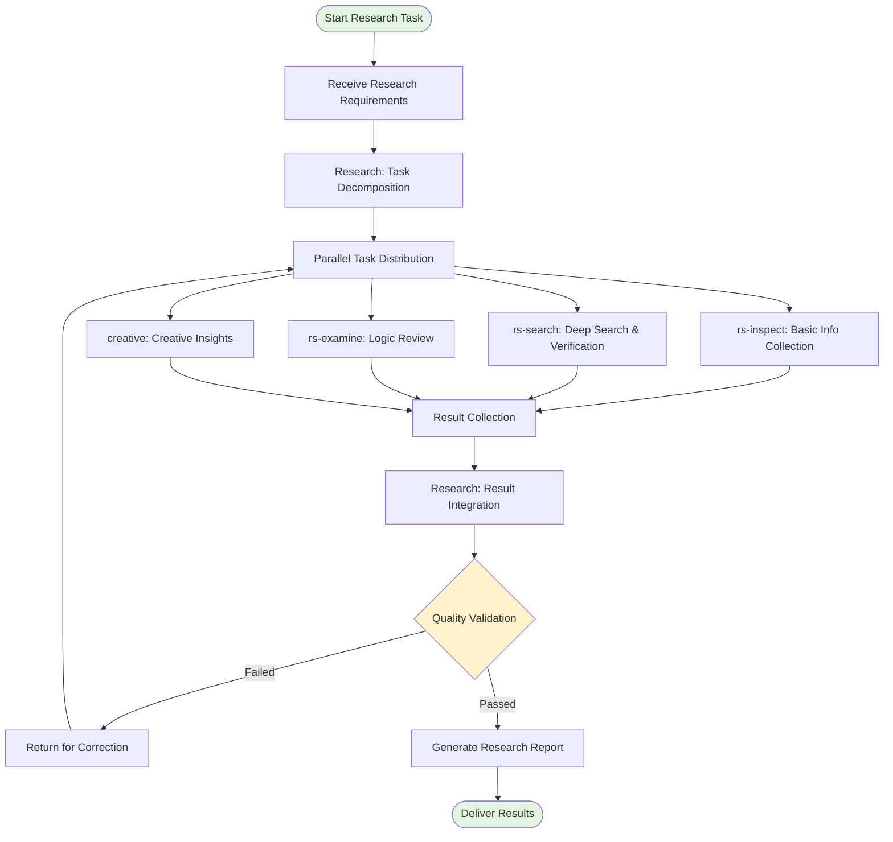
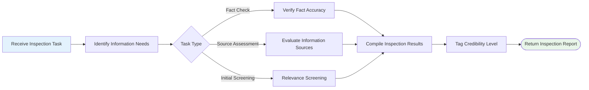
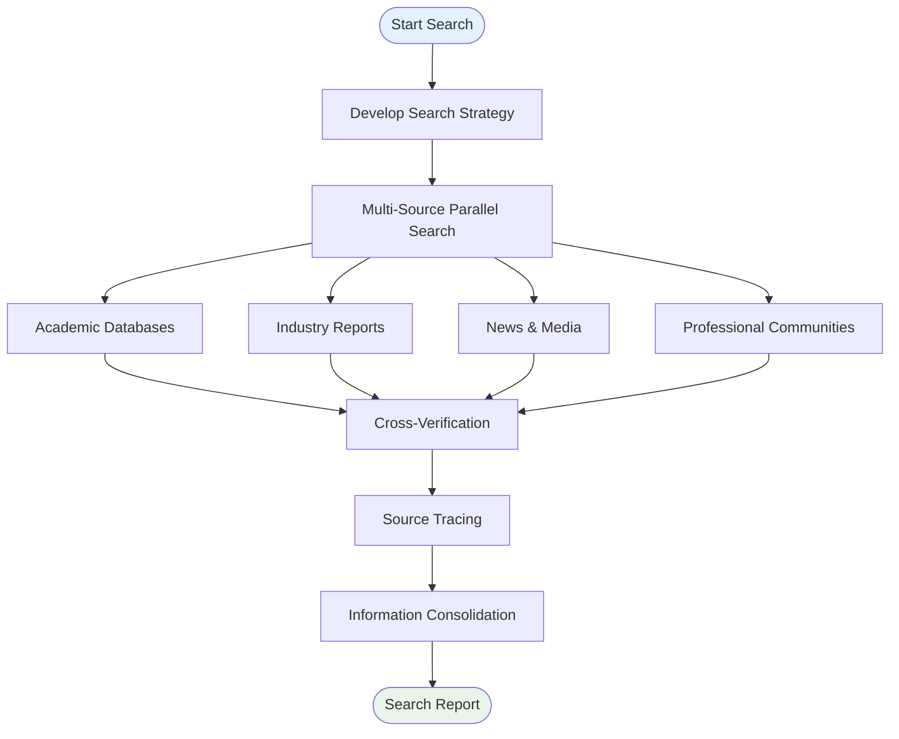
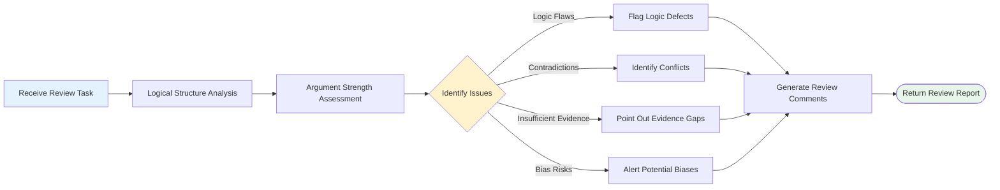
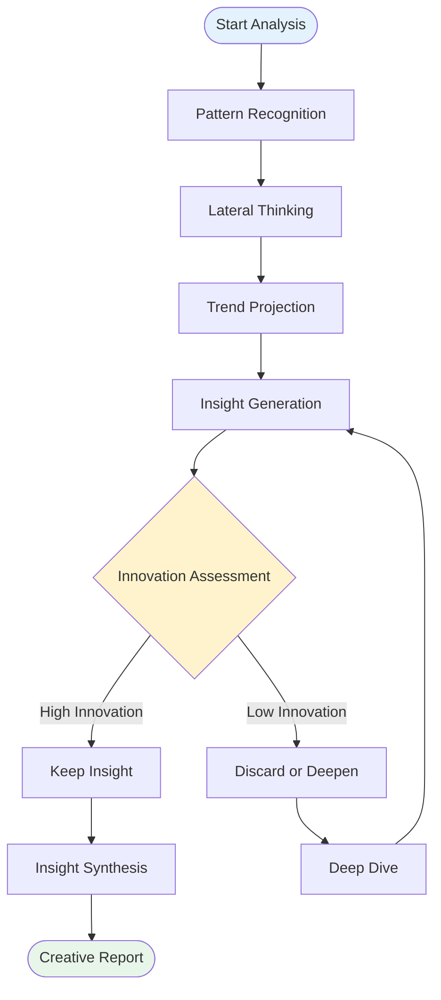
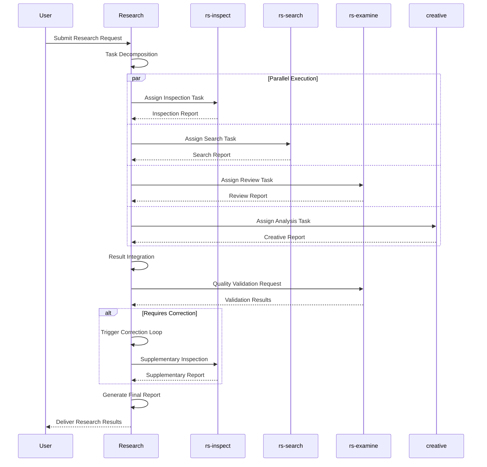
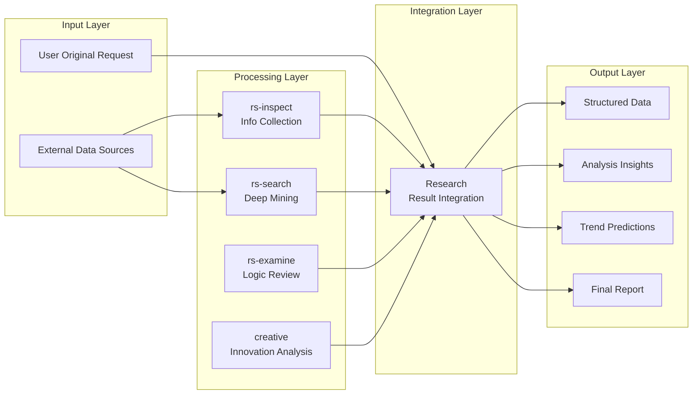
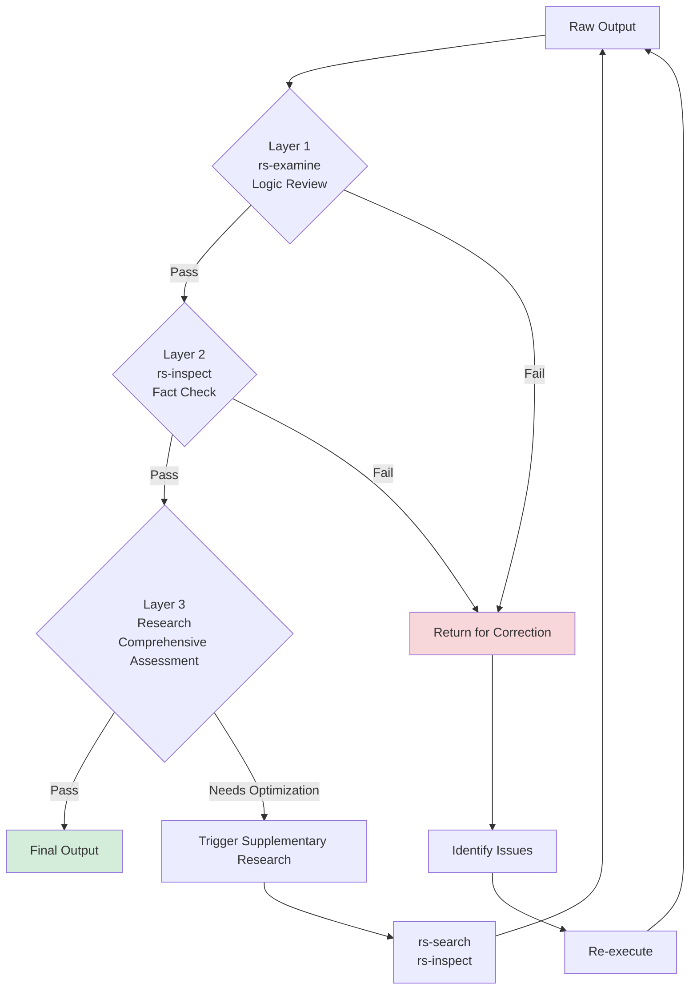

# Deep Research Team

## 1. Team Composition

The Deep Research Team is an intelligent agent collaboration system designed to execute complex, multi-dimensional research tasks. The team adopts a "1 main + 4 sub" architecture, achieving efficient and comprehensive research analysis through task decomposition and parallel execution.

### 1.1 Organizational Structure

### 1.2 Role Responsibilities

| Role | Type | Core Responsibilities | Areas of Expertise |
|------|------|----------------------|-------------------|
| **Research** | Main Agent | Task dispatch, result integration, quality control, final output | Coordination, complex task decomposition |
| **rs-inspect** | Sub-Agent | Information collection and preliminary analysis | Data acquisition, information retrieval, initial screening |
| **rs-search** | Sub-Agent | Deep search and multi-source verification | Multi-dimensional search, cross-verification, source tracing |
| **rs-examine** | Sub-Agent | Content review and logic verification | Logical analysis, quality review, contradiction identification |
| **creative** | Sub-Agent | Innovative perspectives and insight generation | Pattern recognition, innovative thinking, trend prediction |

---

## 2. Overall Workflow

### 2.1 Main Process Flow

### 2.2 Workflow Phases

#### Phase 1: Requirement Analysis & Task Decomposition (Research)
- **Input**: User's research requirements
- **Process**: Analyze requirement complexity, identify key dimensions
- **Output**: Structured sub-task list

#### Phase 2: Parallel Execution (Sub-Agents)
- **rs-inspect**: Execute basic information collection, establish knowledge framework
- **rs-search**: Conduct deep search, verify information accuracy
- **rs-examine**: Review logical consistency, identify potential issues
- **creative**: Provide innovative perspectives, generate unique insights

#### Phase 3: Result Integration (Research)
- Aggregate outputs from all sub-agents
- Identify conflicts and complementary information
- Build complete research framework

#### Phase 4: Quality Validation & Output (Research)
- Multi-dimensional quality checks
- Trigger correction loops when necessary
- Generate final research report

---

## 3. Sub-Task Workflows

### 3.1 rs-inspect (Research Inspector) Workflow

**Key Responsibilities**:
1. **Fact Checking**: Verify accuracy of key facts
2. **Source Assessment**: Evaluate reliability and authority of information sources
3. **Initial Screening**: Filter relevant content from massive information
4. **Credibility Tagging**: Label information with credibility levels

---

### 3.2 rs-search (Research Searcher) Workflow

**Key Responsibilities**:
1. **Search Strategy**: Develop comprehensive search plans
2. **Multi-Source Search**: Simultaneously retrieve from academic, industry, media sources
3. **Cross-Verification**: Compare multi-source information, identify consistency and discrepancies
4. **Source Tracing**: Trace original information sources to ensure verifiability

---

### 3.3 rs-examine (Research Examiner) Workflow

**Key Responsibilities**:
1. **Logical Analysis**: Check logical completeness of arguments
2. **Argument Assessment**: Evaluate strength of supporting arguments
3. **Contradiction Identification**: Discover internal or external contradictions
4. **Bias Detection**: Identify potential cognitive or positional biases

---

### 3.4 creative (Creative Analyst) Workflow

**Key Responsibilities**:
1. **Pattern Recognition**: Discover hidden patterns in data
2. **Lateral Thinking**: Cross-domain associations to spark new perspectives
3. **Trend Projection**: Predict future trends based on existing data
4. **Insight Generation**: Extract unique, valuable insights

---

## 4. Collaboration Patterns

### 4.1 Collaboration Sequence Diagram

### 4.2 Information Flow

---

## 5. Quality Control Mechanisms

### 5.1 Multi-Layer Validation System

### 5.2 Quality Assessment Dimensions

| Dimension | Assessment Content | Responsible Agent |
|-----------|-------------------|-------------------|
| **Accuracy** | Fact correctness, data precision | rs-inspect, rs-search |
| **Logicality** | Argument completeness, reasoning validity | rs-examine |
| **Comprehensiveness** | Coverage breadth, angle diversity | Research |
| **Innovation** | Insight depth, viewpoint uniqueness | creative |
| **Timeliness** | Information freshness, trend relevance | rs-search |
| **Actionability** | Recommendation practicality, implementation feasibility | Research |

---

## 6. Application Scenarios

The Deep Research Team is suitable for the following scenarios:

1. **Market Research**: Industry analysis, competitive research, user studies
2. **Academic Research**: Literature review, theoretical analysis, methodology assessment
3. **Business Decision-Making**: Investment opportunity analysis, risk assessment, strategic planning
4. **Policy Research**: Policy effectiveness evaluation, trend prediction, impact analysis
5. **Technology Research**: Technology roadmap analysis, patent research, development trends

---

## 7. Usage Guidelines

### 7.1 Input Requirements

To achieve optimal research results, please provide:
- **Clear Research Objectives**: Clearly state the core questions that need answers
- **Background Information**: Relevant context and known information
- **Constraints**: Time range, geographic limits, budget considerations, etc.
- **Expected Output Format**: Report structure, level of detail, focus areas

### 7.2 Output Format

The research team will provide based on requirements:
- **Executive Summary**: Core findings and key recommendations
- **Detailed Analysis**: In-depth analysis by dimension
- **Data Support**: Key data points and source citations
- **Visual Charts**: Necessary charts and diagrams
- **Action Recommendations**: Specific recommendations based on insights

---

*Document Version: 1.0*  
*Last Updated: 2024*
