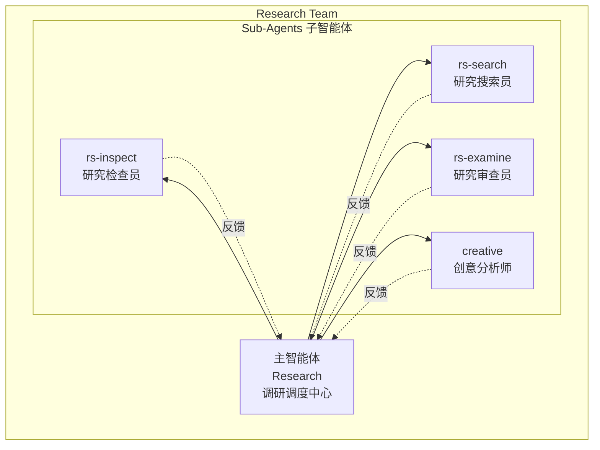
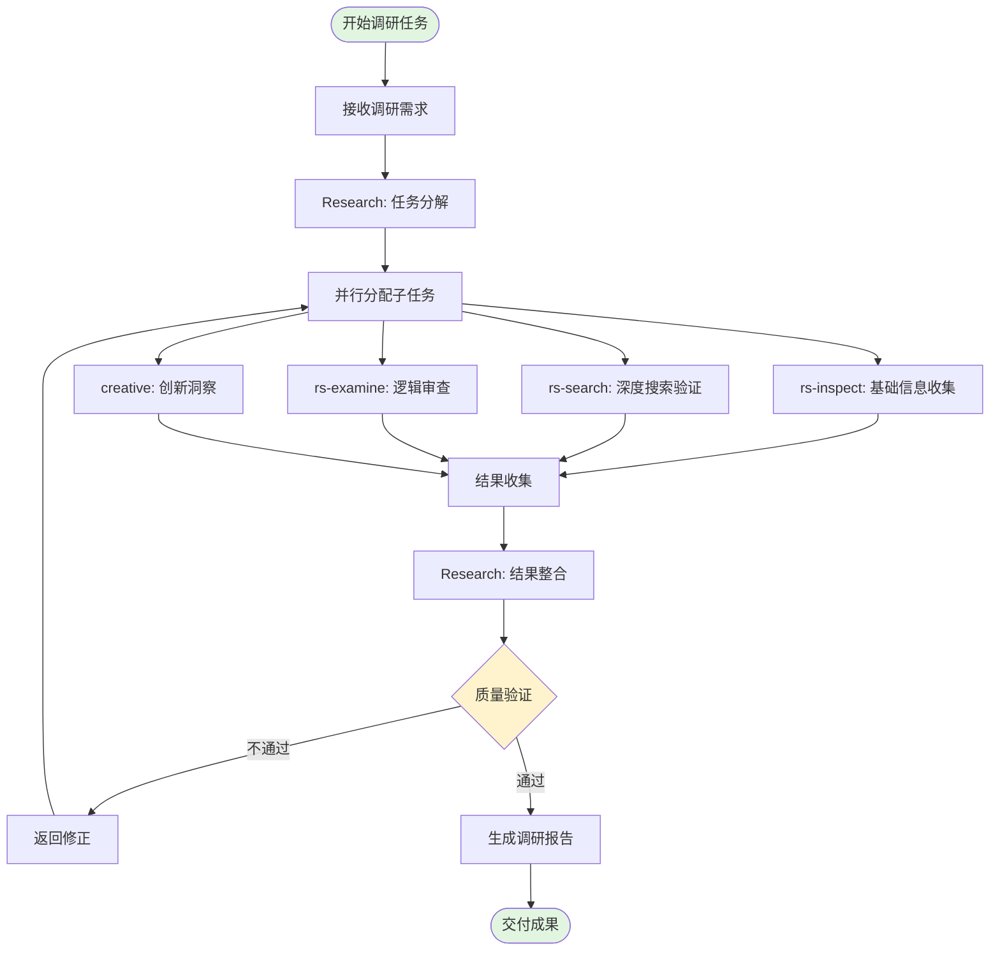
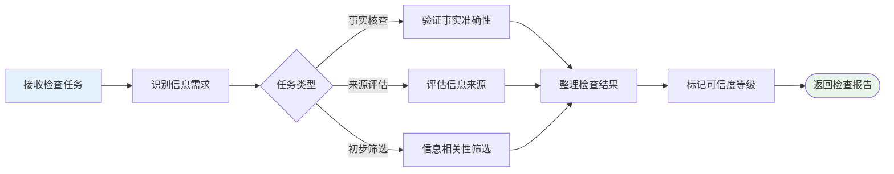
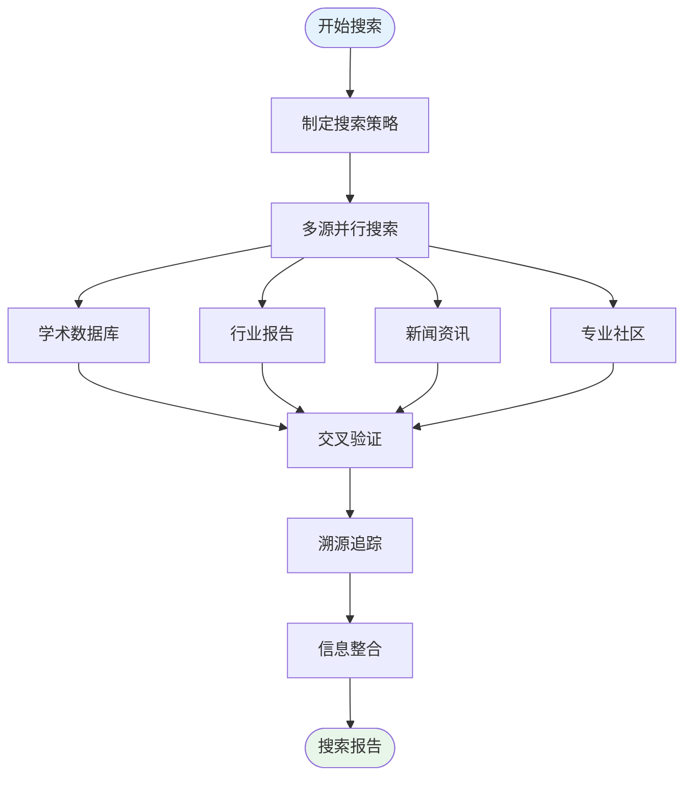
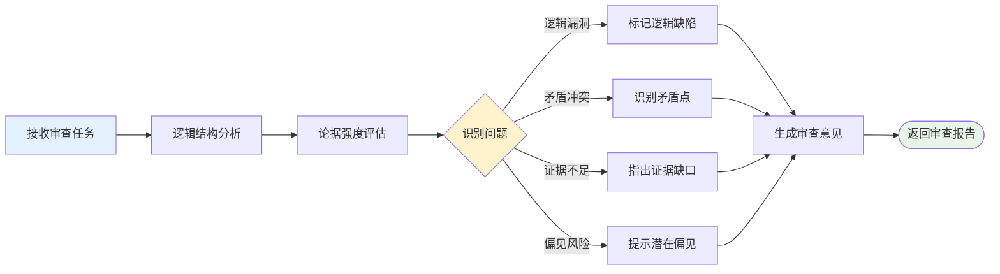
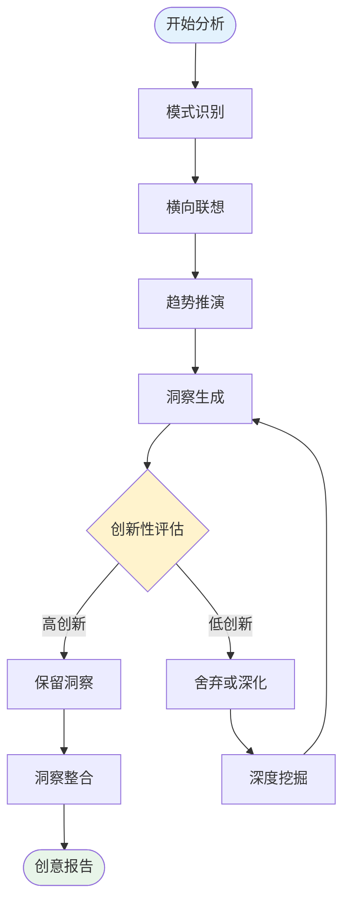
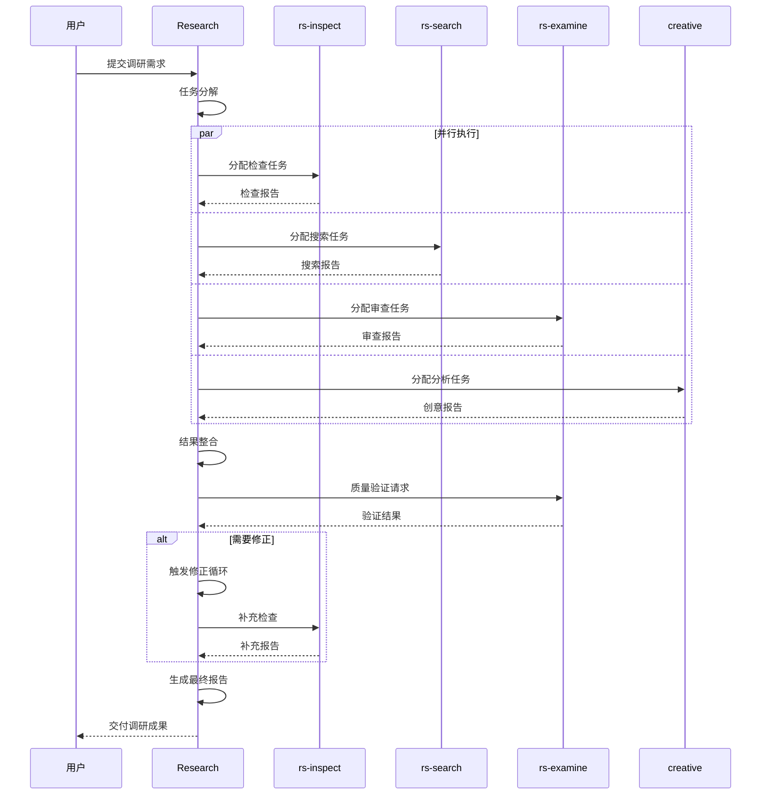
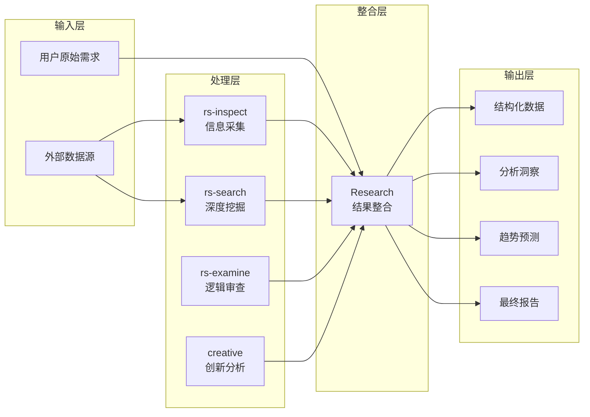
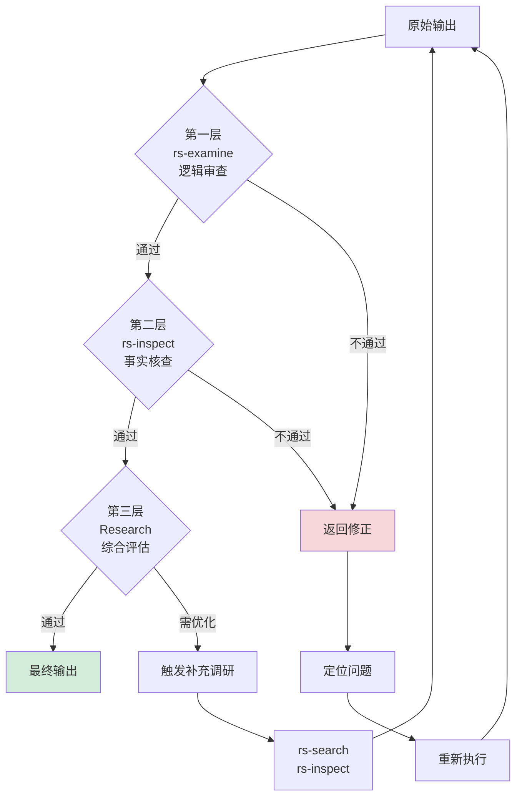

# 深度调研团队 (Research Team)

## 1. 团队组成

深度调研团队是一个专门负责执行复杂、多维度调研任务的智能体协作系统。团队采用"1主4子"的架构设计，通过任务分解与并行执行，实现高效、全面的研究分析。

### 1.1 组织架构

### 1.2 角色职责

| 角色 | 类型 | 核心职责 | 专长领域 |
|------|------|----------|----------|
| **Research** | 主智能体 | 任务调度、结果整合、质量控制、最终输出 | 统筹协调、复杂任务分解 |
| **rs-inspect** | 子智能体 | 信息收集与初步分析 | 数据采集、信息检索、初步筛选 |
| **rs-search** | 子智能体 | 深度搜索与多源验证 | 多维度搜索、交叉验证、溯源追踪 |
| **rs-examine** | 子智能体 | 内容审查与逻辑验证 | 逻辑分析、质量审查、矛盾识别 |
| **creative** | 子智能体 | 创新视角与洞察生成 | 模式识别、创新思考、趋势预测 |

---

## 2. 整体工作流

### 2.1 主流程图

### 2.2 工作阶段说明

#### 阶段一：需求解析与任务分解 (Research)
- **输入**: 用户的调研需求
- **处理**: 分析需求复杂度，识别关键维度
- **输出**: 结构化的子任务清单

#### 阶段二：并行执行 (Sub-Agents)
- **rs-inspect**: 执行基础信息收集，建立知识框架
- **rs-search**: 进行深度搜索，验证信息准确性
- **rs-examine**: 审查逻辑一致性，识别潜在问题
- **creative**: 提供创新视角，生成独特洞察

#### 阶段三：结果整合 (Research)
- 汇总各子智能体的输出
- 识别冲突与补充
- 构建完整的研究框架

#### 阶段四：质量验证与输出 (Research)
- 多维度质量检查
- 必要时触发修正循环
- 生成最终调研报告

---

## 3. 子任务工作流

### 3.1 rs-inspect (研究检查员) 工作流

**主要职责**:
1. **事实核查**: 验证关键事实的准确性
2. **来源评估**: 评估信息来源的可靠性和权威性
3. **初步筛选**: 从海量信息中筛选相关内容
4. **可信度标记**: 为信息标注可信度等级

---

### 3.2 rs-search (研究搜索员) 工作流

**主要职责**:
1. **搜索策略**: 制定全面的搜索计划
2. **多源搜索**: 同时检索学术、行业、媒体等多类来源
3. **交叉验证**: 对比多源信息，识别一致性与差异
4. **溯源追踪**: 追溯原始信息来源，确保可验证性

---

### 3.3 rs-examine (研究审查员) 工作流

**主要职责**:
1. **逻辑分析**: 检查论证的逻辑完整性
2. **论据评估**: 评估支持论据的强度
3. **矛盾识别**: 发现内部或外部矛盾
4. **偏见检测**: 识别潜在的认知偏见或立场偏见

---

### 3.4 creative (创意分析师) 工作流

**主要职责**:
1. **模式识别**: 从数据中发现隐藏模式
2. **横向联想**: 跨领域关联，激发新视角
3. **趋势推演**: 基于现有数据预测未来趋势
4. **洞察生成**: 提炼独特的、有价值的见解

---

## 4. 协作模式

### 4.1 协作时序图

### 4.2 信息流动

---

## 5. 质量控制机制

### 5.1 多层验证体系

### 5.2 质量评估维度

| 维度 | 评估内容 | 负责智能体 |
|------|----------|------------|
| **准确性** | 事实正确性、数据精确度 | rs-inspect, rs-search |
| **逻辑性** | 论证完整性、推理合理性 | rs-examine |
| **全面性** | 覆盖广度、角度多样性 | Research |
| **创新性** | 洞察深度、观点独特性 | creative |
| **时效性** | 信息新鲜度、趋势相关性 | rs-search |
| **可操作性** | 建议实用性、落地可行性 | Research |

---

## 6. 应用场景

深度调研团队适用于以下场景：

1. **市场研究**: 行业分析、竞品调研、用户研究
2. **学术研究**: 文献综述、理论梳理、方法论评估
3. **商业决策**: 投资机会分析、风险评估、战略规划
4. **政策研究**: 政策效果评估、趋势预测、影响分析
5. **技术调研**: 技术路线分析、专利研究、发展趋势

---

## 7. 使用说明

### 7.1 输入要求

为了获得最佳调研效果，请提供：
- **明确的调研目标**: 清楚说明需要回答的核心问题
- **背景信息**: 相关的上下文和已知信息
- **约束条件**: 时间范围、地域限制、预算考虑等
- **期望输出格式**: 报告结构、详细程度、侧重点

### 7.2 输出格式

调研团队将根据需求提供：
- **执行摘要**: 核心发现和关键建议
- **详细分析**: 分维度的深入分析
- **数据支撑**: 关键数据点和来源引用
- **可视化图表**: 必要的图表和图示
- **行动建议**: 基于洞察的具体建议

---

*文档版本: 1.0*  
*最后更新: 2026年3月*
