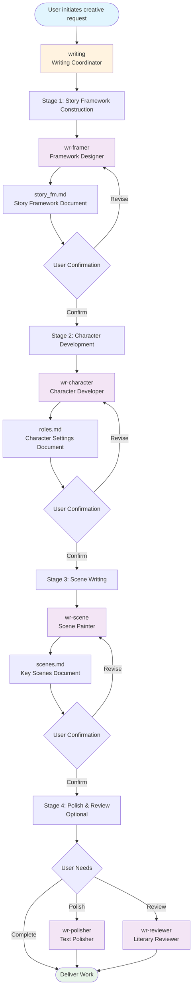
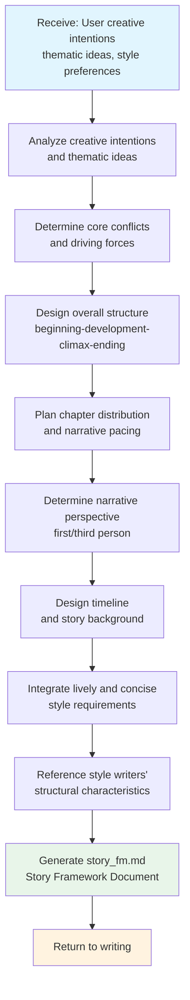
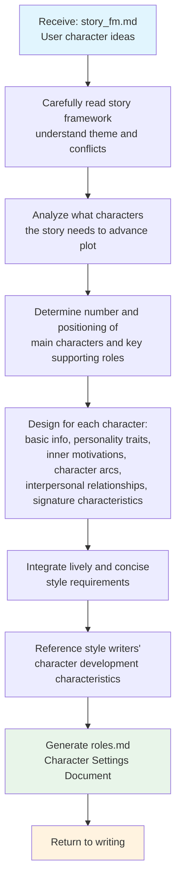
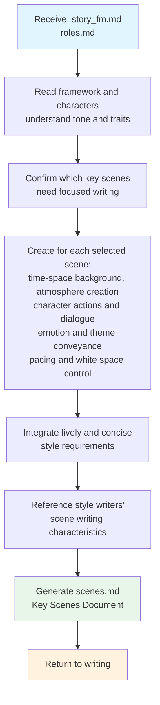
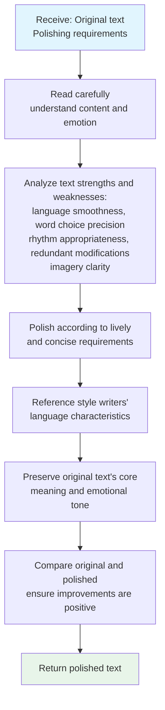
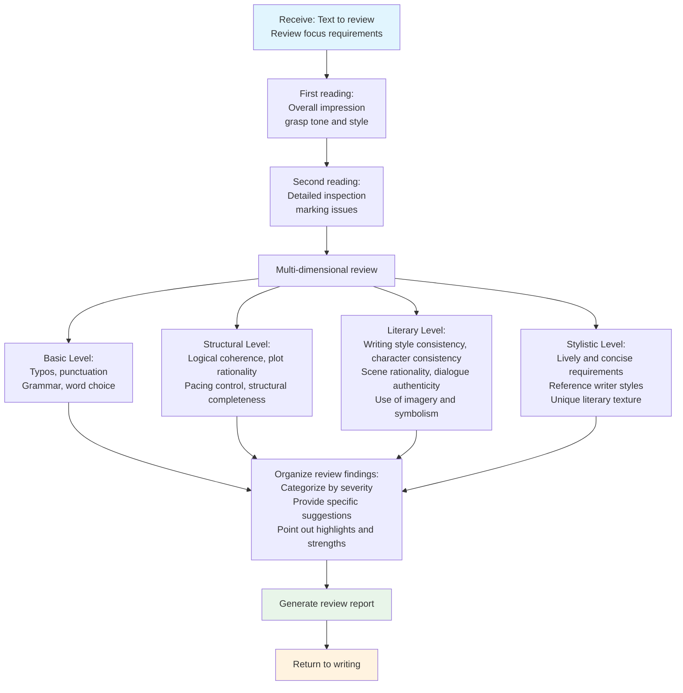
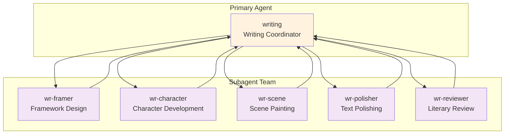

# Writing Team Documentation

> A professional literary writing team dedicated to creating vivid, concise works with unique literary texture

---

## I. Team Composition

The writing team consists of **1 primary agent** and **5 specialized subagents**, forming a complete collaborative system for literary creation:

### 1. Primary Agent: writing (Writing Coordinator)

| Attribute | Description |
|-----------|-------------|
| **Role** | Literary Writing Coordinator |
| **Responsibilities** | Communicate with users about creative intentions, orchestrate the entire creative process |
| **Working Method** | Invoke subagents in stages to progressively build the literary work |
| **Core Capabilities** | Deep understanding of user needs, team coordination, style consistency assurance |

**Key Responsibilities**:
- Deeply understand user's creative intentions and literary preferences
- Guide users to gradually refine creative ideas
- Coordinate efficient collaboration among subagents
- Ensure final work meets "lively and concise" style requirements
- Blend stylistic elements from Han Han, Hermann Hesse, Orhan Pamuk, and Paulo Coelho

---

### 2. Subagents

#### wr-framer (Framework Designer)

| Attribute | Description |
|-----------|-------------|
| **Role** | Story Framework Design Expert |
| **Specialty** | Building story structure, plot development, narrative pacing |
| **Output** | `story_fm.md` (Story Framework Document) |
| **Style Characteristics** | Clear structure without rigidity, tension-filled plot without dragging, brisk pacing without rushing |

**Core Capabilities**:
- Analyze user's creative intentions and thematic ideas
- Determine story's core conflicts and driving forces
- Design story's overall structure (beginning-development-climax-ending)
- Plan chapter distribution and narrative pacing
- Determine narrative perspective and timeline

---

#### wr-character (Character Developer)

| Attribute | Description |
|-----------|-------------|
| **Role** | Character Development Expert |
| **Specialty** | Character portrayal, motivation exploration, character arc design |
| **Output** | `roles.md` (Character Settings Document) |
| **Style Characteristics** | Creating three-dimensional and authentic character images |

**Core Capabilities**:
- Design main characters and key supporting roles based on story framework
- Create basic character info, personality traits, inner motivations
- Design character arcs (starting point - transformation - ending point)
- Build interpersonal relationship networks among characters
- Endow characters with signature characteristics (catchphrases, habitual actions, etc.)

---

#### wr-scene (Scene Painter)

| Attribute | Description |
|-----------|-------------|
| **Role** | Scene Writing Expert |
| **Specialty** | Creating atmosphere, depicting visuals, conveying emotions through words |
| **Output** | `scenes.md` (Key Scenes Document) |
| **Style Characteristics** | Lively, concise, and poetic scene presentation |

**Core Capabilities**:
- Create key scenes based on story framework and character settings
- Craft scenes with visual impact and atmospheric quality
- Create atmosphere through sensory descriptions (visual, auditory, olfactory, tactile)
- Arrange character actions and dialogue
- Convey emotions and thematic ideas

---

#### wr-polisher (Text Polisher)

| Attribute | Description |
|-----------|-------------|
| **Role** | Text Polishing Expert |
| **Specialty** | Enhancing language quality, optimizing expression, improving literary quality |
| **Output** | Polished text |
| **Style Characteristics** | Lively, concise, precise and powerful |

**Core Capabilities**:
- Delete redundant words and sentence patterns
- Optimize word choice, pursuing precision and vividness
- Adjust sentence structure to enhance rhythm
- Strengthen imagery and metaphors
- Ensure logical coherence

---

#### wr-reviewer (Literary Reviewer)

| Attribute | Description |
|-----------|-------------|
| **Role** | Literary Review Expert |
| **Specialty** | Proofreading, literary quality checks, overall quality control |
| **Output** | Review report |
| **Style Characteristics** | Ensuring works reach publication standards |

**Core Capabilities**:
- Multi-dimensional review (basic/structural/literary/stylistic)
- Check for typos, punctuation, and grammar errors
- Verify logical coherence and plot rationality
- Check writing style consistency and character consistency
- Provide tiered modification suggestions (severe/moderate/minor)

---

## II. Overall Workflow

The writing team adopts a **four-stage progressive creative process**, building the literary work from macro to micro:

### Process Overview

### Stage Descriptions

| Stage | Name | Description | Output Document |
|-------|------|-------------|-----------------|
| **Stage 1** | Story Framework Construction | Deep communication with user about creative ideas, invoke wr-framer to design story framework | `story_fm.md` |
| **Stage 2** | Character Development | Based on confirmed story framework, invoke wr-character to design characters | `roles.md` |
| **Stage 3** | Scene Writing | Based on framework and characters, invoke wr-scene to write key scenes | `scenes.md` |
| **Stage 4** | Polish & Review (Optional) | Invoke wr-polisher or wr-reviewer for optimization as needed | Polished text / Review report |

### Literary Style Guide

Throughout the coordination process, always adhere to the following style requirements:

**Core Principles of "Lively and Concise" Style**:
- Clean and crisp language, no wordiness
- Vivid imagery, full of vitality
- Appropriate use of "white space" (留白), leaving room for reader's imagination
- Brisk pacing, no dragging

**Stylistic Characteristics of Reference Writers**:
- **Han Han**: Sharp social observation, concise and powerful narration, barbed humor
- **Hermann Hesse**: Poetic philosophical thinking, deep exploration of the soul, symbolism and metaphor
- **Orhan Pamuk**: Delicate sensory description, blend of Eastern and Western cultures, sense of historical weight
- **Paulo Coelho**: Allegorical wisdom, spiritual growth themes, simple yet profound insights

---

## III. Subtask Workflows

### 3.1 wr-framer (Framework Designer) Workflow

#### Workflow

#### Key Design Principles

1. **Less is More**: Don't complicate for complexity's sake; simple structures often carry more power
2. **Art of White Space**: Leave space for reader's imagination and participation
3. **Sense of Rhythm**: Combination of fast and slow, tension and relaxation
4. **Organic Structure**: Each part should serve the overall theme
5. **Emotional Truth**: Structure serves emotional expression, not technical show-off

#### Reference Writers' Structural Characteristics

| Writer | Structural Characteristics |
|--------|---------------------------|
| Han Han | Direct entry, minimal foreshadowing, rapid advancement |
| Hesse | Interweaving inner exploration with external events |
| Pamuk | Multi-layered narration, time-space interweaving |
| Coelho | Simple framework carrying profound meaning |

---

### 3.2 wr-character (Character Developer) Workflow

#### Workflow

#### Character Design Dimensions

| Dimension | Description |
|-----------|-------------|
| **Basic Information** | Name, age, appearance, occupation/identity |
| **Character Portrait** | Core traits, strengths, weaknesses, personality layers |
| **Inner World** | Core desires, deep fears, value system, inner conflicts |
| **Character Arc** | Story starting point, transformation opportunity, growth trajectory, story ending point |
| **Relationships** | Interaction patterns with other characters |
| **Signature Characteristics** | Language style, habitual actions, special quirks, representative items |

#### Character Creation Techniques

- **Iceberg Theory**: What is shown to readers is only part; there's richer content below the surface
- **Unity of Opposites**: Contradictions within characters are often sources of charm
- **Detail Portrayal**: Make characters vivid through one or two precise details
- **Dialogue Shaping**: Let characters reveal personality through unique ways of speaking
- **Actions Speak**: Don't just say what kind of person they are; show what they do

---

### 3.3 wr-scene (Scene Painter) Workflow

#### Workflow

#### Key Scene Types

- **Opening Scene**: How to attract readers
- **Important Turning Point Scenes**
- **Emotional Climax Scenes**
- **Key Character Relationship Scenes**
- **Ending Scenes**

#### Scene Creation Principles

1. **Visualization**: Let readers "see" the scene in their minds
2. **Multi-sensory**: Don't just write what is seen; write what is heard, smelled, and felt
3. **Dynamic Quality**: Scenes are not static pictures; they should have time flow
4. **Emotional Carrier**: Scenes should carry and convey emotions
5. **Beauty of Simplicity**: Convey the richest information with the least words

#### Reference Writers' Scene Styles

| Writer | Scene Characteristics |
|--------|----------------------|
| Han Han | Concise and powerful, cool humor, authentic social details |
| Hesse | Full of poetry, blending inner world with external world |
| Pamuk | Delicate and elaborate, rich cultural imagery, strong sense of time-space |
| Coelho | Strongly symbolic, profound in simplicity, with a sense of mystery |

---

### 3.4 wr-polisher (Text Polisher) Workflow

#### Workflow

#### Polishing Dimensions

| Dimension | Description |
|-----------|-------------|
| **Language Refinement** | Delete unnecessary modifiers, avoid repetitive expressions, simplify lengthy sentence patterns |
| **Precise Word Choice** | Choose most appropriate words, avoid clichés, make good use of verbs and nouns |
| **Rhythm Optimization** | Alternation of long and short sentences, variation in paragraph length, natural pauses and transitions |
| **Imagery Strengthening** | Ensure imagery is clear, metaphors are appropriate, sensory descriptions are vivid |
| **Style Consistency** | Maintain consistent overall writing style, conform to character language characteristics, match scene atmosphere |

#### Polishing Principles

1. **Respect Original Work**: Polishing is enhancement, not rewriting
2. **Less is More**: Subtraction is often more effective than addition
3. **Maintain Voice**: Preserve author's unique voice and style
4. **Precision First**: Accuracy is more important than ornateness
5. **Reader Perspective**: Always consider reader's reading experience

---

### 3.5 wr-reviewer (Literary Reviewer) Workflow

#### Workflow

#### Review Dimensions Explained

| Level | Check Content |
|-------|---------------|
| **Basic** | Typos (common characters, easily confused characters), punctuation standardization, grammar, word choice |
| **Structural** | Logic (clear causal relationships), plot (conforms to story internal logic), pacing (tension and relaxation), structure (complete beginning, development, climax, ending) |
| **Literary** | Writing style consistency, characters (speech and behavior conform to personality settings), scenes (authentic and believable), dialogue (conforms to character identity), imagery (appropriate, clear, meaningful) |
| **Stylistic** | Lively (language has vitality), concise (simple and powerful), reference styles (Han Han's sharp simplicity, Hesse's poetic philosophy, Pamuk's delicate narration, Coelho's allegorical wisdom) |

#### Issue Classification

- **Severe Issues (Must Modify)**: Affect understanding or cause ambiguity
- **Moderate Issues (Suggested to Modify)**: Affect reading experience
- **Minor Issues (Optional to Modify)**: Details that can be changed or not

---

## IV. Document Naming Conventions

| Stage | Document Name | Description |
|-------|---------------|-------------|
| Stage 1 | `story_fm.md` | Story Framework Document |
| Stage 2 | `roles.md` | Character Settings Document |
| Stage 3 | `scenes.md` | Key Scenes Document |
| Stage 4 (Polish) | `*_polished.md` | Polished text (e.g., `scenes_polished.md`) |
| Stage 4 (Review) | `review_report.md` | Literary Review Report |

---

## V. Collaboration Mode Summary

**Collaboration Characteristics**:
- **writing** serves as the unified entry point, responsible for user communication and requirement collection
- Each subagent focuses on its specialized domain, outputting standardized documents
- Each stage's deliverable requires user confirmation before proceeding to the next stage
- Supports iterative modifications to ensure final work meets user expectations
- Optional polishing and review stages provide additional quality assurance
