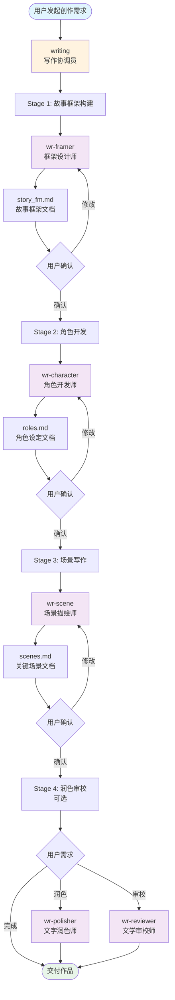
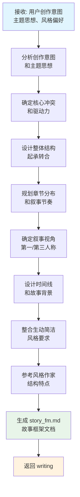
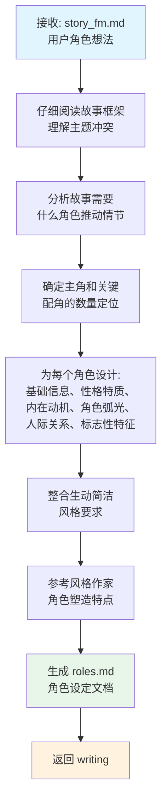
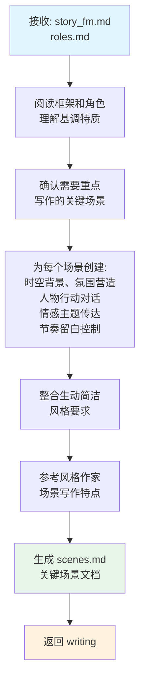
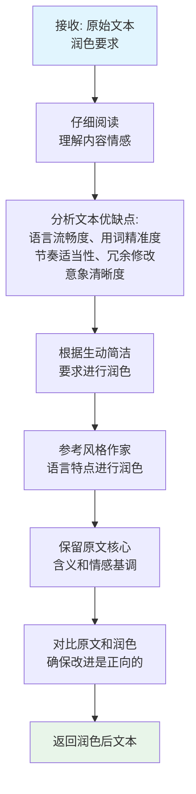
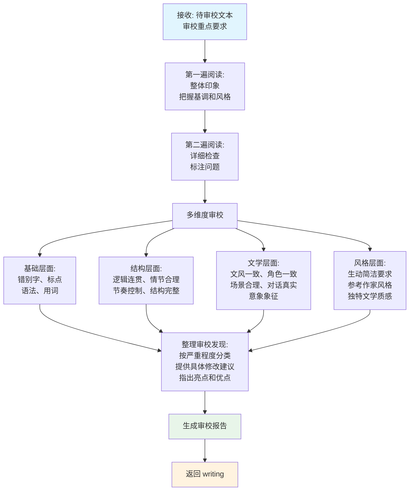
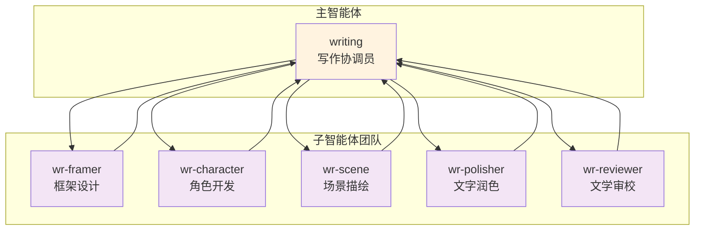

# 写作团队说明

> 文学写作专业团队，致力于创作生动简洁、具有独特文学质感的作品

---

## 一、团队组成

写作团队由 **1 个主智能体** 和 **5 个专业子智能体** 组成，形成完整的文学创作协作体系：

### 1. 主智能体：writing（写作协调员）

| 属性 | 说明 |
|------|------|
| **角色** | 文学写作协调员 |
| **职责** | 与用户沟通创作意图，统筹整个创作流程 |
| **工作方式** | 分阶段调用子智能体，逐步构建文学作品 |
| **核心能力** | 深度理解用户需求、协调团队协作、确保风格一致性 |

**主要职责**：
- 深入了解用户的创作意图和文学偏好
- 引导用户逐步细化创作构思
- 协调各子智能体高效协作
- 确保最终作品符合"生动简洁"的风格要求
- 融合韩寒、赫尔曼·黑塞、奥尔罕·帕慕克、保罗·柯艾略等作家的风格特点

---

### 2. 子智能体

#### wr-framer（框架设计师）

| 属性 | 说明 |
|------|------|
| **角色** | 故事框架设计专家 |
| **专长** | 构建故事结构、情节发展、叙事节奏 |
| **输出** | `story_fm.md`（故事框架文档） |
| **风格特点** | 结构清晰而不僵硬、情节紧张而不拖沓、节奏明快而不仓促 |

**核心能力**：
- 分析用户创作意图和主题思想
- 确定故事核心冲突和驱动力
- 设计故事整体结构（起承转合）
- 规划章节分布和叙事节奏
- 确定叙事视角和时间线

---

#### wr-character（角色开发师）

| 属性 | 说明 |
|------|------|
| **角色** | 角色开发专家 |
| **专长** | 人物塑造、动机探索、角色弧光设计 |
| **输出** | `roles.md`（角色设定文档） |
| **风格特点** | 塑造立体真实的角色形象 |

**核心能力**：
- 根据故事框架设计主要角色和关键配角
- 创建角色基础信息、性格特质、内在动机
- 设计角色弧光（起点-转变-终点）
- 构建角色间的人际关系网络
- 赋予角色标志性特征（口头禅、习惯性动作等）

---

#### wr-scene（场景描绘师）

| 属性 | 说明 |
|------|------|
| **角色** | 场景写作专家 |
| **专长** | 营造氛围、描写视觉画面、用文字传达情感 |
| **输出** | `scenes.md`（关键场景文档） |
| **风格特点** | 生动、简洁、富有诗意的场景呈现 |

**核心能力**：
- 基于故事框架和角色设定创作关键场景
- 营造具有视觉冲击力的场景氛围
- 通过感官描写（视觉、听觉、嗅觉、触觉）创造氛围
- 安排人物行动和对话
- 传达情感和思想主题

---

#### wr-polisher（文字润色师）

| 属性 | 说明 |
|------|------|
| **角色** | 文字润色专家 |
| **专长** | 提升语言质量、优化表达、增强文学性和感染力 |
| **输出** | 润色后的文本 |
| **风格特点** | 生动简洁、精准有力 |

**核心能力**：
- 删除冗余词汇和句式
- 优化用词，追求精准生动
- 调整句式结构，增强节奏感
- 强化意象和隐喻
- 确保逻辑连贯

---

#### wr-reviewer（文学审校师）

| 属性 | 说明 |
|------|------|
| **角色** | 文学审校专家 |
| **专长** | 校对、文学质量检查、整体质量把控 |
| **输出** | 审校报告 |
| **风格特点** | 确保作品达到出版标准 |

**核心能力**：
- 多维度审校（基础/结构/文学/风格）
- 错别字、标点、语法检查
- 逻辑连贯性、情节合理性检查
- 文风一致性、角色一致性检查
- 提供分级修改建议（严重/中等/轻微）

---

## 二、整体工作流

写作团队采用**四阶段渐进式创作流程**，从宏观到微观逐步构建文学作品：

### 流程概览

### 各阶段说明

| 阶段 | 名称 | 说明 | 输出文档 |
|------|------|------|----------|
| **Stage 1** | 故事框架构建 | 与用户深度沟通创作想法，调用 wr-framer 设计故事框架 | `story_fm.md` |
| **Stage 2** | 角色开发 | 基于确认的故事框架，调用 wr-character 设计角色 | `roles.md` |
| **Stage 3** | 场景写作 | 基于框架和角色，调用 wr-scene 撰写关键场景 | `scenes.md` |
| **Stage 4** | 润色审校（可选） | 根据需要调用 wr-polisher 或 wr-reviewer 进行优化 | 润色文本/审校报告 |

### 文学风格指南

整个创作过程始终遵循以下风格要求：

**"生动简洁"核心原则**：
- 语言干净利落，不拖泥带水
- 意象鲜活生动，富有生命力
- 适当留白，给读者想象空间
- 节奏明快，不拖沓

**参考作家风格特点**：
- **韩寒**：犀利的社会观察、简洁有力的叙述、带刺的幽默
- **赫尔曼·黑塞**：诗意的哲学思考、灵魂深处的探索、象征与隐喻
- **奥尔罕·帕慕克**：细腻的感官描写、东西方文化交融、历史厚重感
- **保罗·柯艾略**：寓言式的智慧、灵性成长主题、简洁而深刻的启示

---

## 三、子任务工作流

### 3.1 wr-framer（框架设计师）工作流

#### 工作流程

#### 关键设计原则

1. **少即是多**：不要为了复杂而复杂，简单的结构往往更有力量
2. **留白艺术**：给读者留下想象和参与的空间
3. **节奏感**：快慢结合、张弛有度
4. **有机结构**：每个部分都应服务于整体主题
5. **情感真实**：结构服务于情感表达，而非技术炫技

#### 参考作家结构特点

| 作家 | 结构特点 |
|------|----------|
| 韩寒 | 单刀直入、极少铺垫、快速推进 |
| 黑塞 | 内心探索与外部事件交织 |
| 帕慕克 | 多层叙述、时空交织 |
| 柯艾略 | 简单框架承载深刻内涵 |

---

### 3.2 wr-character（角色开发师）工作流

#### 工作流程

#### 角色设计维度

| 维度 | 说明 |
|------|------|
| **基础信息** | 姓名、年龄、外貌、职业/身份 |
| **性格画像** | 核心特质、优点、缺点、性格层次 |
| **内心世界** | 核心欲望、深层恐惧、价值体系、内在冲突 |
| **角色弧光** | 故事起点、转变契机、成长轨迹、故事终点 |
| **人际关系** | 与其他角色的互动模式 |
| **标志性特征** | 语言风格、习惯性动作、特殊癖好、代表性物品 |

#### 角色创作技巧

- **冰山理论**：展现给读者的只是冰山一角，水下有更丰富的内容
- **对立统一**：人物内心的矛盾往往是魅力的来源
- **细节刻画**：通过一两个精准的细节让人物鲜活
- **对话塑造**：让人物通过独特的说话方式展现个性
- **行动说话**：不要只说他是什么样的人，要展示他做了什么

---

### 3.3 wr-scene（场景描绘师）工作流

#### 工作流程

#### 关键场景类型

- **开场**：如何吸引读者
- **重要转折点场景**
- **情感高潮场景**
- **关键人物关系场景**
- **结尾场景**

#### 场景创作原则

1. **可视化**：让读者在脑海中"看到"场景
2. **多感官**：不只写看到的，还要写听到的、闻到的、感受到的
3. **动态感**：场景不是静态画面，要有时间流动
4. **情感载体**：场景要承载和传达情感
5. **简洁之美**：用最少的文字传达最丰富的信息

#### 参考作家场景风格

| 作家 | 场景特点 |
|------|----------|
| 韩寒 | 简洁有力、冷幽默、真实的社会细节 |
| 黑塞 | 充满诗意、内心世界与外部世界交融 |
| 帕慕克 | 细腻繁复、丰富的文化意象、强烈的时空感 |
| 柯艾略 | 象征性强、简约中见深刻、带有神秘感 |

---

### 3.4 wr-polisher（文字润色师）工作流

#### 工作流程

#### 润色维度

| 维度 | 说明 |
|------|------|
| **语言精练** | 删除不必要的修饰语、避免重复表达、简化冗长句式 |
| **用词精准** | 选择最恰当的词语、避免陈词滥调、善用动词名词 |
| **节奏优化** | 长短句交替、段落长短变化、自然停顿和过渡 |
| **意象强化** | 确保意象清晰、隐喻恰当、感官描写生动 |
| **风格统一** | 保持整体文风一致、符合人物语言特点、呼应主题思想 |

#### 润色原则

1. **尊重原作**：润色是提升，不是重写
2. **少即是多**：做减法往往比做加法更有效
3. **保持声音**：保留作者独特的声音和风格
4. **精准优先**：准确比华丽更重要
5. **读者视角**：始终考虑读者的阅读体验

---

### 3.5 wr-reviewer（文学审校师）工作流

#### 工作流程

#### 审校维度详解

| 层面 | 检查内容 |
|------|----------|
| **基础** | 错别字（常见字、易混字）、标点规范、语法正确、用词准确 |
| **结构** | 逻辑清晰、情节合理、张弛有度、起承转合完整 |
| **文学** | 文风一致、言行符合人设、场景真实可信、对话符合身份、意象清晰有意义 |
| **风格** | 语言有生命力、简洁有力、符合目标风格特点 |

#### 问题分级

- **严重问题（必须修改）**：影响理解或造成歧义
- **中等问题（建议修改）**：影响阅读体验
- **轻微问题（可选修改）**：可改可不改的细节

---

## 四、文档命名规范

| 阶段 | 文档名称 | 说明 |
|------|----------|------|
| Stage 1 | `story_fm.md` | 故事框架文档 |
| Stage 2 | `roles.md` | 角色设定文档 |
| Stage 3 | `scenes.md` | 关键场景文档 |
| Stage 4 (润色) | `*_polished.md` | 润色后文本（如 `scenes_polished.md`）|
| Stage 4 (审校) | `review_report.md` | 文学审校报告 |

---

## 五、协作模式总结

**协作特点**：
- **writing** 作为统一入口，负责用户沟通和需求收集
- 各子智能体专注于自己的专业领域，输出标准化文档
- 每个阶段产出都需经用户确认后才进入下一阶段
- 支持迭代修改，确保最终作品符合用户期望
- 可选的润色和审校阶段提供额外的质量保障
