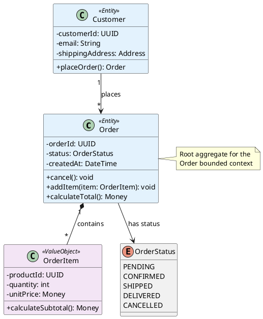
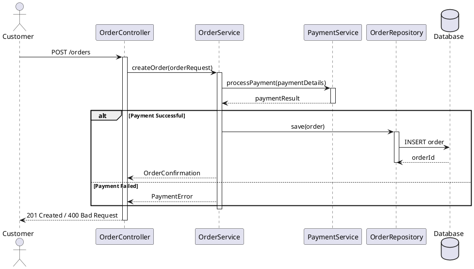
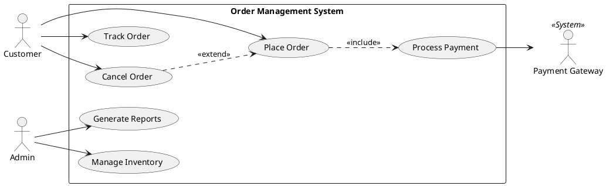
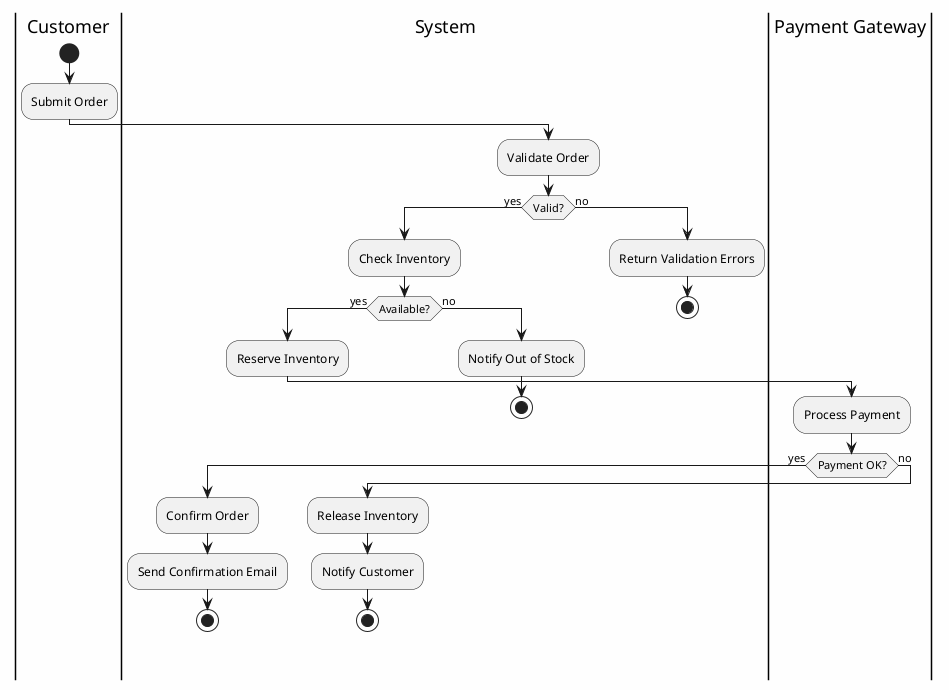
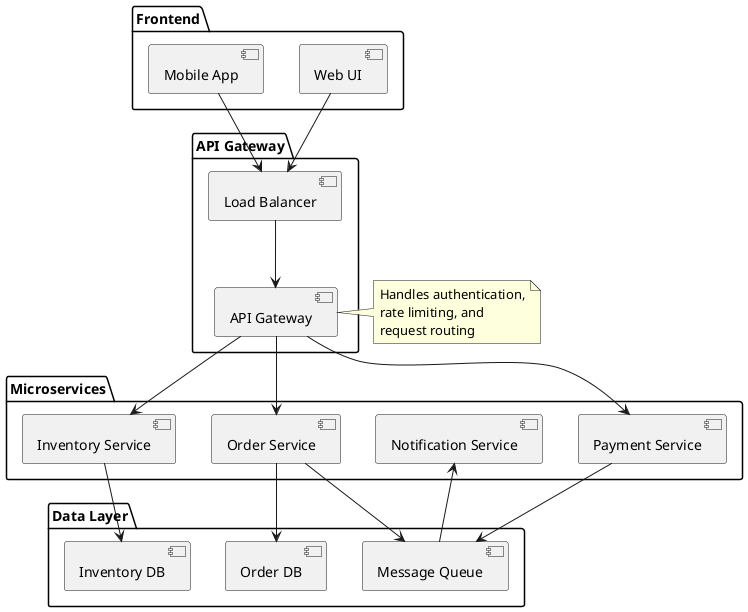
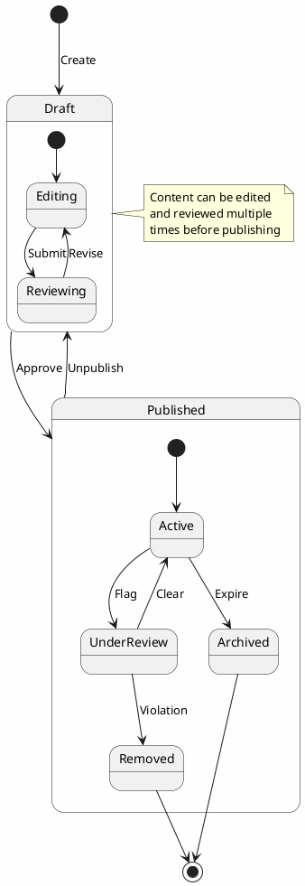
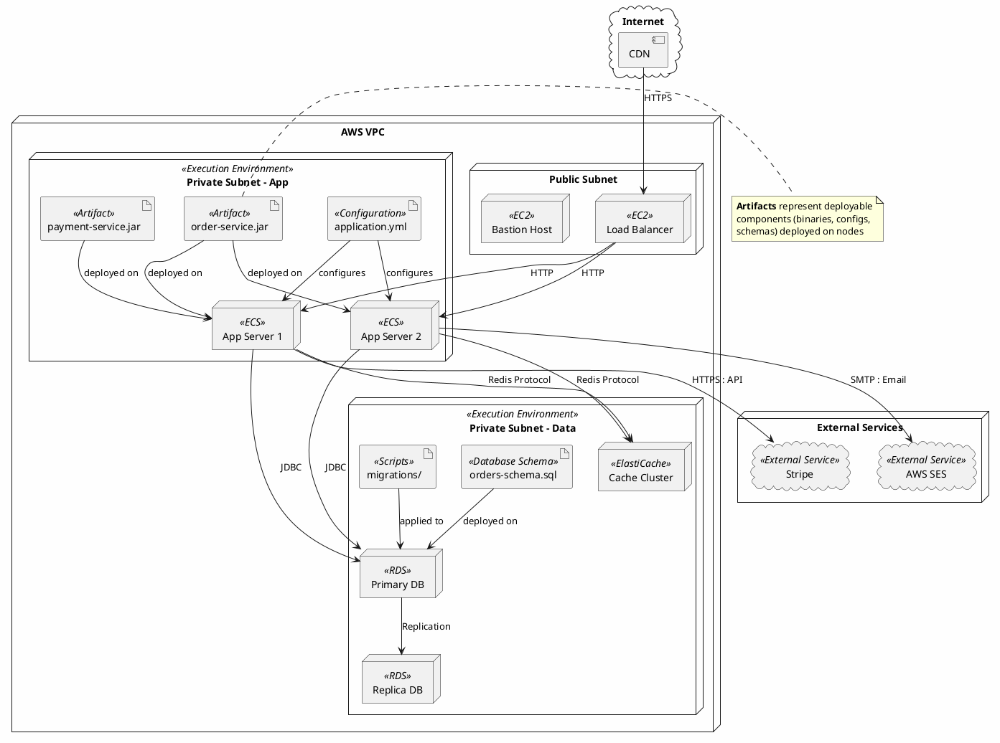
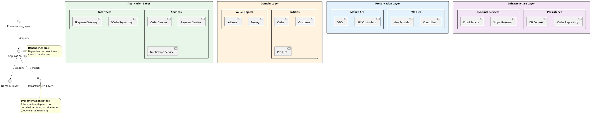

# UML Guidelines for Software Architecture

## Table of Contents
1. [Introduction](#introduction)
2. [General Principles](#general-principles)
3. [Diagram Types and When to Use](#diagram-types-and-when-to-use)
4. [PlantUML Syntax Guidelines](#plantuml-syntax-guidelines)
5. [Diagram-Specific Best Practices](#diagram-specific-best-practices)
   - [Class Diagrams](#class-diagrams)
   - [Sequence Diagrams](#sequence-diagrams)
   - [Use Case Diagrams](#use-case-diagrams)
   - [Activity Diagrams](#activity-diagrams)
   - [Component Diagrams](#component-diagrams)
   - [State Diagrams](#state-diagrams)
   - [Deployment Diagrams](#deployment-diagrams)
   - [Package Diagrams](#package-diagrams)
   - [Object Diagrams](#object-diagrams)
   - [Communication Diagrams](#communication-diagrams)
   - [C4 Model Integration](#c4-model-integration)
   - [Profile and Stereotype Definition](#profile-and-stereotype-definition)
6. [Consistency Guidelines](#consistency-guidelines)
   - [Diagram Relationships in Architecture Documentation](#diagram-relationships-in-architecture-documentation)
7. [Documentation Standards](#documentation-standards)
8. [Quality Checklist](#quality-checklist)
9. [Appendix A: Troubleshooting Common PlantUML Issues](#appendix-a-troubleshooting-common-plantuml-issues)
10. [Appendix B: PlantUML Resources](#appendix-b-plantuml-resources)
11. [Appendix C: UML Notation Quick Reference](#appendix-c-uml-notation-quick-reference)

---

## Introduction

### Purpose

This document establishes comprehensive guidelines for creating UML diagrams in software architecture contexts. These guidelines ensure consistency, clarity, and effectiveness when communicating architectural designs to stakeholders.

### Scope

These guidelines apply to:
- High-level architectural diagrams
- System design documentation
- Technical communication with development teams
- Stakeholder presentations
- Architecture decision records (ADRs)

### References

- **OMG UML Specification**: https://www.uml.org
- **PlantUML Documentation**: https://plantuml.com
- **IEEE 1471-2000**: Recommended Practice for Architectural Description

---

## Quick Start Guide

New to UML or PlantUML? Follow these steps to get started quickly:

### 1. Choose the Right Diagram Type

| If you want to show... | Use this diagram |
|------------------------|------------------|
| System structure and classes | [Class Diagram](#class-diagrams) |
| How components interact over time | [Sequence Diagram](#sequence-diagrams) |
| System functionality and user goals | [Use Case Diagram](#use-case-diagrams) |
| Business processes and workflows | [Activity Diagram](#activity-diagrams) |
| System deployment and infrastructure | [Deployment Diagram](#deployment-diagrams) |
| High-level system architecture | [C4 Model Integration](#c4-model-integration) |

### 2. Set Up Your Environment

**Option A: Online Editor (Quickest)**
- Use [PlantUML Online Server](https://www.plantuml.com/plantuml) for immediate testing
- No installation required

**Option B: IDE Integration (Recommended for Development)**
- **VS Code**: Install "PlantUML" extension by Jebbs
- **IntelliJ IDEA**: Use "PlantUML Integration" plugin
- **Eclipse**: Install via "PlantUML Eclipse Plugin"

**Option C: Command Line**
```bash
# Install PlantUML
brew install plantuml  # macOS
apt-get install plantuml  # Ubuntu/Debian

# Generate diagram
plantuml mydiagram.puml
```

### 3. Basic Template

Copy this starter template for any new diagram:


### 4. Key Principles to Remember

1. **Start simple**: Create a basic diagram first, then add details
2. **Focus on clarity**: If the diagram is hard to understand, simplify it
3. **Use consistent naming**: See [Naming Conventions](#naming-conventions) section
4. **Validate your diagram**: Check against the [Quality Checklist](#quality-checklist) before sharing

### 5. Next Steps

- Review [General Principles](#general-principles) for foundational concepts
- Explore [Diagram-Specific Best Practices](#diagram-specific-best-practices) for detailed guidance
- Refer to [Appendix A](#appendix-a-troubleshooting-common-plantuml-issues) if you encounter issues

---

## General Principles

### 1. Clarity Over Complexity

**Principle**: A diagram should be immediately understandable without extensive explanation.

**Guidelines**:
- Limit each diagram to 7±2 elements (cognitive load management)
- Use decomposition: create multiple focused diagrams rather than one complex diagram
- Eliminate redundant information
- Focus on the "big picture" for architectural diagrams

**Example**: Instead of showing all 50 classes in a system, show 5-7 key abstractions with package grouping.

### 2. Consistent Notation

**Principle**: Use standard UML notation consistently throughout all diagrams.

**Guidelines**:
- Follow OMG UML 2.5 specification
- Use PlantUML standard syntax (not custom extensions unless necessary)
- Maintain consistent arrow directions and relationship types
- Use standard stereotypes (`<<interface>>`, `<<abstract>>`, etc.)

### 3. Appropriate Level of Detail

**Principle**: Match detail level to the diagram's purpose and audience.

| Audience | Detail Level | Example Elements |
|----------|--------------|------------------|
| Executives | High-level | Systems, major components, data flow |
| Architects | Medium-level | Components, interfaces, dependencies |
| Developers | Detailed | Classes, methods, attributes |

### 4. Audience Consideration

**Principle**: Tailor diagrams to the intended audience's technical background.

**Guidelines**:
- **Business Stakeholders**: Use case diagrams, high-level component diagrams
- **Technical Architects**: Component, deployment, sequence diagrams
- **Development Teams**: Class, sequence, state diagrams
- **Operations**: Deployment, network topology diagrams

---

## Diagram Types and When to Use

### Overview Matrix

| Diagram Type | Purpose | Primary Use Case |
|--------------|---------|------------------|
| Class Diagram | Static structure | Domain model, API design |
| Sequence Diagram | Dynamic behavior | Use case realization, API flows |
| Use Case Diagram | System functionality | Requirements gathering |
| Activity Diagram | Business processes | Workflow modeling |
| Component Diagram | System organization | Architecture overview |
| State Diagram | Object lifecycle | Complex state management |
| Deployment Diagram | Infrastructure | System deployment |

---

## PlantUML Syntax Guidelines

### Code Structure and Organization

#### File Organization
```plantuml
@startuml
!include https://raw.githubusercontent.com/plantuml-stdlib/C4-PlantUML/master/C4_Context.puml

' ============================================
' TITLE AND METADATA
' ============================================
title System Architecture - Order Processing

caption Architecture Team | v1.2 | 2024-01-15

' ============================================
' CONFIGURATION
' ============================================
skinparam backgroundColor #FEFEFE
skinparam componentStyle rectangle

' ============================================
' DEFINITIONS
' ============================================
!define PRIMARY_COLOR #4472C4
!define SECONDARY_COLOR #70AD47
!define ACCENT_COLOR #FFC000

' ============================================
' COMPONENTS
' ============================================
package "Order Service" {
    [Order Controller] as OC
    [Order Service] as OS
    [Order Repository] as OR
}

' ============================================
' RELATIONSHIPS
' ============================================
OC --> OS : uses
OS --> OR : persists

' ============================================
' NOTES
' ============================================
note right of OC
  Handles HTTP requests
  Validates input
end note

@enduml
```

#### Section Ordering
1. **Includes**: External files and libraries
2. **Title/Metadata**: Diagram identification
3. **Configuration**: Skin parameters and styling
4. **Definitions**: Constants and macros
5. **Components**: The main diagram elements
6. **Relationships**: Connections between elements
7. **Notes**: Annotations and explanations

### Naming Conventions

#### Elements
```plantuml
' Classes: PascalCase
class OrderProcessor
class CustomerRepository

' Interfaces: PascalCase with I prefix (optional)
interface IOrderService
interface PaymentGateway

' Packages: PascalCase or snake_case with proper nesting
package "OrderProcessing" {
    package "SubModule" {
        ' content here
    }
}

package "order_processing" {
    ' content here
}

' Components: Descriptive names in brackets
[Order Service]
[Payment Gateway]
[User Authentication]

' Actors: Role-based naming
:Customer:
:Admin User:
:External API:

' Use Cases: Verb + Noun
(Place Order)
(Process Payment)
(Generate Report)
```

#### Aliases
```plantuml
' Use short, meaningful aliases for long names
[Customer Relationship Management] as CRM
[Order Processing System] as OPS

' Reference using aliases
CRM --> OPS : sends data
```

### Color Schemes and Styling

#### Standard Color Palette
```plantuml
' Define color constants at the top
!define COLOR_PRIMARY #4472C4
!define COLOR_SECONDARY #70AD47
!define COLOR_WARNING #FFC000
!define COLOR_DANGER #C5504B
!define COLOR_INFO #5B9BD5
!define COLOR_NEUTRAL #A5A5A5

' Application
class OrderController #COLOR_PRIMARY
class OrderService #COLOR_SECONDARY
class OrderRepository #COLOR_NEUTRAL
```

#### Semantic Coloring
```plantuml
' Color by layer/responsibility
skinparam class {
    BackgroundColor<<Controller>> #E1F5FE
    BackgroundColor<<Service>> #E8F5E9
    BackgroundColor<<Repository>> #FFF3E0
    BackgroundColor<<Entity>> #F3E5F5
}

class OrderController <<Controller>>
class OrderService <<Service>>
class OrderRepository <<Repository>>
class Order <<Entity>>
```

### Layout Best Practices

#### Direction Control
```plantuml
' Use left-to-right for flow diagrams
left to right direction

' Use top-down for hierarchies
top to bottom direction

' Control layout with hidden relationships
[Component A] -[hidden]-> [Component B]
```

#### Spacing and Alignment
```plantuml
' Group related elements
package "API Layer" {
    [Controller A]
    [Controller B]
}

package "Service Layer" {
    [Service A]
    [Service B]
}

' Align using relationships
[Controller A] --> [Service A]
[Controller B] --> [Service B]
```

---

## Diagram-Specific Best Practices

### Class Diagrams

#### When to Use
- Domain modeling
- API contract definition
- Object-oriented design
- Database schema representation

#### Key Elements to Include
- Classes with key attributes (not all attributes)
- Essential operations (public interface only)
- Relationships (association, aggregation, composition, inheritance)
- Multiplicity indicators
- Visibility modifiers (+, -, #, ~)

#### Common Mistakes to Avoid
- **Including all attributes**: Show only architecturally significant attributes
- **Deep inheritance hierarchies**: Prefer composition over deep inheritance (>3 levels)
- **Missing multiplicity**: Always indicate cardinality
- **Bi-directional associations**: Unless necessary, use unidirectional

#### PlantUML Example


**See Also**: 
- [Object Diagrams](#object-diagrams) for instance-level examples of these classes
- [Package Diagrams](#package-diagrams) for organizing these classes into packages

### Sequence Diagrams

#### When to Use
- Use case realization
- API interaction flows
- Message-based system interactions
- Transaction flows

#### Key Elements to Include
- Participants (actors, systems, components)
- Lifelines
- Messages (synchronous and asynchronous)
- Activation bars (for complex operations)
- Return messages
- Alt/Opt/Loop fragments for conditionals

#### Common Mistakes to Avoid
- **Too many participants**: Maximum 6-8 participants per diagram
- **Missing activation bars**: Show when operations take time
- **Unclear message direction**: Always indicate direction clearly
- **No error handling**: Include alternative flows

#### PlantUML Example


**See Also**: 
- [Activity Diagrams](#activity-diagrams) for modeling the workflows within use cases
- [Communication Diagrams](#communication-diagrams) for alternative interaction representations

### Use Case Diagrams

#### When to Use
- Requirements gathering
- Scope definition
- Stakeholder communication
- System boundary identification

#### Key Elements to Include
- System boundary
- Actors (primary and secondary)
- Use cases (user goals)
- Relationships (include, extend, generalization)

#### Common Mistakes to Avoid
- **Too detailed**: Use cases should be user goals, not functions
- **Technical language**: Use business terminology
- **Missing actors**: Identify all stakeholders
- **CRUD use cases**: Group CRUD operations into single use case

#### PlantUML Example


**See Also**: 
- [Activity Diagrams](#activity-diagrams) for modeling detailed workflows within use cases
- [Sequence Diagrams](#sequence-diagrams) for time-based interaction details

### Activity Diagrams

#### When to Use
- Business process modeling
- Algorithm flow
- Parallel processing flows
- Decision workflows

#### Key Elements to Include
- Initial and final nodes
- Activities/Actions
- Decision/merge nodes
- Fork/join nodes (for parallel flows)
- Partitions/swimlanes (for responsibility)
- Object flows (optional)

#### Common Mistakes to Avoid
- **Too granular**: Show workflow, not code
- **Missing decision labels**: Always label outgoing edges
- **No swimlanes**: Use partitions to show responsibilities
- **Complex control flow**: Simplify or decompose

#### PlantUML Example


**See Also**: 
- [Component Diagrams](#component-diagrams) for showing the high-level system structure
- [Deployment Diagrams](#deployment-diagrams) for mapping components to infrastructure

### Component Diagrams

#### When to Use
- System architecture overview
- Component interfaces and dependencies
- Modular system design
- Technology stack visualization

#### Key Elements to Include
- Components (with interfaces)
- Provided and required interfaces
- Dependencies between components
- Ports (for complex components)
- Subsystems/packages

#### Common Mistakes to Avoid
- **Mixing levels**: Show components at consistent abstraction level
- **Missing interfaces**: Always show component interfaces
- **Circular dependencies**: Break cycles with interfaces
- **Too detailed**: Focus on architectural components, not classes

#### PlantUML Example


**See Also**:
- [Deployment Diagrams](#deployment-diagrams) for mapping components to infrastructure
- [Package Diagrams](#package-diagrams) for higher-level component organization
- [C4 Model Integration](#c4-model-integration) for system-level component views

### State Diagrams

#### When to Use
- Complex object lifecycle modeling
- State-dependent behavior
- Event-driven systems
- Workflow state management

#### Key Elements to Include
- States (initial, final, composite)
- Transitions (with events, guards, actions)
- State activities (entry, exit, do)
- Composite states (for complex states)
- Concurrent regions (if needed)

#### Common Mistakes to Avoid
- **State explosion**: Use composite states for complexity
- **Missing transitions**: Every state needs exit paths
- **Unclear triggers**: Label all transitions with events
- **Too many states**: Group related states

#### PlantUML Example


**See Also**:
- [Class Diagrams](#class-diagrams) for the classes whose instances change state
- [Activity Diagrams](#activity-diagrams) for workflows that trigger state changes
- [Sequence Diagrams](#sequence-diagrams) for interactions that cause state transitions

### Deployment Diagrams

#### When to Use
- Infrastructure architecture
- Cloud deployment planning
- Hardware topology
- Network architecture
- DevOps documentation

#### Key Elements to Include
- Nodes (devices, execution environments)
- Artifacts (deployable components)
- Communication paths
- <<device>> and <<executionEnvironment>> stereotypes
- Network boundaries/cloud regions

#### Common Mistakes to Avoid
- **Confusing nodes and artifacts**: Nodes are hardware/software containers
- **Missing communication protocols**: Label connections with protocols
- **Outdated information**: Keep in sync with actual infrastructure
- **Too much detail**: Show logical deployment, not physical layout

#### PlantUML Example


**See Also**:
- [Component Diagrams](#component-diagrams) for the components being deployed
- [C4 Model Integration](#c4-model-integration) for container-level deployment views

### Package Diagrams

#### When to Use
- Organizing large systems into logical modules
- Showing module dependencies and relationships
- Managing namespaces and avoiding naming conflicts
- Documenting library and framework dependencies
- Layered architecture visualization

#### Key Elements to Include
- Packages (namespaces/containers for related elements)
- Dependencies between packages (`-->`)
- Import relationships (`..>`)
- Merge relationships (for package specialization)
- Visibility indicators (public, private, protected)
- Package nesting for hierarchical organization

#### Package Relationships

**Dependency**: One package depends on another (most common)
```plantuml
package "Domain Layer" {}
package "Infrastructure Layer" {}
Infrastructure_Layer --> Domain_Layer : depends on
```

**Import**: Elements from one package are imported into another
```plantuml
package "UI Layer" {}
package "Application Layer" {}
UI_Layer ..> Application_Layer : <<import>>
```

**Merge**: One package merges the contents of another
```plantuml
package "Base Package" {}
package "Extended Package" {}
Extended_Package ..> Base_Package : <<merge>>
```

#### Common Mistakes to Avoid
- **Cyclic dependencies**: Package A depends on B, B depends on C, C depends on A
- **Leaky abstractions**: Higher layers shouldn't depend on implementation details
- **Overly granular packages**: Too many small packages reduce clarity
- **Missing dependency direction**: Always show which package depends on which

#### PlantUML Example


#### Dependency Management Best Practices

1. **Acyclic Dependencies Principle**: The dependency graph must not have cycles
2. **Stable Dependencies Principle**: Depend on stable packages, not volatile ones
3. **Dependency Inversion**: Higher-level modules shouldn't depend on lower-level implementation
4. **Package Cohesion**: Keep related classes together; separate unrelated ones
5. **Explicit Dependencies**: Always make dependencies visible in diagrams

### C4 Model Integration

#### Overview
The C4 Model (Context, Containers, Components, Code) provides a structured approach to visualizing software architecture at different levels of abstraction. It complements UML by providing a standardized hierarchy for architecture diagrams.

#### C4 vs UML: When to Use Each

| Level | C4 Diagram | UML Equivalent | When to Use |
|-------|------------|----------------|-------------|
| **System Level** | Context Diagram | High-level Component Diagram | Communicating with non-technical stakeholders |
| **Application Level** | Container Diagram | Detailed Component Diagram | Technical architecture discussions |
| **Component Level** | Component Diagram | Class/Component Diagram | Detailed design within a single application |
| **Code Level** | Code Diagram | Class Diagram | Implementation details |

**Guideline**: Use C4 for high-level architectural communication and UML for detailed design documentation.

#### C4 Context Diagrams

**Purpose**: Show the system in context - what users and external systems interact with it.

```plantuml
@startuml
!include https://raw.githubusercontent.com/plantuml-stdlib/C4-PlantUML/master/C4_Context.puml

LAYOUT_WITH_LEGEND()

Person(customer, "Customer", "A user of the e-commerce system")
System(ecommerce, "E-Commerce System", "Allows customers to browse products and place orders")
System_Ext(payment, "Payment Gateway", "External payment processing")
System_Ext(shipping, "Shipping Service", "External logistics provider")

Rel(customer, ecommerce, "Places orders")
Rel(ecommerce, payment, "Processes payments via")
Rel(ecommerce, shipping, "Arranges shipping via")

@enduml
```

#### C4 Container Diagrams

**Purpose**: Show the high-level technology choices and how responsibilities are distributed.

```plantuml
@startuml
!include https://raw.githubusercontent.com/plantuml-stdlib/C4-PlantUML/master/C4_Container.puml

LAYOUT_WITH_LEGEND()

Person(customer, "Customer", "A user of the system")

System_Boundary(ecommerce, "E-Commerce System") {
    Container(web, "Web Application", "React", "Provides e-commerce functionality")
    Container(api, "API Application", "Java/Spring", "Business logic and data access")
    ContainerDb(db, "Database", "PostgreSQL", "Stores products, orders, customers")
    Container(queue, "Message Queue", "RabbitMQ", "Async event processing")
}

System_Ext(payment, "Payment Gateway", "Stripe")

Rel(customer, web, "Uses", "HTTPS")
Rel(web, api, "Calls", "JSON/HTTPS")
Rel(api, db, "Reads/Writes", "JDBC")
Rel(api, queue, "Publishes events")
Rel(api, payment, "Charges cards", "HTTPS")

@enduml
```

#### Integration Best Practices

1. **Start with C4**: Use C4 for initial architecture discussions with stakeholders
2. **Drill down with UML**: Use UML sequence and class diagrams to detail specific interactions
3. **Maintain traceability**: Reference C4 containers/components in detailed UML diagrams
4. **Consistent naming**: Use the same names for elements across C4 and UML diagrams
5. **Level-appropriate detail**: Don't mix abstraction levels in the same diagram

#### C4 Standards

- **Person**: Human users of the system (blue)
- **Software System**: Highest level abstraction - a system being built or used (grey)
- **Container**: Deployable/runnable unit (web app, database, file system) (green)
- **Component**: Grouping of related functionality within a container (orange)

**See Also**:
- [Package Diagrams](#package-diagrams) for organizing diagrams into namespaces
- [Component Diagrams](#component-diagrams) for detailed component interactions
- [Sequence Diagrams](#sequence-diagrams) for time-based interaction details

### Communication Diagrams

#### When to Use
- **Object collaboration focus**: When you need to emphasize the relationships and links between objects rather than temporal ordering
- **Space constraints**: When horizontal space is limited (Communication diagrams are more compact than Sequence diagrams)
- **Structural context**: When showing how objects are connected structurally while communicating
- **Simpler interactions**: For interactions with fewer than 5-6 messages

#### Communication vs Sequence Diagrams

| Aspect | Communication Diagram | Sequence Diagram |
|--------|----------------------|------------------|
| **Focus** | Object relationships and links | Temporal ordering of messages |
| **Layout** | Free-form, object-oriented | Linear, time-based |
| **Strengths** | Shows structural context, compact | Shows timing, complex conditionals |
| **Best for** | Simple interactions, collaboration | Complex flows, real-time constraints |
| **Numbering** | Messages are numbered sequentially | Messages flow top to bottom |

**Guideline**: Use Communication diagrams for simple, object-focused collaborations. Use Sequence diagrams for complex temporal flows with many conditionals.

#### Key Elements to Include
- **Objects**: Instances shown with underlined names (e.g., `:OrderController`)
- **Links**: Connections between objects (lines)
- **Messages**: Numbered arrows showing communication sequence
- **Parameters**: Message arguments and return values
- **Guards**: Conditions for message execution (optional)

#### PlantUML Example
```plantuml
@startuml
skinparam backgroundColor #FEFEFE

object "Customer" as C
object "OrderController" as OC
object "OrderService" as OS
object "PaymentService" as PS
object "OrderRepository" as OR

C -- OC : places order
OC -- OS : creates order
OS -- PS : processes payment
OS -- OR : saves order

note right of C
  1: placeOrder(request)
end note

note right of OC
  1.1: createOrder(orderRequest)
end note

note right of OS
  1.1.1: processPayment(details)
  1.1.2: save(order)
end note

note right of PS
  1.1.1.1: validate()
  1.1.1.2: charge()
end note

note right of OR
  1.1.2.1: insert(order)
end note

@enduml
```

#### Best Practices

1. **Number Sequentially**: Use decimal notation for nested messages (1, 1.1, 1.1.1)
2. **Show Object Structure**: Place objects to emphasize their relationships
3. **Keep It Simple**: Communication diagrams become cluttered with many messages (>6-7)
4. **Use Notes**: Add numbered notes to clarify message flow if needed
5. **Label Links**: Indicate the nature of object relationships on links

#### Common Mistakes to Avoid
- **Too many messages**: Communication diagrams become unreadable with >8-10 messages
- **Missing numbers**: Always number messages to show sequence
- **Unclear object roles**: Objects should be clearly labeled with their class and role
- **Mixing abstraction levels**: Don't mix high-level and detailed interactions

**See Also**:
- [Sequence Diagrams](#sequence-diagrams) for alternative time-based interaction representation
- [Class Diagrams](#class-diagrams) for the static structure these objects instantiate

### Object Diagrams

#### When to Use
- **Instance-level examples**: Show concrete examples of system state at a point in time
- **Data validation**: Verify that class diagrams support required data scenarios
- **Test case design**: Illustrate specific test scenarios with actual data
- **Data migration**: Document specific data transformations
- **Stakeholder communication**: Show "what the data looks like" to non-technical audiences

#### Key Elements to Include
- **Object instances**: Named instances with underlined names (`myOrder:Order`)
- **Attribute values**: Specific values for key attributes
- **Links between objects**: Actual connections showing references
- **Multiplicity verification**: Confirm that relationships support real scenarios

#### PlantUML Example
```plantuml
@startuml
skinparam backgroundColor #FEFEFE

object "order123: Order" as Order {
  orderId = "ORD-2024-001"
  status = CONFIRMED
  createdAt = 2024-01-15T10:30:00Z
  totalAmount = 299.99
}

object "customer456: Customer" as Customer {
  customerId = "CUST-789"
  email = "john.doe@example.com"
  name = "John Doe"
}

object "item1: OrderItem" as Item1 {
  productId = "PROD-100"
  quantity = 2
  unitPrice = 99.99
}

object "item2: OrderItem" as Item2 {
  productId = "PROD-200"
  quantity = 1
  unitPrice = 100.01
}

Customer -- Order : places
Order -- Item1 : contains
Order -- Item2 : contains

note right of Order
  **Example Instance**:
  Shows concrete values
  for an order scenario
end note

@enduml
```

#### Best Practices

1. **Use Realistic Data**: Attribute values should be realistic examples
2. **Keep It Focused**: Show only objects relevant to the scenario
3. **Document the Scenario**: Add a note explaining what situation is being illustrated
4. **Link to Class Diagrams**: Reference the class diagram being exemplified
5. **Version Control**: Object diagrams should be updated when class structures change

**See Also**:
- [Class Diagrams](#class-diagrams) for applying stereotypes to class definitions
- [Component Diagrams](#component-diagrams) for stereotyped components

### Profile and Stereotype Definition

#### Creating Custom Stereotypes

Stereotypes extend UML vocabulary to add domain-specific meaning to elements.

**Naming Convention**:
- Use `<<CamelCase>>` for stereotypes
- Keep names descriptive but concise (1-3 words)
- Use standard stereotypes when available before creating custom ones

**Definition Syntax**:
```plantuml
skinparam class {
    BackgroundColor<<Service>> #E8F5E9
    BorderColor<<Service>> #4CAF50
}

class OrderService <<Service>> {
    + processOrder()
}
```

#### Common Custom Stereotypes by Layer

```plantuml
' Layer stereotypes
class OrderController <<Controller>>
class OrderService <<Service>>
class OrderRepository <<Repository>>
class Order <<Entity>>
class Money <<ValueObject>>

' Architecture pattern stereotypes
class PaymentGateway <<Interface>>
class CacheProvider <<Abstract>>
class Logger <<Utility>>

' Infrastructure stereotypes
node "App Server" <<EC2>>
database "Primary DB" <<RDS>>
cloud "CDN" <<CloudFront>>
```

#### Documenting Stereotypes

Create a legend or dedicated section documenting custom stereotypes:

```plantuml
legend right
  |= Stereotype |= Color |= Meaning |
  | <<Controller>> | <#E3F2FD> | HTTP request handlers |
  | <<Service>> | <#E8F5E9> | Business logic |
  | <<Repository>> | <#FFF3E0> | Data access |
  | <<Entity>> | <#F3E5F5> | Domain objects |
  | <<ValueObject>> | <#FFEBEE> | Immutable data |
endlegend
```

#### Consistency Across Custom Stereotypes

1. **Define Once**: Create a shared stereotypes definition file
2. **Standard Colors**: Use consistent colors for the same concepts across all diagrams
3. **Document Usage**: Include stereotype definitions in project documentation
4. **Review Regularly**: Periodically review custom stereotypes for consistency
5. **Team Agreement**: Ensure all team members understand and use stereotypes consistently

**Example Shared Definition File** (`stereotypes.puml`):
```plantuml
' Domain stereotypes
skinparam class {
    BackgroundColor<<Entity>> #E3F2FD
    BackgroundColor<<ValueObject>> #F3E5F5
    BackgroundColor<<AggregateRoot>> #E1BEE7
}

' Architecture stereotypes
skinparam class {
    BackgroundColor<<Controller>> #E8F5E9
    BackgroundColor<<Service>> #C8E6C9
    BackgroundColor<<Repository>> #FFF9C4
}

' Infrastructure stereotypes
skinparam node {
    BackgroundColor<<EC2>> #FFE0B2
    BackgroundColor<<ECS>> #FFCCBC
    BackgroundColor<<Lambda>> #D1C4E9
}

skinparam database {
    BackgroundColor<<RDS>> #C5CAE9
    BackgroundColor<<DynamoDB>> #B2DFDB
}
```

**See Also**:
- [Class Diagrams](#class-diagrams) for stereotype usage in class definitions
- [Component Diagrams](#component-diagrams) for component stereotypes
- [Deployment Diagrams](#deployment-diagrams) for node stereotypes

---

## Consistency Guidelines

### Naming Conventions

#### General Rules
1. **Use English**: All names should be in English
2. **Be Descriptive**: Names should clearly indicate purpose
3. **Avoid Abbreviations**: Except for well-known acronyms (HTTP, API, DB)
4. **Consistent Capitalization**: Follow language conventions

#### Specific Conventions

| Element Type | Convention | Example |
|--------------|------------|---------|
| Classes | PascalCase | `OrderProcessor` |
| Interfaces | PascalCase (I prefix optional) | `IOrderService` |
| Methods/Operations | camelCase | `processOrder()` |
| Attributes | camelCase | `customerName` |
| Packages | lowercase_with_underscores | `order_processing` |
| Actors | Role-based, Title Case | `Admin User` |
| Components | Descriptive phrase | `Order Service` |
| Use Cases | Verb + Noun | `Place Order` |
| States | Adjective/Noun | `Pending`, `Processed` |

### Color Coding Standards

#### Layer-Based Colors
```plantuml
!define PRESENTATION_COLOR #E3F2FD
!define APPLICATION_COLOR #E8F5E9
!define DOMAIN_COLOR #FFF3E0
!define INFRASTRUCTURE_COLOR #F3E5F5
!define EXTERNAL_COLOR #FFEBEE
```

#### Semantic Colors
```plantuml
!define SUCCESS_COLOR #4CAF50
!define WARNING_COLOR #FF9800
!define ERROR_COLOR #F44336
!define INFO_COLOR #2196F3
!define NEUTRAL_COLOR #9E9E9E
```

#### Status Colors
```plantuml
!define ACTIVE_COLOR #C8E6C9
!define INACTIVE_COLOR #FFCDD2
!define DEPRECATED_COLOR #FFF9C4
!define NEW_COLOR #B3E5FC
```

### Relationship Notation Consistency

#### Association
```plantuml
' Standard association
ClassA --> ClassB : uses

' Bidirectional
ClassA -- ClassB : connected

' With multiplicity
"1" ClassA --> "*" ClassB : manages
```

#### Inheritance
```plantuml
' Use --|> for inheritance (arrow points from child to parent)
ChildClass --|> ParentClass : extends
' Note: The arrow points TOWARD the parent class
```

#### Dependency
```plantuml
' Use ..> for dependencies
Client ..> Service : depends on
```

#### Aggregation and Composition
```plantuml
' Aggregation (whole-part, independent lifecycle)
Company o-- Employee : employs

' Composition (whole-part, dependent lifecycle)
Order *-- OrderItem : contains
```

#### Realization
```plantuml
' Interface realization
ServiceImpl ..|> IService : implements
```

### Diagram Relationships in Architecture Documentation

Diagrams don't exist in isolation - they form a cohesive architecture documentation set. Understanding how they relate helps create comprehensive documentation.

#### Hierarchy of Architectural Views

```
┌─────────────────────────────────────────────────────────┐
│                    C4 Context                           │
│              (System in its environment)                │
└────────────────────┬────────────────────────────────────┘
                     │ refines
                     ▼
┌─────────────────────────────────────────────────────────┐
│                   C4 Container                          │
│           (Applications and data stores)                │
└────────────────────┬────────────────────────────────────┘
                     │ refines
                     ▼
┌─────────────────────────────────────────────────────────┐
│             Component Diagram / C4 Component            │
│              (Modules within applications)              │
└────────────────────┬────────────────────────────────────┘
                     │ refines
                     ▼
┌─────────────────────────────────────────────────────────┐
│          Class Diagram / Sequence Diagram               │
│            (Detailed design and behavior)               │
└─────────────────────────────────────────────────────────┘
```

#### Cross-Diagram Relationships

**Static Structure Chain**:
```
Package Diagram → Component Diagram → Class Diagram → Object Diagram
(Modules)       → (Components)      → (Classes)     → (Instances)
```

**Behavior Chain**:
```
Use Case Diagram → Activity Diagram → Sequence/Communication → State Diagram
(What)           → (Workflow)       → (How - interactions)    → (Lifecycle)
```

**Deployment Chain**:
```
Component Diagram → Deployment Diagram
(Logical)         → (Physical)
```

#### Traceability Matrix

| From Diagram | To Diagram | Relationship Type | Example |
|--------------|------------|-------------------|---------|
| Use Case | Sequence | Realizes | Use case "Place Order" → Sequence showing order placement flow |
| Component | Class | Decomposes | "Order Service" component → Classes implementing it |
| Package | Component | Contains | "Domain Layer" package → Domain components |
| Class | Object | Instantiates | `Order` class → `order123: Order` object |
| Component | Deployment | Deployed to | "Order Service" → App Server node |

#### Maintaining Consistency Across Diagrams

1. **Naming Consistency**: Use the same names for elements across diagrams
   ```
   Component Diagram: [Order Service]
   Class Diagram:     class OrderService
   Sequence Diagram:  participant "OrderService" as OS
   ```

2. **Reference Elements**: Use notes to reference related diagrams
   ```plantuml
   note right of OrderService
     See detailed class diagram:
     [[class-diagram-order-service.puml]]
   end note
   ```

3. **Version Alignment**: When updating one diagram, check related diagrams
   - Component renamed? Update all diagrams referencing it
   - Interface changed? Update both structure and sequence diagrams
   - New dependency? Update package and component diagrams

4. **Documentation Links**: Maintain a diagram index document
   ```markdown
   ## Architecture Documentation Index
   
   - **System Context**: context-diagram-v1.0.puml
     - Refines to: Container Diagram
   - **Container Diagram**: container-v1.0.puml
     - Refines to: Component Diagrams
     - Related: Deployment Diagram
   - **Order Service Component**: order-service-component-v1.0.puml
     - Refines to: Class Diagram
     - Related: Sequence Diagrams
   ```

#### Navigation Guidelines

**Documentation Structure**:
```
architecture/
├── README.md                    # Overview and navigation
├── context/
│   └── system-context-v1.0.puml
├── containers/
│   └── ecommerce-system-v1.0.puml
├── components/
│   ├── order-service-v1.0.puml
│   └── payment-service-v1.0.puml
├── classes/
│   ├── domain-model-v1.0.puml
│   └── order-service-classes-v1.0.puml
├── sequences/
│   ├── place-order-v1.0.puml
│   └── process-payment-v1.0.puml
└── deployment/
    └── production-deployment-v1.0.puml
```

---

## Documentation Standards

### How to Annotate Diagrams

#### Title and Version
Every diagram must include:
- **Title**: Descriptive and concise
- **Version**: Semantic versioning (e.g., v1.2.0)
- **Date**: ISO 8601 format (YYYY-MM-DD)
- **Author**: Creator or team responsible

```plantuml
@startuml
title Order Processing Architecture - v1.2.0
caption Architecture Team | 2024-01-15 | Author: John Doe
@enduml
```

#### Notes and Comments
```plantuml
' Use notes for explanations
note right of Component
  **Purpose**: Handles order validation
  **Technology**: Java Spring Boot
  **Owner**: Order Management Team
end note

' Use floating notes for general context
note as N1
  **Architecture Decision**:
  Microservices chosen for scalability
  and independent deployment
end note
```

### Adding Context and Descriptions

#### Legend Usage
```plantuml
legend right
    |= Color |= Meaning |
    | <#E3F2FD> | Presentation Layer |
    | <#E8F5E9> | Application Layer |
    | <#FFF3E0> | Domain Layer |
    | <#F3E5F5> | Infrastructure Layer |
endlegend
```

#### URL References
```plantuml
class OrderService [[https://wiki.company.com/order-service]] {
    {method} processOrder()
}

' Alternative: Using note with hyperlink
note right of OrderService
  [[https://wiki.company.com/order-service Documentation]]
end note
```

### Version Control for Diagrams

#### File Naming Convention
```
diagrams/
├── architecture/
│   ├── system-context-v1.0.0.puml
│   ├── system-context-v1.1.0.puml
│   └── system-context-v2.0.0.puml
├── components/
│   ├── order-service-v1.0.0.puml
│   └── payment-service-v1.0.0.puml
└── sequences/
    ├── place-order-v1.0.0.puml
    └── process-payment-v1.0.0.puml
```

#### Git Workflow
1. **Branch per diagram**: For major revisions
2. **Commit messages**: `Update order service diagram to v1.2.0`
3. **Tags**: Tag approved versions (e.g., `arch-v2.0.0`)
4. **Reviews**: Require PR reviews for diagram changes

#### Change Documentation
Include a change log within the diagram file:
```plantuml
' ============================================
' CHANGE LOG
' ============================================
' v1.0.0 - Initial version
' v1.1.0 - Added caching layer
' v1.2.0 - Updated database to PostgreSQL
' ============================================
```

---

## Quality Checklist

### Before Finalizing Any Diagram

#### Content Checklist

- [ ] **Purpose Clear**: Can someone understand the diagram's intent in 30 seconds?
- [ ] **Appropriate Level**: Detail level matches audience and purpose
- [ ] **Complete Story**: All necessary elements are present (no gaps)
- [ ] **Accurate**: Reflects actual system architecture (not aspirational)
- [ ] **Consistent**: Uses standard notation consistently

#### Structural Checklist

- [ ] **Not Too Complex**: Maximum 7±2 main elements
- [ ] **Proper Grouping**: Related elements are visually grouped
- [ ] **Clear Relationships**: All connections are labeled and unambiguous
- [ ] **No Orphans**: Every element connects to at least one other element
- [ ] **Balanced Layout**: Elements distributed evenly (no clustering)

#### Visual Checklist

- [ ] **Readable Text**: Font size adequate for presentation/distribution
- [ ] **Clear Contrast**: Colors provide sufficient contrast
- [ ] **Consistent Colors**: Same colors used for same concepts
- [ ] **Proper Alignment**: Elements aligned logically
- [ ] **No Overlaps**: Elements don't overlap or obscure each other

#### Documentation Checklist

- [ ] **Title Present**: Clear, descriptive title included
- [ ] **Version Info**: Version number and date visible
- [ ] **Legend Included**: If custom symbols/colors used
- [ ] **Notes Added**: Complex areas explained
- [ ] **References**: Links to related diagrams/docs provided

#### Review Checklist

- [ ] **Peer Review**: Reviewed by at least one other architect
- [ ] **Stakeholder Validation**: Approved by business/technical stakeholders
- [ ] **Accuracy Check**: Verified against actual implementation
- [ ] **Accessibility**: Considered colorblind users and printing
- [ ] **Export Test**: Verified rendering in PNG/SVG/PDF formats

### Common Anti-Patterns to Avoid

#### 1. The Everything Diagram
**Problem**: Trying to show the entire system in one diagram.

**Why It's Bad**:
- Cognitive overload (too many elements)
- Loses focus on specific concerns
- Becomes a maintenance nightmare
- Unreadable when printed or displayed

**Solution**: Decompose into multiple focused diagrams:
- Context diagram for system boundaries
- Container diagrams for major subsystems
- Component diagrams for specific areas
- Follow the 7±2 rule for elements per diagram

**Example of Poor Practice**:
```plantuml
' DON'T DO THIS - Too many elements
@startuml
[UI] --> [Service1]
[UI] --> [Service2]
[UI] --> [Service3]
[UI] --> [Service4]
[Service1] --> [DB1]
[Service2] --> [DB2]
[Service3] --> [DB3]
[Service4] --> [DB4]
[Service1] --> [Cache]
[Service2] --> [Cache]
[Service3] --> [MessageQueue]
[Service4] --> [MessageQueue]
' ... 50 more elements ...
@enduml
```

#### 2. The Implementation Diagram
**Problem**: Showing code-level details in architecture diagrams.

**Why It's Bad**:
- Architecture diagrams should be stable
- Code changes frequently, making diagrams obsolete
- Wrong abstraction level for stakeholders
- Obscures architectural patterns

**Solution**: 
- Architecture diagrams: Components, systems, relationships
- Code diagrams: Classes, methods, attributes (separate document)

**Example**:
```plantuml
' Architecture level (GOOD)
[Order Service] --> [Payment Gateway] : processes payments

' Implementation level (BAD in architecture diagrams)
class OrderController {
  - orderService: OrderService
  + createOrder(dto: OrderDTO): ResponseEntity
  + cancelOrder(id: UUID): ResponseEntity
}
```

#### 3. The Orphan Diagram
**Problem**: Diagrams not linked to requirements or other diagrams.

**Why It's Bad**:
- No context for understanding
- Can't trace decisions back to requirements
- Becomes documentation for documentation's sake
- Hard to maintain relevance

**Solution**:
- Reference requirements in diagram notes
- Link to related diagrams
- Include in architecture decision records (ADRs)

#### 4. The Stale Diagram
**Problem**: Diagrams not updated after architectural changes.

**Why It's Bad**:
- Misleading documentation
- Loss of trust in architecture docs
- Onboarding confusion
- Decision-making based on incorrect information

**Solution**:
- Include diagrams in Definition of Done for changes
- Regular diagram reviews (e.g., quarterly)
- Version control diagrams with code
- Automated validation where possible

#### 5. The Cryptic Diagram
**Problem**: Using undefined acronyms, internal jargon, or unclear naming.

**Why It's Bad**:
- Only understandable by creators
- Blocks new team member onboarding
- Stakeholder confusion
- Communication failure

**Solution**:
- Spell out acronyms on first use
- Include a legend for domain-specific terms
- Use business language for stakeholder diagrams
- Review with non-technical stakeholders

**Example of Poor Practice**:
```plantuml
' DON'T DO THIS
[OMS] --> [PMS]
[OMS] --> [IMS]
[OMS] --> [FMS]
' What do these acronyms mean?

' DO THIS INSTEAD
[Order Management System] as OMS
[Product Management System] as PMS
[Inventory Management System] as IMS
[Fulfillment Management System] as FMS

OMS --> PMS : retrieves product info
OMS --> IMS : checks stock
OMS --> FMS : creates shipments
```

#### 6. The Spaghetti Diagram
**Problem**: Excessive crossing lines and tangled relationships.

**Why It's Bad**:
- Difficult to follow data flow
- Visual clutter distracts from message
- Indicates poor architecture organization

**Solution**:
- Use layout hints (`left to right`, `top to bottom`)
- Group related elements
- Create separate diagrams for different aspects
- Use hidden relationships for alignment only

#### 7. The Rainbow Diagram
**Problem**: Using too many different colors without meaning.

**Why It's Bad**:
- Distracting and unprofessional
- No semantic meaning conveyed
- Accessibility issues (colorblind users)

**Solution**:
- Limit to 4-5 semantic colors
- Use consistent color scheme across all diagrams
- Include legend for color meanings
- Don't rely solely on color (use patterns, labels)

#### 8. The Inconsistent Notation Diagram
**Problem**: Mixing different notations or inconsistent arrow usage.

**Why It's Bad**:
- Confuses readers
- Violates UML standards
- Looks unprofessional

**Solution**:
- Stick to one notation style
- Maintain relationship arrow dictionary
- Review against UML specification

**Example**:
```plantuml
' DON'T DO THIS - Inconsistent
ClassA --> ClassB
ClassB --> ClassC
ClassC ..> ClassD  ' Why dotted here?
ClassD --> ClassE

' DO THIS - Consistent
ClassA --> ClassB : uses
ClassB --> ClassC : uses
ClassC --> ClassD : uses
ClassD --> ClassE : uses
```

#### 9. The Wrong Level of Detail Diagram
**Problem**: Wrong abstraction level for intended audience.

**Why It's Bad**:
- Executives see too much detail
- Developers don't see enough detail
- Misaligned expectations

**Solution**:
- Match detail level to audience (see General Principles section)
- Create multiple views at different levels
- Clearly label diagram abstraction level

#### 10. The Missing Context Diagram
**Problem**: Diagrams without titles, versions, or explanatory notes.

**Why It's Bad**:
- Can't identify diagram purpose
- No way to track changes
- No explanation for decisions

**Solution**:
- Always include title and version
- Add notes explaining complex areas
- Include author and date information

---

## Appendix A: Troubleshooting Common PlantUML Issues

### Rendering Issues

#### Issue: Syntax Error - No Output Generated
**Symptoms**: PlantUML server returns error message, no diagram generated

**Common Causes & Solutions**:
1. **Missing `@startuml` or `@enduml`**
   ```plantuml
   ' WRONG
   class Foo
   
   ' CORRECT
   @startuml
   class Foo
   @enduml
   ```

2. **Unmatched braces or parentheses**
   ```plantuml
   ' WRONG - Missing closing brace
   package "Foo" {
       class Bar
   
   ' CORRECT
   @startuml
   package "Foo" {
       class Bar
   }
   @enduml
   ```

3. **Special characters not escaped**
   ```plantuml
   ' WRONG - Special characters in labels
   class "Order#Service" as OS
   
   ' CORRECT - Use quotes or escape
   class "Order Service" as OS
   ' OR use aliases
   class OrderService as "Order Service"
   ```

#### Issue: Elements Overlapping or Poor Layout
**Symptoms**: Diagram renders but elements overlap or layout is messy

**Solutions**:
1. **Use direction hints**
   ```plantuml
   left to right direction
   ' or
   top to bottom direction
   ```

2. **Add hidden relationships for alignment**
   ```plantuml
   [Component A] -[hidden]-> [Component B]
   ```

3. **Group related elements**
   ```plantuml
   package "API Layer" {
       [Controller A]
       [Controller B]
   }
   ```

4. **Use layout spacing**
   ```plantuml
   skinparam linetype ortho
   skinparam nodesep 50
   skinparam ranksep 50
   ```

#### Issue: Colors Not Applied
**Symptoms**: Custom colors not appearing on elements

**Solutions**:
1. **Check color format**
   ```plantuml
   ' WRONG - Missing #
   class Foo #FF0000
   
   ' CORRECT
   class Foo #FF0000
   
   ' OR use defines
   !define RED #FF0000
   class Foo #RED
   ```

2. **Verify skinparam scope**
   ```plantuml
   ' Global setting
   skinparam classBackgroundColor #E3F2FD
   
   ' Or specific to stereotype
   skinparam class {
       BackgroundColor<<Service>> #E8F5E9
   }
   ```

### Diagram-Specific Issues

#### Issue: Sequence Diagram Lifelines Not Aligning
**Symptoms**: Activation bars don't align properly

**Solution**:
```plantuml
@startuml
skinparam sequenceMessageAlign center
skinparam responseMessageBelowArrow true

participant A
participant B

A -> B : message
activate B
B --> A : response
deactivate B
' Ensure activate/deactivate are balanced
@enduml
```

#### Issue: Class Diagram Relationships Not Showing
**Symptoms**: Associations/inheritance lines missing

**Solutions**:
1. **Check relationship syntax**
   ```plantuml
   ' Association
   ClassA --> ClassB
   
   ' Inheritance (note direction)
   Child --|> Parent
   
   ' Implementation
   Impl ..|> Interface
   ```

2. **Verify elements are defined**
   ```plantuml
   ' WRONG - B not defined
   A --> B
   
   ' CORRECT
   class A
   class B
   A --> B
   ```

#### Issue: Component Diagram Boxes Too Small
**Symptoms**: Component names truncated or text cut off

**Solution**:
```plantuml
skinparam component {
    FontSize 12
    Width 150
    Height 80
}

' Or use description
[This is a very long component name that needs wrapping] as Comp
```

### Import/Include Issues

#### Issue: C4-PlantUML Not Loading
**Symptoms**: C4 macros not recognized

**Solution**:
```plantuml
' Verify URL is correct and accessible
!include https://raw.githubusercontent.com/plantuml-stdlib/C4-PlantUML/master/C4_Context.puml

' Alternative: Use local copy for offline work
!include /path/to/local/C4_Context.puml
```

#### Issue: Include Files Not Found
**Symptoms**: "Cannot include" error

**Solutions**:
1. **Check file path**
   ```plantuml
   ' Relative to current file
   !include ../common/stereotypes.puml
   
   ' Absolute path
   !include /home/user/project/common/stereotypes.puml
   ```

2. **Verify file permissions**
   - Ensure include file is readable
   - Check path separators (use `/` even on Windows)

### Performance Issues

#### Issue: Large Diagrams Taking Too Long to Render
**Symptoms**: Timeout errors or very slow generation

**Solutions**:
1. **Split into multiple diagrams**
2. **Reduce complexity** (follow 7±2 rule)
3. **Use simpler notation**
   ```plantuml
   ' Instead of detailed classes, use components
   [Order Service] --> [Payment Service]
   ```

4. **Optimize skinparam settings**
   ```plantuml
   ' Disable antialiasing for faster rendering
   skinparam dpi 100
   ```

### Common Error Messages

| Error Message | Likely Cause | Solution |
|---------------|--------------|----------|
| `Syntax error` | Malformed syntax | Check braces, parentheses, quotes |
| `Cannot include` | File not found | Verify include path |
| `No @startuml found` | Missing directive | Add @startuml/@enduml |
| `Entity not found` | Reference before definition | Define elements before using |
| `Color parsing error` | Invalid color format | Use #RRGGBB format |

### Debugging Tips

1. **Start Simple**: Build diagram incrementally, testing frequently
2. **Use Online Server**: Test on plantuml.com/plantuml for faster feedback
3. **Check Version**: Some features require newer PlantUML versions
4. **Validate Syntax**: Use PlantUML plugins with syntax highlighting
5. **Comment Out**: Isolate issues by commenting sections
   ```plantuml
   @startuml
   ' class Foo ' Temporarily commented for testing
   class Bar
   @enduml
   ```

### Getting Help

- **PlantUML Forum**: plantuml.com/qa
- **GitHub Issues**: github.com/plantuml/plantuml/issues
- **Documentation**: plantuml.com/guide
- **Quick Reference**: This document's Appendix B

---

## Appendix B: PlantUML Resources

### Online Tools
- **PlantUML Online Server**: https://www.plantuml.com/plantuml
- **PlantText**: https://www.planttext.com
- **Draw.io (with PlantUML plugin)**: https://app.diagrams.net

### IDE Plugins and Extensions

**Visual Studio Code**
- **PlantUML** by Jebbs: Syntax highlighting, live preview, export to multiple formats
- **PlantUML Syntax** by qjebbs: Enhanced syntax support

**IntelliJ IDEA / PyCharm / WebStorm**
- **PlantUML Integration**: Full PlantUML support with diagram preview
- **PlantUML Parser**: Advanced parsing and validation

**Eclipse**
- **PlantUML Eclipse Plugin**: Integrated diagram editor
- **PlantUML Library**: Core library integration

**Vim / Neovim**
- **vim-plantuml-preview**: Live preview in browser
- **plantuml-syntax**: Syntax highlighting support

**Emacs**
- **plantuml-mode**: Major mode for PlantUML editing

### Useful Libraries
- **C4-PlantUML**: For C4 model diagrams
- **Azure-PlantUML**: For Azure architecture diagrams
- **AWS-PlantUML**: For AWS architecture diagrams

### Documentation References
- PlantUML Language Reference: plantuml.com/guide
- PlantUML Standard Library: github.com/plantuml/plantuml-stdlib

---

## Appendix C: UML Notation Quick Reference

### Class Diagram Symbols
| Symbol | Meaning |
|--------|---------|
| `-` | Private |
| `+` | Public |
| `#` | Protected |
| `~` | Package |
| `«abstract»` | Abstract class |
| `«interface»` | Interface |

### Relationship Arrows
| Arrow | Meaning |
|-------|---------|
| `-->` | Association |
| `--|>` | Inheritance |
| `..>` | Dependency |
| `o--` | Aggregation |
| `*--` | Composition |
| `..|>` | Realization |

### Sequence Diagram Symbols
| Symbol | Meaning |
|--------|---------|
| `->` | Solid arrow (synchronous) |
| `->>` | Open arrow (asynchronous) |
| `-->` | Dashed arrow (return) |
| `activate` | Activation bar start |
| `deactivate` | Activation bar end |
| `alt` | Alternative fragment |
| `loop` | Loop fragment |
| `opt` | Optional fragment |

---

## Document History

| Version | Date | Author | Changes |
|---------|------|--------|---------|
| 1.0.0 | 2024-01-15 | Architecture Team | Initial version |
| 1.1.0 | 2024-02-16 | Architecture Team | Round 1 Review Updates: Fixed 7 syntax issues, added C4 Model Integration, Package Diagrams, Communication Diagrams, Object Diagrams, Profile and Stereotype Definition sections; expanded Anti-Patterns section with 10 detailed patterns; added Diagram Relationships section; added Troubleshooting Appendix; updated Table of Contents |
| 2.0.0 | 2024-02-17 | Architecture Team | Round 2 Review Updates (Version 3): Fixed inheritance arrow notation (Issue 1), corrected Use Case diagram circular logic (Issue 6), fixed broken reference URLs (Issue 4), aligned TOC with content (Issue 2), standardized Appendix titles (Issue 7), added Quick Start Guide section, added cross-references between related sections, added comprehensive IDE plugin recommendations in Appendix B |

---

**Note**: These guidelines should be adapted to your organization's specific needs and reviewed periodically to ensure they remain relevant and effective.
